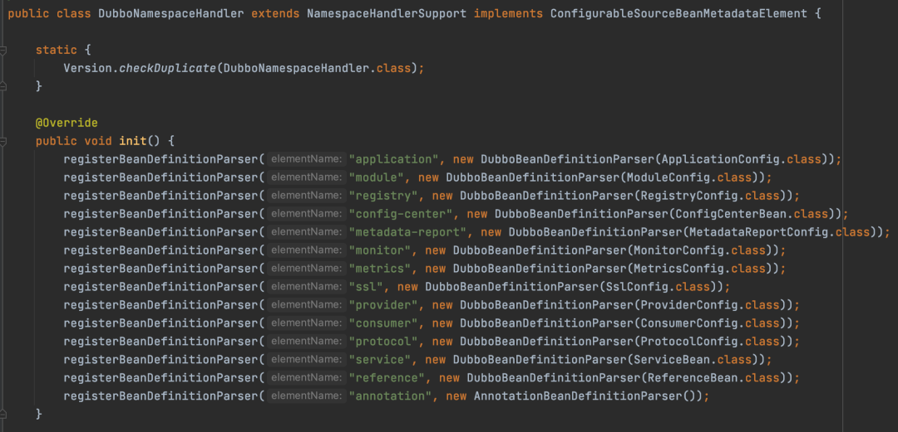

> ###### 

链接：https://mp.weixin.qq.com/s?__biz=Mzg5MDczNDI0Nw==&mid=2247489480&idx=1&sn=55e2f9cedb449c9e7615c2818b04eb46&scene=19#wechat_redirect

# 三万字盘点Spring/Boot的那些常用扩展点

原创 三友 [三友的java日记](javascript:void(0);) *2022-07-25 21:48* *发表于浙江*

大家好，我是三友。

Spring对于每个Java后端程序员来说肯定不陌生，日常开发和面试必备的。本文就来盘点Spring/SpringBoot常见的扩展点，同时也来看看常见的开源框架是如何基于这些扩展点跟Spring/SpringBoot整合的。

话不多说，直接进入正题。

## **FactoryBean**

提起FactoryBean，就有一道“著名”的面试题“说一说FactoryBean和BeanFactory的区别”。其实这两者除了名字有点像，没有半毛钱关系。。


BeanFactory是Bean的工厂，可以帮我们生成想要的Bean，而FactoryBean就是一种Bean的类型。当往容器中注入class类型为FactoryBean的类型的时候，最终生成的Bean是用过FactoryBean的getObject获取的。


### 来个FactoryBean的Demo

定义一个UserFactoryBean，实现FactoryBean接口，getObject方法返回一个User对象

```
public class UserFactoryBean implements FactoryBean<User> {

    @Override
    public User getObject() throws Exception {
        User user = new User();
        System.out.println("调用 UserFactoryBean 的 getObject 方法生成 Bean:" + user);
        return user;
    }

    @Override
    public Class<?> getObjectType() {
        // 这个 FactoryBean 返回的Bean的类型
        return User.class;
    }

}
```

测试类：

```
public class Application {

    public static void main(String[] args) {
        AnnotationConfigApplicationContext applicationContext = new AnnotationConfigApplicationContext();
        //将 UserFactoryBean 注册到容器中
        applicationContext.register(UserFactoryBean.class);
        applicationContext.refresh();

        System.out.println("获取到的Bean为" + applicationContext.getBean(User.class));
    }

}
```

结果：

```
调用 UserFactoryBean 的 getObject 方法生成 Bean:com.sanyou.spring.extension.User@396e2f39
获取到的Bean为com.sanyou.spring.extension.User@396e2f39
```

从结果可以看出，明明注册到Spring容器的是UserFactoryBean，但是却能从容器中获取到User类型的Bean，User这个Bean就是通过UserFactoryBean的getObject方法返回的。

### FactoryBean在开源框架中的使用

#### 1、 在Mybatis中的使用

Mybatis在整合Spring的时候，就是通过FactoryBean来实现的，这也就是为什么在Spring的Bean中可以注入Mybatis的Mapper接口的动态代理对象的原因。

代码如下，省略了不重要的代码。

```
public class MapperFactoryBean<T> extends SqlSessionDaoSupport implements FactoryBean<T> {
  
  // mapper的接口类型
  private Class<T> mapperInterface;
 
  @Override
  public T getObject() throws Exception {
    // 通过SqlSession获取接口的动态搭理对象
    return getSqlSession().getMapper(this.mapperInterface);
  }
  
  @Override
  public Class<T> getObjectType() {
    return this.mapperInterface;
  }
  
}
```

getObject方法的实现就是返回通过SqlSession获取到的Mapper接口的动态代理对象。

而@MapperScan注解的作用就是将每个接口对应的MapperFactoryBean注册到Spring容器的。

#### 2、在OpenFeign中的使用

FeignClient接口的动态代理也是通过FactoryBean注入到Spring中的。

```
class FeignClientFactoryBean implements FactoryBean<Object>, InitializingBean, ApplicationContextAware {
    
    // FeignClient接口类型
    private Class<?> type;
    
    @Override
   public Object getObject() throws Exception {
      return getTarget();
   }
    
    @Override
   public Class<?> getObjectType() {
      return type;
   }
}
```

getObject方法是调用getTarget方法来返回的动态代理。

@EnableFeignClients注解的作用就是将每个接口对应的FeignClientFactoryBean注入到Spring容器的。

> ###### 一般来说，FactoryBean 比较适合那种复杂Bean的构建，在其他框架整合Spring的时候用的比较多。

## **@Import注解**

@Import注解在项目中可能不常见，但是下面这两个注解肯定常见。

```
@Import({SchedulingConfiguration.class})
public @interface EnableScheduling {
}
@Import({AsyncConfigurationSelector.class})
public @interface EnableAsync {
    //忽略
}
```

@EnableScheduling和@EnableAsync两个注解，一个是开启定时任务，一个是开启异步执行。通过这两个注解可以看出，他们都使用了@Import注解，所以真正起作用的是@Import注解。并且在很多情况下，@EnbaleXXX这种格式的注解，都是通过@Import注解起作用的，代表开启了某个功能。

### @Import注解导入的配置类的分类

@Import注解导入的配置类可以分为三种情况：

#### 第一种：配置类实现了 ImportSelector 接口

```
public interface ImportSelector {

   String[] selectImports(AnnotationMetadata importingClassMetadata);

   @Nullable
   default Predicate<String> getExclusionFilter() {
      return null;
   }

}
```

当配置类实现了 ImportSelector 接口的时候，就会调用 selectImports 方法的实现，获取一批类的全限定名，最终这些类就会被注册到Spring容器中。

UserImportSelector实现了ImportSelector，selectImports方法返回User的全限定名，代表吧User这个类注册容器中

```
public class UserImportSelector implements ImportSelector {

    @Override
    public String[] selectImports(AnnotationMetadata importingClassMetadata) {
        System.out.println("调用 UserImportSelector 的 selectImports 方法获取一批类限定名");
        return new String[]{"com.sanyou.spring.extension.User"};
    }

}
```

测试：

```
// @Import 注解导入 UserImportSelector
@Import(UserImportSelector.class)
public class Application {

    public static void main(String[] args) {
        AnnotationConfigApplicationContext applicationContext = new AnnotationConfigApplicationContext();
        //将 Application 注册到容器中
        applicationContext.register(Application.class);
        applicationContext.refresh();

        System.out.println("获取到的Bean为" + applicationContext.getBean(User.class));
    }

}
```

结果：

```
调用 UserImportSelector 的 selectImports 方法获取一批类限定名
获取到的Bean为com.sanyou.spring.extension.User@282003e1
```

所以可以看出，的确成功往容器中注入了User这个Bean

#### 第二种：配置类实现了 ImportBeanDefinitionRegistrar 接口

```
public interface ImportBeanDefinitionRegistrar {

   default void registerBeanDefinitions(AnnotationMetadata importingClassMetadata, BeanDefinitionRegistry registry,BeanNameGenerator importBeanNameGenerator) {
       registerBeanDefinitions(importingClassMetadata, registry);
   }

   default void registerBeanDefinitions(AnnotationMetadata importingClassMetadata, BeanDefinitionRegistry registry) {
   }

}
```

当配置类实现了 ImportBeanDefinitionRegistrar 接口，你就可以自定义往容器中注册想注入的Bean。这个接口相比与 ImportSelector 接口的主要区别就是，ImportSelector接口是返回一个类，你不能对这个类进行任何操作，但是 ImportBeanDefinitionRegistrar 是可以自己注入 BeanDefinition，可以添加属性之类的。

来个demo：

实现ImportBeanDefinitionRegistrar接口

```
public class UserImportBeanDefinitionRegistrar implements ImportBeanDefinitionRegistrar {

    @Override
    public void registerBeanDefinitions(AnnotationMetadata importingClassMetadata, BeanDefinitionRegistry registry, BeanNameGenerator importBeanNameGenerator) {
        //构建一个 BeanDefinition , Bean的类型为 User
        AbstractBeanDefinition beanDefinition = BeanDefinitionBuilder.rootBeanDefinition(User.class)
                // 设置 User 这个Bean的属性username的值为三友的java日记
                .addPropertyValue("username", "三友的java日记")
                .getBeanDefinition();

        System.out.println("往Spring容器中注入User");
        //把 User 这个Bean的定义注册到容器中
        registry.registerBeanDefinition("user", beanDefinition);
    }

}
```

测试：

```
// 导入 UserImportBeanDefinitionRegistrar
@Import(UserImportBeanDefinitionRegistrar.class)
public class Application {

    public static void main(String[] args) {
        AnnotationConfigApplicationContext applicationContext = new AnnotationConfigApplicationContext();
        //将 Application 注册到容器中
        applicationContext.register(Application.class);
        applicationContext.refresh();

        User user = applicationContext.getBean(User.class);
        System.out.println("获取到的Bean为" + user + "，属性username值为：" + user.getUsername());
    }

}
```

结果：

```
往Spring容器中注入User
获取到的Bean为com.sanyou.spring.extension.User@6385cb26，属性username值为：三友的java日记
```

#### 第三种：配置类什么接口都没实现

这种就不演示了，就是一个普普通通的类。

### 总结

' fill='%23FFFFFF'%3E%3Crect x='249' y='126' width='1' height='1'%3E%3C/rect%3E%3C/g%3E%3C/g%3E%3C/svg%3E)@Import注解作用示意图

其实不论是什么样的配置类，主要的作用就是往Spring容器中注册Bean，只不过注入的方式不同罢了。

这种方式有什么好处呢？

ImportSelector和ImportBeanDefinitionRegistrar的方法是有入参的，也就是注解的一些属性的封装，所以就可以根据注解的属性的配置，来决定应该返回样的配置类或者是应该往容器中注入什么样的类型的Bean，可以看一下 @EnableAsync 的实现，看看是如何根据@EnableAsync注解的属性来决定往容器中注入什么样的Bean。

> ###### @Import的核心作用就是导入配置类，并且还可以根据配合（比如@EnableXXX）使用的注解的属性来决定应该往Spring中注入什么样的Bean。

## **Bean的生命周期**

第一节讲的FactoryBean是一种特殊的Bean的类型，@Import注解是往Spring容器中注册Bean。其实不论是@Import注解，还是@Component、@Bean等注解，又或是xml配置，甚至是demo中的register方法，其实主要都是做了一件事，那就是往Spring容器去注册Bean。

Bean注册示意图

为什么需要去注册Bean？

当然是为了让Spring知道要为我们生成Bean，并且需要按照我的要求来生成Bean，比如说，我要@Autowired一个对象，那么你在创建Bean的过程中，就得给我@Autowired一个对象，这就是一个IOC的过程。所以这就涉及了Bean的创建，销毁的过程，也就是面试常问的Bean的生命周期。我之前写过 [Spring bean到底是如何创建的？（上）](https://mp.weixin.qq.com/s?__biz=Mzg5MDczNDI0Nw==&mid=2247483671&idx=1&sn=c62c951ae1d4c12e5be40f6a2561b84e&chksm=cfd952dff8aedbc9b54b549cf8a06ecbd4549c36ac40af35bc46e243ccabc8b3227c0ae2c906&token=1484236675&lang=zh_CN&scene=21#wechat_redirect)、[Spring bean到底是如何创建的？（下）](https://mp.weixin.qq.com/s?__biz=Mzg5MDczNDI0Nw==&mid=2247483709&idx=1&sn=9309f50cdc546d3be4beeb98b665589f&chksm=cfd952f5f8aedbe3d77549be444e184d51e1953328bea140bfa688b5f1f0adf03eb03464b65a&token=1484236675&lang=zh_CN&scene=21#wechat_redirect)两篇文章，来剖析Bean的生命周期的源码，有需要的小伙伴可以看一下。

本节来着重看一下，一个Bean在创建的过程中，有哪些常见的操作Spring在Bean的创建过程中给我们完成，并且操作的顺序是什么样的。

话不多说，直接测试，基于结果来分析。

### Bean生命周期的回调

#### 先来测试

##### 创建LifeCycle类

创建了一个LifeCycle，实现了 InitializingBean、ApplicationContextAware、DisposableBean接口，加了@PostConstruct、@PreDestroy注解，注入了一个User对象。

```
public class LifeCycle implements InitializingBean, ApplicationContextAware, DisposableBean {

    @Autowired
    private User user;

    public LifeCycle() {
        System.out.println("LifeCycle对象被创建了");
    }

    /**
     * 实现的 Aware 回调接口
     *
     * @param applicationContext
     * @throws BeansException
     */
    @Override
    public void setApplicationContext(ApplicationContext applicationContext) throws BeansException {
        System.out.println("Aware接口起作用，setApplicationContext被调用了，此时user=" + user);
    }

    @PostConstruct
    public void postConstruct() {
        System.out.println("@PostConstruct注解起作用，postConstruct方法被调用了");
    }

    /**
     * 实现 InitializingBean 接口
     *
     * @throws Exception
     */
    @Override
    public void afterPropertiesSet() throws Exception {
        System.out.println("InitializingBean接口起作用，afterPropertiesSet方法被调用了");
    }

    /**
     * 通过 {@link Bean#initMethod()}来指定
     *
     * @throws Exception
     */
    public void initMethod() throws Exception {
        System.out.println("@Bean#initMethod()起作用，initMethod方法被调用了");
    }

    @PreDestroy
    public void preDestroy() throws Exception {
        System.out.println("@PreDestroy注解起作用，preDestroy方法被调用了");
    }

    /**
     * 通过 {@link Bean#destroyMethod()}来指定
     *
     * @throws Exception
     */
    public void destroyMethod() throws Exception {
        System.out.println("@Bean#destroyMethod()起作用，destroyMethod方法被调用了");
    }

    /**
     * 实现 DisposableBean 注解
     *
     * @throws Exception
     */
    @Override
    public void destroy() throws Exception {
        System.out.println("DisposableBean接口起作用，destroy方法被调用了");
    }

}
```

##### 声明LifeCycle

通过@Bean声明了LifeCycle，并且initMethod和destroyMethod属性分别指定到了LifeCycle类的initMethod方法和destroyMethod方法

```
@Bean(initMethod = "initMethod", destroyMethod = "destroyMethod")
public LifeCycle lifeCycle() {
    return new LifeCycle();
}
```

##### 测试

```
public class Application {

    public static void main(String[] args) {
        AnnotationConfigApplicationContext applicationContext = new AnnotationConfigApplicationContext();
        //将 LifeCycle 注册到容器中
        applicationContext.register(Application.class);
        applicationContext.refresh();

        // 关闭上下文，触发销毁操作
        applicationContext.close();
    }

    @Bean(initMethod = "initMethod", destroyMethod = "destroyMethod")
    public LifeCycle lifeCycle() {
        return new LifeCycle();
    }

    @Bean
    public User user() {
        return new User();
    }

}
```

执行结果：

```
LifeCycle对象被创建了
Aware接口起作用，setApplicationContext被调用了，此时user=com.sanyou.spring.extension.User@57d5872c
@PostConstruct注解起作用，postConstruct方法被调用了
InitializingBean接口起作用，afterPropertiesSet方法被调用了
@Bean#initMethod()起作用，initMethod方法被调用了
@PreDestroy注解起作用，preDestroy方法被调用了
DisposableBean接口起作用，destroy方法被调用了
@Bean#destroyMethod()起作用，destroyMethod方法被调用了
```

#### 分析结果

通过测试的结果可以看出，Bean在创建和销毁的过程当我们实现了某些接口或者加了某些注解，Spring就会回调我们实现的接口或者执行的方法。

同时，在执行setApplicationContext的时候，能打印出User对象，说明User已经被注入了，说明注入发生在setApplicationContext之前。

这里画张图总结一下Bean创建和销毁过程中调用的顺序。

回调顺序

红色部分发生在Bean的创建过程，灰色部分发生在Bean销毁的过程中，在容器关闭的时候，就会销毁Bean。

这里说一下图中的Aware接口指的是什么。其余的其实没什么好说的，就是按照这种方式配置，Spring会调用对应的方法而已。

Aware接口是指以Aware结尾的一些Spring提供的接口，当你的Bean实现了这些接口的话，在创建过程中会回调对应的set方法，并传入响应的对象。

这里列举几个Aware接口以及它们的作用

| 接口                           | 作用                                    |
| :----------------------------- | :-------------------------------------- |
| ApplicationContextAware        | 注入ApplicationContext                  |
| ApplicationEventPublisherAware | 注入ApplicationEventPublisher事件发布器 |
| BeanFactoryAware               | 注入BeanFactory                         |
| BeanNameAware                  | 注入Bean的名称                          |

有了这些回调，比如说我的Bean想拿到ApplicationContext，不仅可以通过@Autowired注入，还可以通过实现ApplicationContextAware接口拿到。

通过上面的例子我们知道了比如说@PostConstruct注解、@Autowired注解、@PreDestroy注解的作用，但是它们是如何在不同的阶段实现的呢？接着往下看。

## **BeanPostProcessor**

BeanPostProcessor，中文名 Bean的后置处理器，在Bean创建的过程中起作用。

BeanPostProcessor是Bean在创建过程中一个非常重要的扩展点，因为每个Bean在创建的各个阶段，都会回调BeanPostProcessor及其子接口的方法，传入正在创建的Bean对象，这样如果想对Bean创建过程中某个阶段进行自定义扩展，那么就可以自定义BeanPostProcessor来完成。

说得简单点，BeanPostProcessor就是在Bean创建过程中留的口子，通过这个口子可以对正在创建的Bean进行扩展。只不过Bean创建的阶段比较多，然后BeanPostProcessor接口以及他的子接口InstantiationAwareBeanPostProcessor、DestructionAwareBeanPostProcessor就提供了很多方法，可以使得在不同的阶段都可以拿到正在创建的Bean进行扩展。

### 来个Demo

现在需要实现一个这样的需求，如果Bean的类型是User，那么就设置这个对象的username属性为 ”三友的java日记“。

那么就可以这么写：

```
public class UserBeanPostProcessor implements BeanPostProcessor {

    @Override
    public Object postProcessAfterInitialization(Object bean, String beanName) throws BeansException {
        if (bean instanceof User) {
            //如果当前的Bean的类型是 User ，就把这个对象 username 的属性赋值为 三友的java日记
            ((User) bean).setUsername("三友的java日记");
        }

        return bean;
    }

}
```

测试：

```
public class Application {

    public static void main(String[] args) {
        AnnotationConfigApplicationContext applicationContext = new AnnotationConfigApplicationContext();
        //将 UserBeanPostProcessor 和  User 注册到容器中
        applicationContext.register(UserBeanPostProcessor.class);
        applicationContext.register(User.class);
        applicationContext.refresh();

        User user = applicationContext.getBean(User.class);
        System.out.println("获取到的Bean为" + user + "，属性username值为：" + user.getUsername());
    }

}
```

测试结果：

```
获取到的Bean为com.sanyou.spring.extension.User@21a947fe，属性username值为：三友的java日记
```

从结果可以看出，每个生成的Bean在执行到某个阶段的时候，都会回调UserBeanPostProcessor，然后UserBeanPostProcessor就会判断当前创建的Bean的类型，如果是User类型，那么就会将username的属性设置为 ”三友的java日记“。

### Spring内置的BeanPostProcessor

这里我列举了常见的一些BeanPostProcessor的实现以及它们的作用

| BeanPostProcessor                      | 作用                                           |
| :------------------------------------- | :--------------------------------------------- |
| AutowiredAnnotationBeanPostProcessor   | 处理@Autowired、@Value注解                     |
| CommonAnnotationBeanPostProcessor      | 处理@Resource、@PostConstruct、@PreDestroy注解 |
| AnnotationAwareAspectJAutoProxyCreator | 处理一些注解或者是AOP切面的动态代理            |
| ApplicationContextAwareProcessor       | 处理Aware接口注入的                            |
| AsyncAnnotationBeanPostProcessor       | 处理@Async注解                                 |
| ScheduledAnnotationBeanPostProcessor   | 处理@Scheduled注解                             |

通过列举的这些BeanPostProcessor的实现可以看出，Spring Bean的很多注解的处理都是依靠BeanPostProcessor及其子类的实现来完成的，这也回答了上一小节的疑问，处理@Autowired、@PostConstruct、@PreDestroy注解是如何起作用的，其实就是通过BeanPostProcessor，在Bean的不同阶段来调用对应的方法起作用的。

### BeanPostProcessor在Dubbo中的使用

在Dubbo中可以通过@DubboReference(@Reference)来引用生产者提供的接口，这个注解的处理也是依靠ReferenceAnnotationBeanPostProcessor，也就是 BeanPostProcessor 的扩展来实现的。

```
public class ReferenceAnnotationBeanPostProcessor 
       extends AbstractAnnotationBeanPostProcessor 
       implements ApplicationContextAware, BeanFactoryPostProcessor {
        // 忽略
}
```

当Bean在创建的某一阶段，走到了ReferenceAnnotationBeanPostProcessor这个类，就会根据反射找出这个类有没有@DubboReference(@Reference)注解，有的话就构建一个动态搭理注入就可以了。

> ###### BeanPostProcessor在Spring Bean的扩展中扮演着重要的角色，是Spring Bean生命周期中很重要的一部分。正是因为有了BeanPostProcessor，你就可以在Bean创建过程中的任意一个阶段扩展自己想要的东西。

## **BeanFactoryPostProcessor**

通过上面一节我们知道 BeanPostProcessor 是对Bean的处理，那么BeanFactoryPostProcessor很容易就猜到是对BeanFactory，也就是Spring容器的处理。

举个例子，如果我们想禁止循环依赖，那么就可以这么写。

```
public class MyBeanFactoryPostProcessor implements BeanFactoryPostProcessor {

    @Override
    public void postProcessBeanFactory(ConfigurableListableBeanFactory beanFactory) throws BeansException {
        // 禁止循环依赖
        ((DefaultListableBeanFactory) beanFactory).setAllowCircularReferences(false);
    }

}
```

后面只需要将注入到Spring容器中就会生效。

> ###### BeanFactoryPostProcessor是可以对Spring容器做处理的，方法的入参就是Spring的容器，通过这个接口，就对容器进行为所欲为的操作。

## **Spring SPI机制**

SPI全称为 (Service Provider Interface)，是一种动态替换发现的机制，一种解耦非常优秀的思想，SPI可以很灵活的让接口和实现分离， 让api提供者只提供接口，第三方来实现，然后可以使用配置文件的方式来实现替换或者扩展，在框架中比较常见，提高框架的可扩展性。

JDK有内置的SPI机制的实现ServiceLoader，Dubbo也有自己的SPI机制的实现ExtensionLoader，但是这里我们都不讲。。


但是，我之前写过相关的文章，[面试常问的dubbo的spi机制到底是什么？（上）](https://mp.weixin.qq.com/s?__biz=Mzg5MDczNDI0Nw==&mid=2247483734&idx=1&sn=9e7d0877acb541bf164a16842391adba&chksm=cfd9529ef8aedb882116f37710fc524f9bea3ca7b98613136dfe4020a11696852c59d0953520&token=1484236675&lang=zh_CN&scene=21#wechat_redirect)，文章的前半部分有对比三者的区别。

这里我们着重讲一下Spring的SPI机制的实现SpringFactoriesLoader。

### SpringFactoriesLoader

Spring的SPI机制规定，配置文件必须在classpath路径下的META-INF文件夹内，文件名必须为spring.factories，文件内容为键值对，一个键可以有多个值，只需要用逗号分割就行，同时键值都需要是类的全限定名。但是键和值可以没有任何关系，当然想有也可以有。

### show me the code

这里我自定义一个类，MyEnableAutoConfiguration作为键，值就是User

```
public class MyEnableAutoConfiguration {
}
```

spring.factories文件

```
com.sanyou.spring.extension.spi.MyEnableAutoConfiguration=com.sanyou.spring.extension.User
```

然后放在META-INF底下

' fill='%23FFFFFF'%3E%3Crect x='249' y='126' width='1' height='1'%3E%3C/rect%3E%3C/g%3E%3C/g%3E%3C/svg%3E)

测试：

```
public class Application {

    public static void main(String[] args) {
        List<String> classNames = SpringFactoriesLoader.loadFactoryNames(MyEnableAutoConfiguration.class, MyEnableAutoConfiguration.class.getClassLoader());
        classNames.forEach(System.out::println);
    }

}
```

结果：

```
com.sanyou.spring.extension.User
```

可以看出，通过SpringFactoriesLoader的确可以从spring.factories文件中拿到MyEnableAutoConfiguration键对应的值。

到这你可能说会，这SPI机制也没啥用啊。的确，我这个例子比较简单，拿到就是遍历，但是在Spring中，如果Spring在加载类的话使用SPI机制，那我们就可以扩展，接着往下看。

## **SpringBoot启动扩展点**

SpringBoot项目在启动的过程中有很多扩展点，这里就来盘点一下几个常见的扩展点。

### 1、自动装配

说到SpringBoot的扩展点，第一时间肯定想到的就是自动装配机制，面试贼喜欢问，但是其实就是一个很简单的东西。当项目启动的时候，会去从所有的spring.factories文件中读取@EnableAutoConfiguration键对应的值，拿到配置类，然后根据一些条件判断，决定哪些配置可以使用，哪些不能使用。

spring.factories文件？键值？不错，自动装配说白了就是SPI机制的一种运用场景。

@EnableAutoConfiguration注解：

```
@Import(AutoConfigurationImportSelector.class)
public @interface EnableAutoConfiguration {
    //忽略
}
```

我擦，这个注解也是使用@Import注解，而且配置类还实现了ImportSelector接口，跟前面也都对上了。在SpringBoot中，@EnableAutoConfiguration是通过@SpringBootApplication来使用的。

在AutoConfigurationImportSelector中还有这样一段代码' fill='%23FFFFFF'%3E%3Crect x='249' y='126' width='1' height='1'%3E%3C/rect%3E%3C/g%3E%3C/g%3E%3C/svg%3E)

所以，这段代码也明显地可以看出，自动装配也是基于SPI机制实现的。

那么我想实现自动装配怎么办呢？很简单，只需两步。

第一步，写个配置类：

```
@Configuration
public class UserAutoConfiguration {

    @Bean
    public UserFactoryBean userFactoryBean() {
        return new UserFactoryBean();
    }

}
```

这里我为了跟前面的知识有关联，配置了一个UserFactoryBean。

第二步，往spring.factories文件配置一下

```
org.springframework.boot.autoconfigure.EnableAutoConfiguration=\
com.sanyou.spring.extension.springbootextension.UserAutoConfiguration
```

到这就已经实现了自动装配的扩展。

接下来进行测试：

```
@SpringBootApplication
public class Application {

    public static void main(String[] args) {
        ConfigurableApplicationContext applicationContext = SpringApplication.run(Application.class);

        User user = applicationContext.getBean(User.class);

        System.out.println("获取到的Bean为" + user);
    }

}
```

运行结果：

```
调用 UserFactoryBean 的 getObject 方法生成 Bean:com.sanyou.spring.extension.User@3406472c
获取到的Bean为com.sanyou.spring.extension.User@3406472c
```

从运行结果可以看出，自动装配起了作用，并且虽然往容器中注入的Bean的class类型为UserFactoryBean，但是最终会调用UserFactoryBean的getObject的实现获取到User对象。

自动装配机制是SpringBoot的一个很重要的扩展点，很多框架在整合SpringBoot的时候，也都通过自动装配来的，实现项目启动，框架就自动启动的，这里我举个Mybatis整合SpringBoot。

' fill='%23FFFFFF'%3E%3Crect x='249' y='126' width='1' height='1'%3E%3C/rect%3E%3C/g%3E%3C/g%3E%3C/svg%3E)Mybatis整合SpringBoot的spring.factories文件

### 2、PropertySourceLoader

#### PropertySourceLoader，这是干啥的呢？

我们都知道，在SpringBoot环境下，外部化的配置文件支持properties和yaml两种格式。但是，现在不想使用properties和yaml格式的文件，想使用json格式的配置文件，怎么办？

当然是基于该小节讲的PropertySourceLoader来实现的。

```
public interface PropertySourceLoader {

   //可以支持哪种文件格式的解析
   String[] getFileExtensions();

   // 解析配置文件，读出内容，封装成一个PropertySource<?>结合返回回去
   List<PropertySource<?>> load(String name, Resource resource) throws IOException;

}
```

对于PropertySourceLoader的实现，SpringBoot两个实现

PropertiesPropertySourceLoader：可以解析properties或者xml结尾的配置文件

YamlPropertySourceLoader：解析以yml或者yaml结尾的配置文件' fill='%23FFFFFF'%3E%3Crect x='249' y='126' width='1' height='1'%3E%3C/rect%3E%3C/g%3E%3C/g%3E%3C/svg%3E)

所以可以看出，要想实现json格式的支持，只需要自己实现可以用来解析json格式的配置文件的PropertySourceLoader就可以了。

动手来一个。

#### 实现可以读取json格式的配置文件

实现这个功能，只需要两步就可以了。

##### 第一步：自定义一个PropertySourceLoader

JsonPropertySourceLoader，实现PropertySourceLoader接口

```
public class JsonPropertySourceLoader implements PropertySourceLoader {

    @Override
    public String[] getFileExtensions() {
        //这个方法表明这个类支持解析以json结尾的配置文件
        return new String[]{"json"};
    }

    @Override
    public List<PropertySource<?>> load(String name, Resource resource) throws IOException {

        ReadableByteChannel readableByteChannel = resource.readableChannel();

        ByteBuffer byteBuffer = ByteBuffer.allocate((int) resource.contentLength());

        //将文件内容读到 ByteBuffer 中
        readableByteChannel.read(byteBuffer);
        //将读出来的字节转换成字符串
        String content = new String(byteBuffer.array());
        // 将字符串转换成 JSONObject
        JSONObject jsonObject = JSON.parseObject(content);

        Map<String, Object> map = new HashMap<>(jsonObject.size());
        //将 json 的键值对读出来，放入到 map 中
        for (String key : jsonObject.keySet()) {
            map.put(key, jsonObject.getString(key));
        }

        return Collections.singletonList(new MapPropertySource("jsonPropertySource", map));
    }

}
```

##### 第二步：配置PropertySourceLoader

JsonPropertySourceLoader 已经有了，那么怎么用呢？当然是SPI机制了，SpringBoot对于配置文件的处理，就是依靠SPI机制，这也是能扩展的重要原因。

' fill='%23FFFFFF'%3E%3Crect x='249' y='126' width='1' height='1'%3E%3C/rect%3E%3C/g%3E%3C/g%3E%3C/svg%3E)SPI机制加载PropertySourceLoader实现

' fill='%23FFFFFF'%3E%3Crect x='249' y='126' width='1' height='1'%3E%3C/rect%3E%3C/g%3E%3C/g%3E%3C/svg%3E)spring.factories文件配置PropertySourceLoader

SpringBoot会先通过SPI机制加载所有PropertySourceLoader，然后遍历每个PropertySourceLoader，判断当前遍历的PropertySourceLoader，通过getFileExtensions获取到当前PropertySourceLoader能够支持哪些配置文件格式的解析，让后跟当前需要解析的文件格式进行匹配，如果能匹配上，那么就会使用当前遍历的PropertySourceLoader来解析配置文件。

PropertySourceLoader其实就属于策略接口，配置文件的解析就是策略模式的运用。

所以，只需要按照这种格式，在spring.factories文件中配置一下就行了。

```
org.springframework.boot.env.PropertySourceLoader=\
com.sanyou.spring.extension.springbootextension.propertysourceloader.JsonPropertySourceLoader
```

到此，其实就扩展完了，接下来就来测试一下。

#### 测试

先创建一个application.json的配置文件

application.json配置文件

改造User

```
public class User {
    // 注入配置文件的属性
    @Value("${sanyou.username:}")
    private String username;
}
```

启动项目

```
@SpringBootApplication
public class Application {

    public static void main(String[] args) {
        ConfigurableApplicationContext applicationContext = SpringApplication.run(Application.class);

        User user = applicationContext.getBean(User.class);

        System.out.println("获取到的Bean为" + user + "，属性username值为：" + user.getUsername());
    }


    @Bean
    public User user() {
        return new User();
    }

}
```

运行结果：

```
获取到的Bean为com.sanyou.spring.extension.User@481ba2cf，属性username值为：三友的java日记
```

成功将json配置文件的属性注入到User对象中。

至此，SpringBoot就支持了以json为结尾的配置文件格式。

#### Nacos对于PropertySourceLoader的实现

如果你的项目正在用Nacos作为配置中心，那么刚刚好，Nacos已经实现json配置文件格式的解析。

' fill='%23FFFFFF'%3E%3Crect x='249' y='126' width='1' height='1'%3E%3C/rect%3E%3C/g%3E%3C/g%3E%3C/svg%3E)Nacos对于PropertySourceLoader的实现

Nacos不仅实现了json格式的解析，也实现了关于xml格式的配置文件的解析，并且优先级会比SpringBoot默认的xml格式文件解析的优先级高。至于Nacos为啥需要实现PropertySourceLoader？其实很简单，因为Nacos作为配置中心，不仅支持properties和yaml格式的文件，还支持json格式的配置文件，那么客户端拿到这些配置就需要解析，SpringBoot已经支持了properties和yaml格式的文件的解析，那么Nacos只需要实现SpringBoot不支持的就可以了。

### 3、ApplicationContextInitializer

ApplicationContextInitializer也是SpringBoot启动过程的一个扩展点。

' fill='%23FFFFFF'%3E%3Crect x='249' y='126' width='1' height='1'%3E%3C/rect%3E%3C/g%3E%3C/g%3E%3C/svg%3E)ApplicationContextInitializer

在SpringBoot启动过程，会回调这个类的实现initialize方法，传入ConfigurableApplicationContext。

那怎么用呢？

依然是SPI。

' fill='%23FFFFFF'%3E%3Crect x='249' y='126' width='1' height='1'%3E%3C/rect%3E%3C/g%3E%3C/g%3E%3C/svg%3E)SPI加载ApplicationContextInitializer

然后遍历所有的实现，依次调用

' fill='%23FFFFFF'%3E%3Crect x='249' y='126' width='1' height='1'%3E%3C/rect%3E%3C/g%3E%3C/g%3E%3C/svg%3E)调用initialize

这里就不演示了，实现接口，按照如下这种配置就行了


但是这里需要注意的是，此时传入的ConfigurableApplicationContext并没有调用过refresh方法，也就是里面是没有Bean对象的，一般这个接口是用来配置ConfigurableApplicationContext，而不是用来获取Bean的。

### 4、EnvironmentPostProcessor

EnvironmentPostProcessor在SpringBoot启动过程中，也会调用，也是通过SPI机制来加载扩展的。

EnvironmentPostProcessor

EnvironmentPostProcessor是用来处理ConfigurableEnvironment的，也就是一些配置信息，SpringBoot所有的配置都是存在这个对象的。

说这个类的主要原因，主要不是说扩展，而是他的一个实现类很关键。

' fill='%23FFFFFF'%3E%3Crect x='249' y='126' width='1' height='1'%3E%3C/rect%3E%3C/g%3E%3C/g%3E%3C/svg%3E)ConfigFileApplicationListener

这个类的作用就是用来处理外部化配置文件的，也就是这个类是用来处理配置文件的，通过前面提到的PropertySourceLoader解析配置文件，放到ConfigurableEnvironment里面。

### 5、ApplicationRunner和CommandLineRunner

ApplicationRunner和CommandLineRunner都是在SpringBoot成功启动之后会调用，可以拿到启动时的参数。

那怎么扩展呢？

当然又是SPI了。

' fill='%23FFFFFF'%3E%3Crect x='249' y='126' width='1' height='1'%3E%3C/rect%3E%3C/g%3E%3C/g%3E%3C/svg%3E)

这两个其实不是通过SPI机制来扩展，而是直接从容器中获取的，这又是为啥呢？

因为调用ApplicationRunner和CommandLineRunner时，SpringBoot已经启动成功了，Spring容器都准备好了，需要什么Bean直接从容器中查找多方便。

而前面说的几个需要SPI机制的扩展点，是因为在SpringBoot启动的时候，Spring容器还没有启动好，也就是无法从Spring容器获取到这些扩展的对象，为了兼顾扩展性，所以就通过SPI机制来实现获取到实现类。

刷新上下文和调用Runner

加载和调用Runner

所以要想扩展这个点，只需要实现接口，添加到Spring容器就可以了。

## **Spring Event 事件**

Event 事件可以说是一种观察者模式的实现，主要是用来解耦合的。当发生了某件事，只要发布一个事件，对这个事件的监听者（观察者）就可以对事件进行响应或者处理。

举个例子来说，假设发生了火灾，可能需要打119、救人，那么就可以基于事件的模型来实现，只需要打119、救人监听火灾的发生就行了，当发生了火灾，通知这些打119、救人去触发相应的逻辑操作。

' fill='%23FFFFFF'%3E%3Crect x='249' y='126' width='1' height='1'%3E%3C/rect%3E%3C/g%3E%3C/g%3E%3C/svg%3E)

### 什么是Spring Event 事件

那么是什么是Spring Event 事件，就是Spring实现了这种事件模型，你只需要基于Spring提供的API进行扩展，就可以完成事件的发布订阅

Spring提供的事件api:

#### ApplicationEvent

' fill='%23FFFFFF'%3E%3Crect x='249' y='126' width='1' height='1'%3E%3C/rect%3E%3C/g%3E%3C/g%3E%3C/svg%3E)ApplicationEvent

事件的父类，所有具体的事件都得继承这个类，构造方法的参数是这个事件携带的参数，监听器就可以通过这个参数来进行一些业务操作。

#### ApplicationListener

' fill='%23FFFFFF'%3E%3Crect x='249' y='126' width='1' height='1'%3E%3C/rect%3E%3C/g%3E%3C/g%3E%3C/svg%3E)ApplicationListener

事件监听的接口，泛型是子类需要监听的事件类型，子类需要实现onApplicationEvent，参数就是事件类型，onApplicationEvent方法的实现就代表了对事件的处理，当事件发生时，Spring会回调onApplicationEvent方法的实现，传入发布的事件。

#### ApplicationEventPublisher

ApplicationEventPublisher

事件发布器，通过publishEvent方法就可以发布一个事件，然后就可以触发监听这个事件的监听器的回调。

ApplicationContext实现了ApplicationEventPublisher接口，所以通过ApplicationContext就可以发布事件。


那怎么才能拿到ApplicationContext呢？

前面Bean生命周期那节说过，可以通过ApplicationContextAware接口拿到，甚至你可以通过实现ApplicationEventPublisherAware直接获取到ApplicationEventPublisher，其实获取到的ApplicationEventPublisher也就是ApplicationContext，因为是ApplicationContext实现了ApplicationEventPublisher。

#### 话不多说，上代码

就以上面的火灾为例

##### 第一步：创建一个火灾事件类

火灾事件类继承ApplicationEvent

```
// 火灾事件
public class FireEvent extends ApplicationEvent {

    public FireEvent(String source) {
        super(source);
    }

}
```

##### 第二步：创建火灾事件的监听器

打119的火灾事件的监听器：

```
public class Call119FireEventListener implements ApplicationListener<FireEvent> {

    @Override
    public void onApplicationEvent(FireEvent event) {
        System.out.println("打119");
    }

}
```

救人的火灾事件的监听器：

```
public class SavePersonFireEventListener implements ApplicationListener<FireEvent> {

    @Override
    public void onApplicationEvent(FireEvent event) {
        System.out.println("救人");
    }

}
```

事件和对应的监听都有了，接下来进行测试：

```
public class Application {

    public static void main(String[] args) {
        AnnotationConfigApplicationContext applicationContext = new AnnotationConfigApplicationContext();
        //将 事件监听器 注册到容器中
        applicationContext.register(Call119FireEventListener.class);
        applicationContext.register(SavePersonFireEventListener.class);
        applicationContext.refresh();

        // 发布着火的事件，触发监听
        applicationContext.publishEvent(new FireEvent("着火了"));
    }

}
```

将两个事件注册到Spring容器中，然后发布FireEvent事件

运行结果：

```
打119
救人
```

控制台打印出了结果，触发了监听。

如果现在需要对火灾进行救火，那么只需要去监听FireEvent，实现救火的逻辑，注入到Spring容器中，就可以了，其余的代码根本不用动。

### Spring内置的事件

Spring内置的事件很多，这里我罗列几个

| 事件类型              | 触发时机                                                     |
| :-------------------- | :----------------------------------------------------------- |
| ContextRefreshedEvent | 在调用ConfigurableApplicationContext 接口中的refresh()方法时触发 |
| ContextStartedEvent   | 在调用ConfigurableApplicationContext的start()方法时触发      |
| ContextStoppedEvent   | 在调用ConfigurableApplicationContext的stop()方法时触发       |
| ContextClosedEvent    | 当ApplicationContext被关闭时触发该事件，也就是调用close()方法触发 |

在Spring容器启动的过程中，Spring会发布这些事件，如果你需要这Spring容器启动的某个时刻进行什么操作，只需要监听对应的事件即可。

### Spring事件的传播

Spring事件的传播是什么意思呢？

我们都知道，在Spring中有子父容器的概念，而Spring事件的传播就是指当通过子容器发布一个事件之后，不仅可以触发在这个子容器的事件监听器，还可以触发在父容器的这个事件的监听器。

#### 上代码

```
public class EventPropagateApplication {

    public static void main(String[] args) {

        // 创建一个父容器
        AnnotationConfigApplicationContext parentApplicationContext = new AnnotationConfigApplicationContext();
        //将 打119监听器 注册到父容器中
        parentApplicationContext.register(Call119FireEventListener.class);
        parentApplicationContext.refresh();

        // 创建一个子容器
        AnnotationConfigApplicationContext childApplicationContext = new AnnotationConfigApplicationContext();
        //将 救人监听器 注册到子容器中
        childApplicationContext.register(SavePersonFireEventListener.class);
        childApplicationContext.refresh();

        // 设置一下父容器
        childApplicationContext.setParent(parentApplicationContext);

        // 通过子容器发布着火的事件，触发监听
        childApplicationContext.publishEvent(new FireEvent("着火了"));

    }

}
```

创建了两个容器，父容器注册了打119的监听器，子容器注册了救人的监听器，然后将子父容器通过setParent关联起来，最后通过子容器，发布了着火的事件。

运行结果：

```
救人
打119
```

从打印的日志，的确可以看出，虽然是子容器发布了着火的事件，但是父容器的监听器也成功监听了着火事件。

#### 源码验证

事件传播源码

从这段源码可以看出，如果父容器不为空，就会通过父容器再发布一次事件。

#### 传播特性的一个坑

前面说过，在Spring容器启动的过程，会发布很多事件，如果你需要有相应的扩展，可以监听这些事件。但是，在SpringCloud环境下，你的这些Spring发布的事件的监听器可能会执行很多次。为什么会执行很多次呢？其实就是跟传播特性有关。

在SpringCloud的环境下，为了使像FeignClient和RibbonClient这些不同的服务的配置相互隔离，会创建很多的子容器，而这些子容器都有一个公共的父容器，那就是SpringBoot项目启动时创建的容器，事件的监听器都在这个容器中。而这些为了配置隔离创建的子容器，在容器启动的过程中，也会发布诸如ContextRefreshedEvent等这样的事件，如果你监听了这些事件，那么由于传播特性的关系，你的这个事件的监听器就会触发多次。

如何解决这个坑呢？

你可以进行判断这些监听器有没有执行过，比如加一个判断的标志；或者是监听类似的事件，比如ApplicationStartedEvent事件，这种事件是在SpringBoot启动中发布的事件，而子容器不是SpringBoot，所以不会多次发这种事件，也就会只执行一次。

### Spring事件的运用举例

#### 1、在Mybatis中的使用

又来以Mybatis举例了。。Mybatis的SqlSessionFactoryBean监听了ApplicationEvent，然后判断如果是ContextRefreshedEvent就进行相应的处理，这个类还实现了FactoryBean接口。。

```
public class SqlSessionFactoryBean
    implements FactoryBean<SqlSessionFactory>, InitializingBean, ApplicationListener<ApplicationEvent> {
    
    @Override
    public void onApplicationEvent(ApplicationEvent event) {
        if (failFast && event instanceof ContextRefreshedEvent) {
        // fail-fast -> check all statements are completed
        this.sqlSessionFactory.getConfiguration().getMappedStatementNames();
        }
    }
    
}
```

说实话，这监听代码写的不太好，监听了ApplicationEvent，那么所有的事件都会回调这个类的onApplicationEvent方法，但是onApplicationEvent方法实现又是当ApplicationEvent是ContextRefreshedEvent类型才会往下走，那为什么不直接监听ContextRefreshedEvent呢？

可以给个差评。

膨胀了膨胀了。。

#### 2、在SpringCloud的运用

在SpringCloud的中，当项目启动的时候，会自动往注册中心进行注册，那么是如何实现的呢？当然也是基于事件来的。当web服务器启动完成之后，就发布ServletWebServerInitializedEvent事件。


然后不同的注册中心的实现都只需要监听这个事件，就知道web服务器已经创建好了，那么就可以往注册中心注册服务实例了。如果你的服务没往注册中心，看看是不是web环境，因为只有web环境才会发这个事件。

SpringCloud提供了一个抽象类 AbstractAutoServiceRegistration，实现了对WebServerInitializedEvent（ServletWebServerInitializedEvent的父类）事件的监听

AbstractAutoServiceRegistration

一般不同的注册中心都会去继承这个类，监听项目启动，实现往注册中心服务端进行注册。

Nacos对于AbstractAutoServiceRegistration的继承

> ###### Spring Event事件在Spring内部中运用很多，是解耦合的利器。在实际项目中，你既可以监听Spring/Boot内置的一些事件，进行相应的扩展，也可以基于这套模型在业务中自定义事件和相应的监听器，减少业务代码的耦合。

## **命名空间**

最后来讲一个可能没有留意，但是很神奇的扩展点--命名空间。起初我知道这个扩展点的时候，我都惊呆了，这玩意也能扩展？真的不得不佩服Spring设计的可扩展性。


回忆一下啥是命名空间？

先看一段配置

```
<?xml version="1.0" encoding="UTF-8"?>
<beans xmlns:xsi="http://www.w3.org/2001/XMLSchema-instance"
       xmlns="http://www.springframework.org/schema/beans"
       xmlns:context="http://www.springframework.org/schema/context"
       xsi:schemaLocation="
       http://www.springframework.org/schema/beans
       http://www.springframework.org/schema/beans/spring-beans.xsd
       http://www.springframework.org/schema/context 
       http://www.springframework.org/schema/beans/spring-context.xsd
       ">

    <context:component-scan base-package="com.sanyou.spring.extension"/>

</beans>
```

这一段xml配置想必都很熟悉，其中， context 标签就代表了一个命名空间。

也就说，这个标签是可以扩展的。

### 话不多说，来个扩展

接下来自定义命名空间 sanyou，总共分为3步。

#### 第一步：定义一个xsd文件

如下：

```
<?xml version="1.0" encoding="UTF-8" standalone="no"?>
<!-- xmlns 和 targetNamespace 需要定义，结尾为sanyou，前面都一样的-->
<xsd:schema xmlns="http://sanyou.com/schema/sanyou"
            xmlns:xsd="http://www.w3.org/2001/XMLSchema"
            targetNamespace="http://sanyou.com/schema/sanyou">

    <xsd:import namespace="http://www.w3.org/XML/1998/namespace"/>

    <xsd:complexType name="Bean">
        <xsd:attribute name="class" type="xsd:string" use="required"/>
    </xsd:complexType>

    <!--  sanyou 便签的子标签，类型是Bean ，就会找到上面的complexType=Bean类型，然后处理属性  -->
    <xsd:element name="mybean" type="Bean"/>
</xsd:schema>
```

这个xsd文件来指明sanyou这个命名空间下有哪些标签和属性。这里我只指定了一个标签 mybean，mybean标签里面有个class的属性，然后这个标签的目的就是将class属性指定的Bean的类型，注入到Spring容器中，作用跟spring的标签的作用是一样的。

xsd文件没有需要放的固定的位置，这里我放到 META-INF 目录下

#### 第二步：解析这个命名空间

解析命名空间很简单，Spring都有配套的东西--NamespaceHandler接口，只要实现这个接口就行了。但一般我们不直接实现 NamespaceHandler 接口，我们可以继承 NamespaceHandlerSupport 类，这个类实现了 NamespaceHandler 接口。

```
public class SanYouNameSpaceHandler extends NamespaceHandlerSupport {

    @Override
    public void init() {
        //注册解析 mybean 标签的解析器
        registerBeanDefinitionParser("mybean", new SanYouBeanDefinitionParser());
    }

    private static class SanYouBeanDefinitionParser extends AbstractSingleBeanDefinitionParser {
        @Override
        protected boolean shouldGenerateId() {
            return true;
        }

        @Override
        protected String getBeanClassName(Element element) {
            return element.getAttribute("class");
        }

    }
}
```

SanYouNameSpaceHandler的作用就是将sanyou命名空间中的mybean这个标签读出来，拿到class的属性，然后将这个class属性指定的class类型注入到Spring容器中，至于注册这个环节的代码，都交给了SanYouBeanDefinitionParser的父类来做了。

#### 第三步：创建并配置spring.handlers和spring.schemas文件

先创建spring.handlers和spring.schemas文件

spring.handlers文件内容

```
http\://sanyou.com/schema/sanyou=com.sanyou.spring.extension.namespace.SanYouNameSpaceHandler
```

通过spring.handlers配置文件，就知道sanyou命名空间应该找SanYouNameSpaceHandler进行解析

spring.schemas文内容

```
http\://sanyou.com/schema/sanyou.xsd=META-INF/sanyou.xsd
```

spring.schemas配置xsd文件的路径

文件都有了，只需要放到classpath下的META-INF文件夹就行了。

xsd、spring.handlers、spring.schema文件

到这里，就完成了扩展，接下来进行测试

#### 测试

先构建一个applicationContext.xml文件，放到resources目录下

```
<?xml version="1.0" encoding="UTF-8"?>
<beans xmlns:xsi="http://www.w3.org/2001/XMLSchema-instance"
       xmlns="http://www.springframework.org/schema/beans"
       xmlns:sanyou="http://sanyou.com/schema/sanyou"
       xsi:schemaLocation="
       http://www.springframework.org/schema/beans
       http://www.springframework.org/schema/beans/spring-beans.xsd
       http://sanyou.com/schema/sanyou
       http://sanyou.com/schema/sanyou.xsd
       ">

    <!--使用 sanyou 标签，配置一个 User Bean-->
    <sanyou:mybean class="com.sanyou.spring.extension.User"/>

</beans>
```

再写个测试类

```
public class Application {

    public static void main(String[] args) {

        ClassPathXmlApplicationContext applicationContext = new ClassPathXmlApplicationContext("applicationContext.xml");
        applicationContext.refresh();

        User user = applicationContext.getBean(User.class);

        System.out.println(user);
    }

}
```

运行结果：

```
com.sanyou.spring.extension.User@27fe3806
```

成功获取到User这个对象，说明自定义标签生效了。

### Spring内置命名空间的扩展

NameSpaceHandler的spring实现

通过NameSpaceHandler接口的这些实现类的命名就可以看出来有哪些扩展和这些扩展的作用，比如有处理aop的，有处理mvc的等等之类的。

### 开源框架对命名空间的扩展

#### 1、Mybatis的扩展

Mybatis的NameSpaceHandler实现

这个就是来扫描指定路径的mapper接口的，处理 scan 标签，跟@MapperScan注解的作用是一样的。

#### 2、dubbo的扩展

使用dubbo可能写过如下的配置

```
<dubbo:registry address="zookeeper://192.168.10.119:2181" />
```

这个dubbo命名空间肯定就是扩展的Spring的，也有对应的dubbo实现的NameSpaceHandler。

DubboNamespaceHandler

不得不说，dubbo解析的标签可真的多啊，不过功能也是真的多。

## **总结**

到这，本文就接近尾声了，这里画两张图来总结一下本文讲了Spring的哪些扩展点。


整体

SpringBoot启动扩展点

通过学习Spring的这些扩展点，既可以帮助我们应对日常的开发，还可以帮助我们更好地看懂Spring的源码。

最后，本文前前后后花了一周多的时间完成，如果对你有点帮助，还请帮忙点赞、在看、转发、非常感谢。

哦，差点忘了，本文所有demo代码都在这了

> ###### https://github.com/sanyou3/spring-extension.git