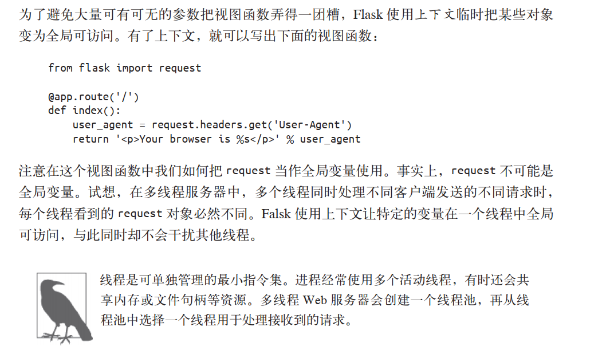
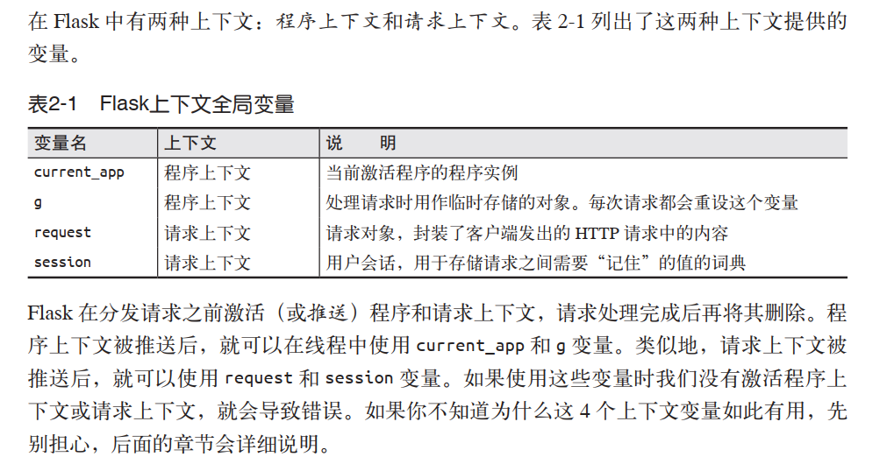
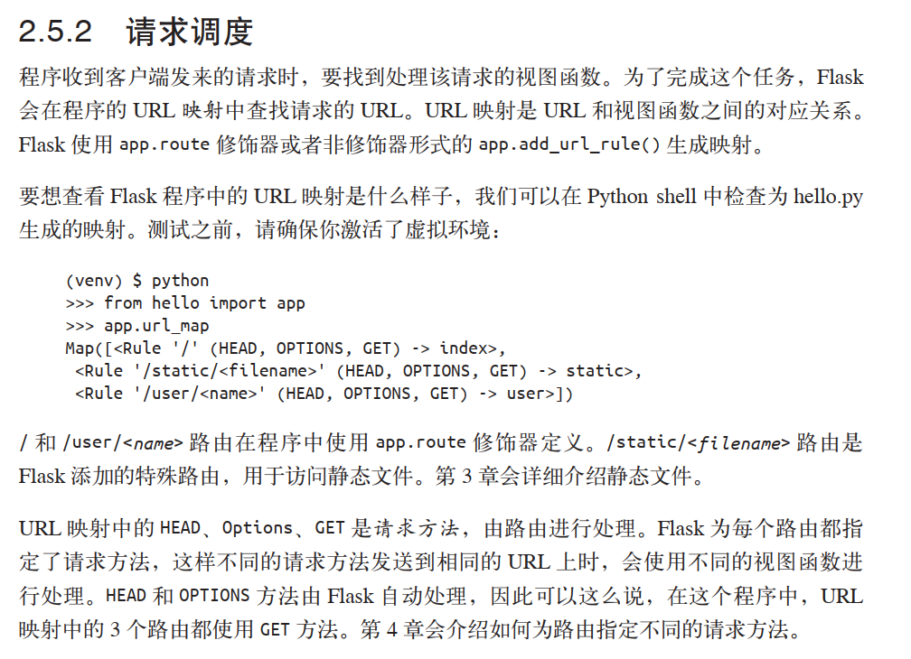
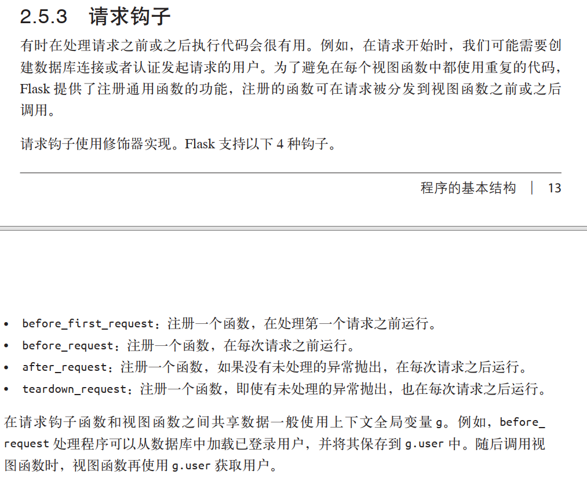
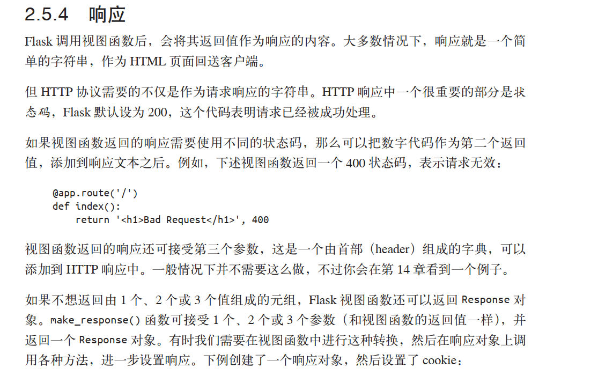
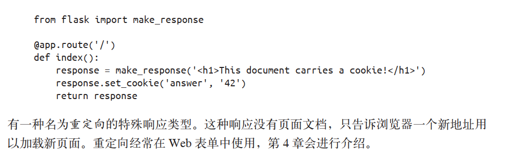
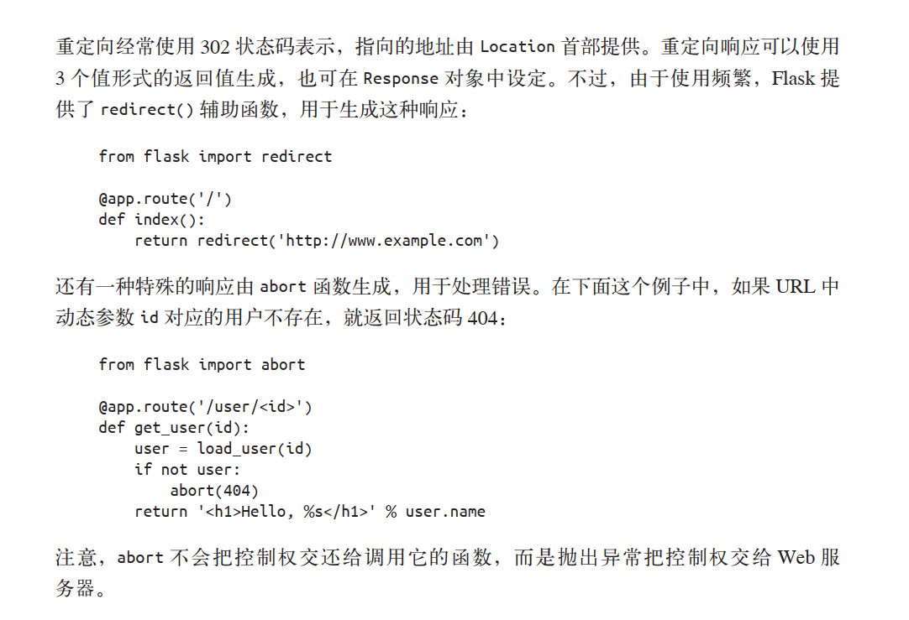
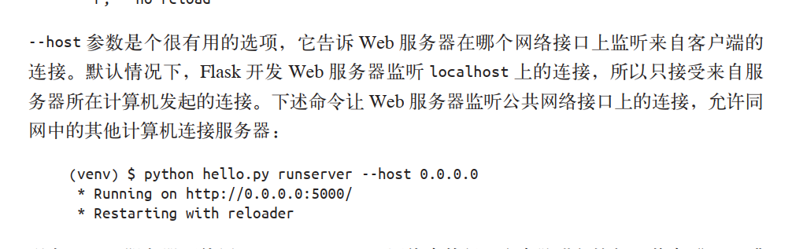
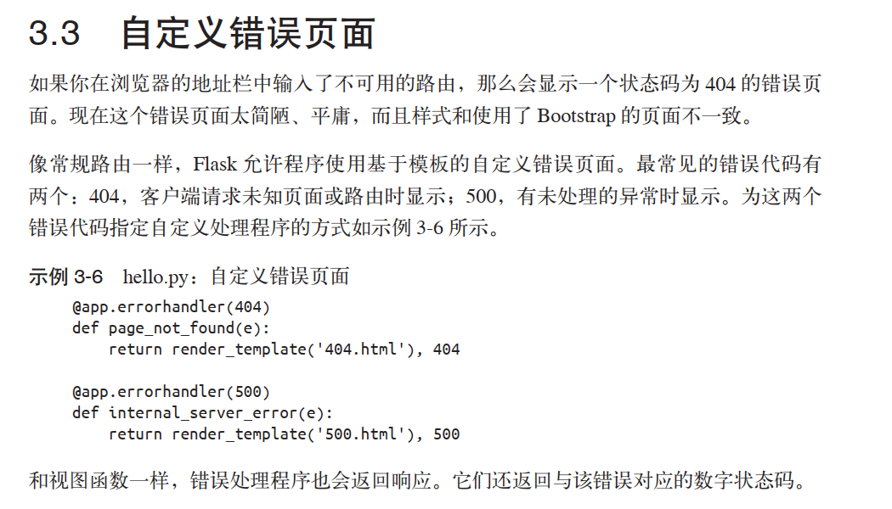
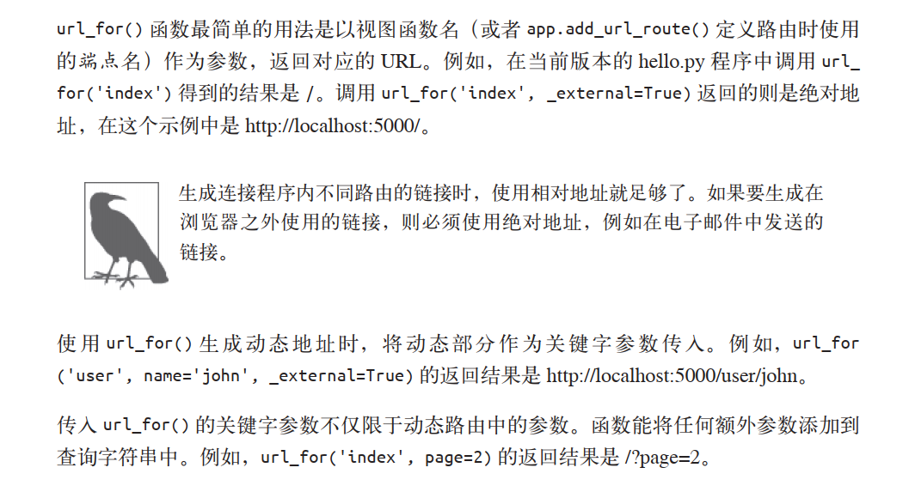

## 程序基本结构

### 1. Flask两个主要依赖

- Werkzeug: 提供路由、调试和web接口（web servver gateway interface, WSGI）子系统

- Jinjia2： 提供模板系统

  **flask 不原生支持数据库访问、web表单验证和用户认证等高级功能，在flask中这些服务都以扩展的形式实现，然后再与核心包集成**

### 2.@app.route修饰器

- 把修饰的函数注册为路由
- 修饰器是 Python 语言的标准特性，可以使用不同的方式修改函数的行为。惯常用法是使用修饰器把函数注册为事件的处理程序。  
- @app.route('/user/<name>')  动态路由，带尖括号

### 3.启动服务器

- ```python
  if __name__ == '__main__':
  	app.run(debug=True)
  ```

- __name__=='__main__' 是 Python 的惯常用法，在这里确保直接执行这个脚本时才启动开发Web 服务器。 如果这个脚本由其他脚本引入，程序假定父级脚本会启动不同的服务器，因此不会执行 app.run()  

- Flask 提供的 Web 服务器不适合在生产环境中使用。第 17 章会介绍生产环境 Web 服务器。  

### 4. Flask 上下文全局变量

- 

- 

- 

### 5. 请求调度

- 

- 视图函数 指被 @app.route修饰器修饰的函数

### 6.请求钩子

- 

### 7. 响应

- 三个返回值：数据，状态码，header
- make_response   & redirect & abort

- 

- 

- 

### 8.扩展 使用flask-script 支持命令行选项

- manager.run(app)

- python hello.py runserver --host 0.0.0.0
- 

## 模板

### 1.jinja2

### 2.bootstrap

### 3.自定义错误页面

- @app.errorhandler(500)
- 

### 4.链接

- url_for
- 

### 5. 静态文件

### 6.使用flask-moment本地化日期和时间

- flask-moment是flask程序扩展，能把moment.js（可以渲染日期和时间）集成到jinja2模板中

## web 表单

- 表单
- 重定向
- flash消息

## 数据库

### SQL数据库

### NoSQL