# Analysis 与 Analzer

- 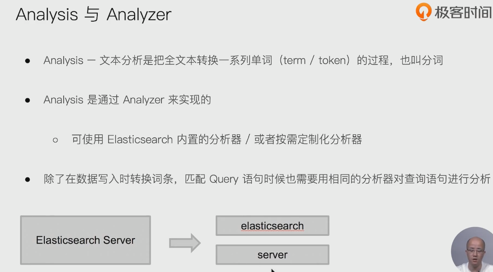

- 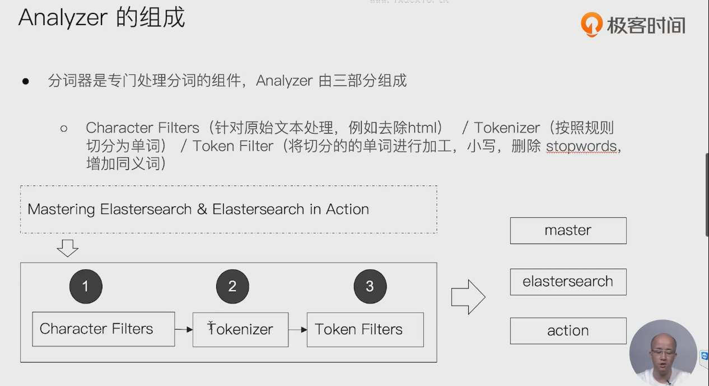

- 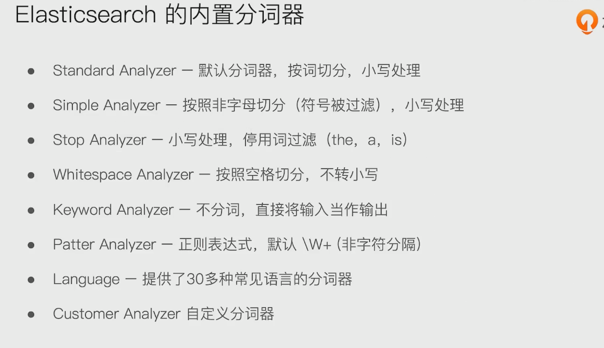

# 使用Analyzer


- 使用这个测试分词器的作用方式

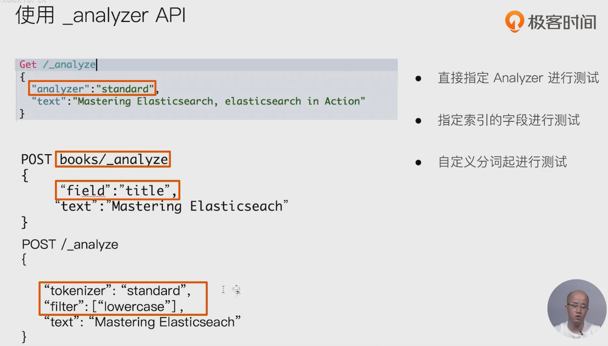

- ```json
  GET /_analyze
  {
    "analyzer": "english"
    , "text": "2 mastering the running  in elasticsearch brown-fax, Elasticsearch in action"
  }
  ```

  

## standard Analyzer: 

- es默认的分词器

- 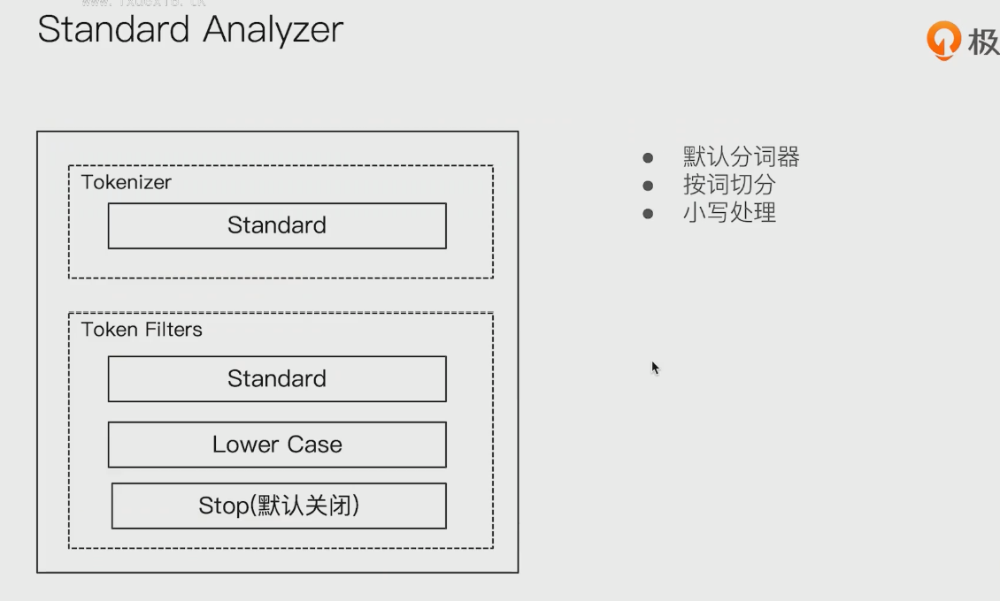

## simple Analyzer

- 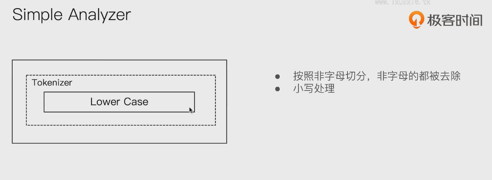

## whitespace analyzer

- 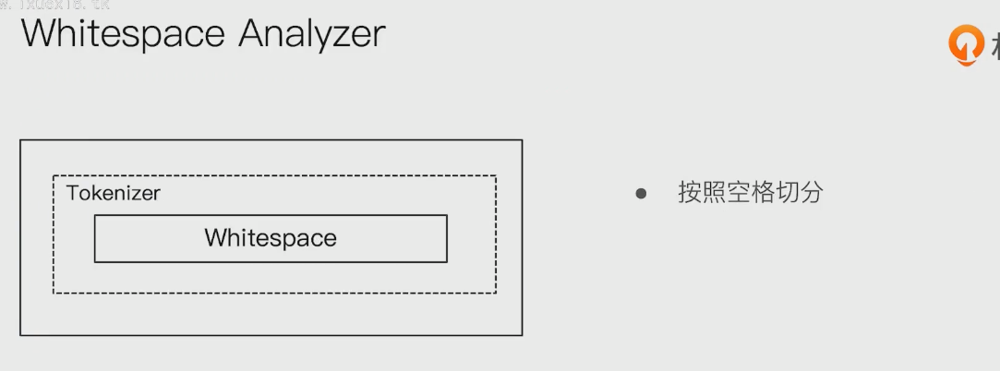

## stop analyzer

- 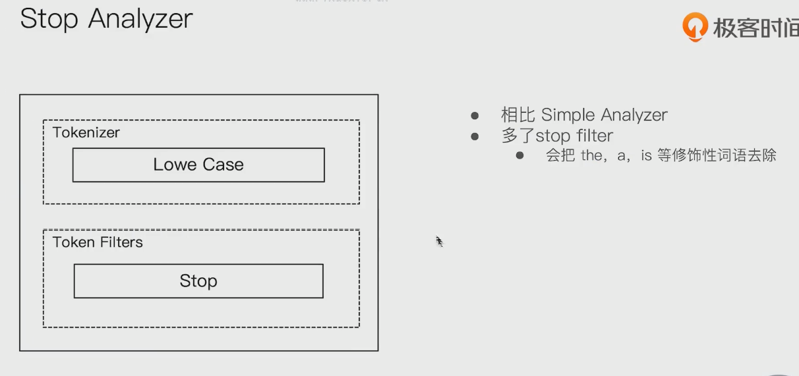

## keyword analyzer

- 

## pattern analyzer

- 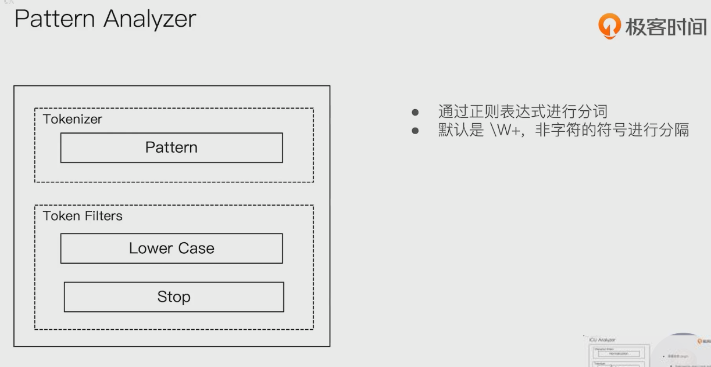

## language Analyzer

- 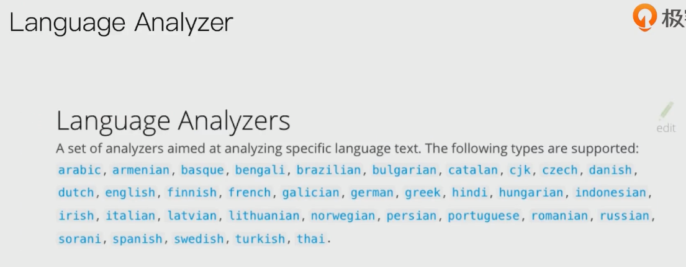


# 中文分词的难点

- 中文句子，切分成一个一个词（不是一个个字）
- 英文中，单词有自然的空格作为分隔
- 一句中文，在不同的上下文，有不同的理解
  - 这个苹果，不大好吃/ 这个苹果，不大，好吃！
- 一些例子
  - 他说的确实在理 / 这事的确定不下来

## icu analyzer

- 

## 更多的中文分词器

- 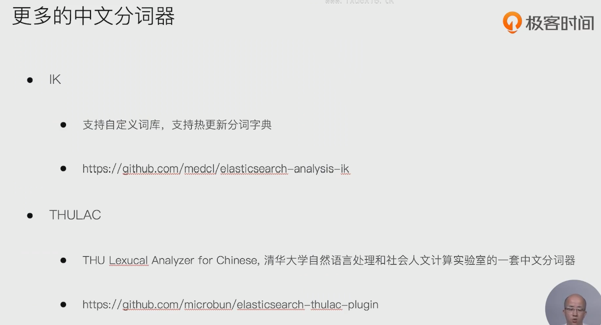

- Analyzer: `ik_smart` , ik_max_word
- 