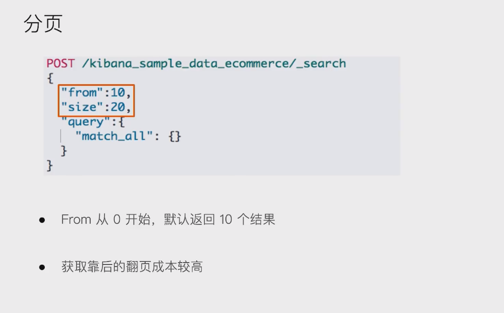
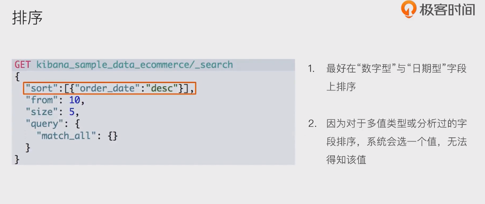

# Request Body Search


## 分页

- 

  

## 排序

- 

## source filtering : 过滤要返回的信息

- 

- ```
  POST kibana_sample_data_ecommerce/_search
  {
    "_source": ["order_date"],
    "query": {
      "match_all": {}
    }
  }
  
  ```

- 

## 脚本字段

- 

## 使用查询表达式 - Match

- 默认 是or的关系。加个operator就是都满足这两个单词

- 

## 短语搜索

- 

  ```
  POST movies/_search
  {
    "query": {
      "match_phrase": {
        "title": {
          "query": "one love",
          "slop": 1  # 表示可以有一个间隔
        }
      }
    }
  }
  ```

  