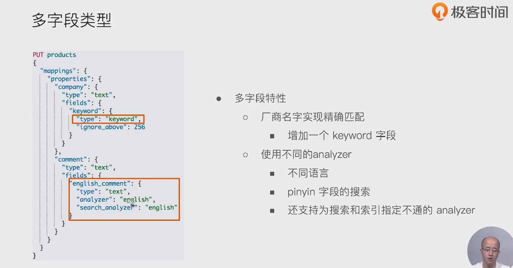
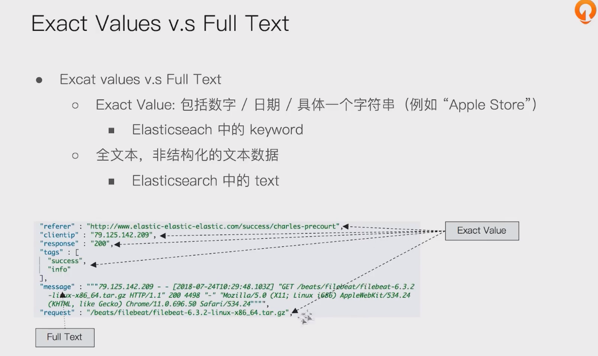
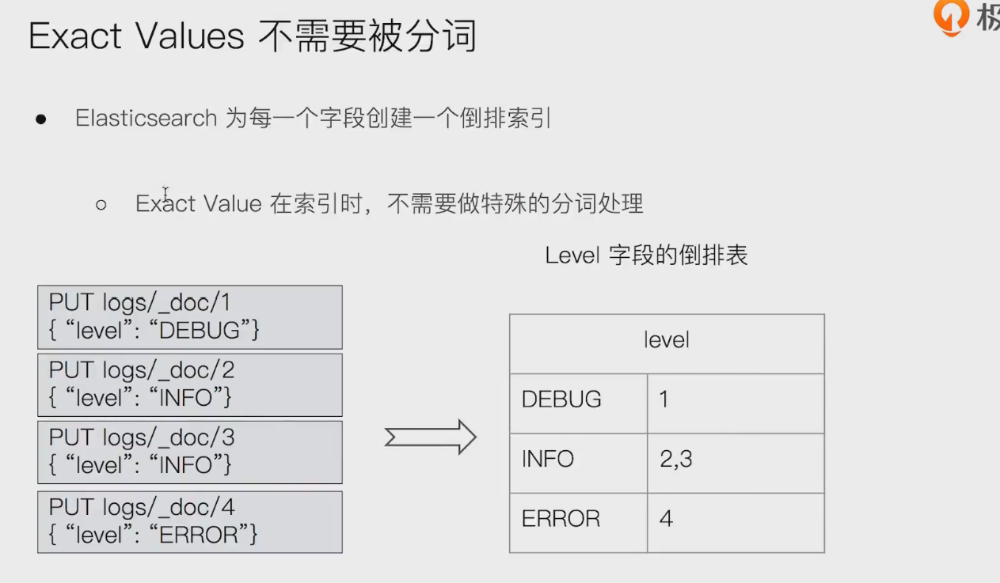
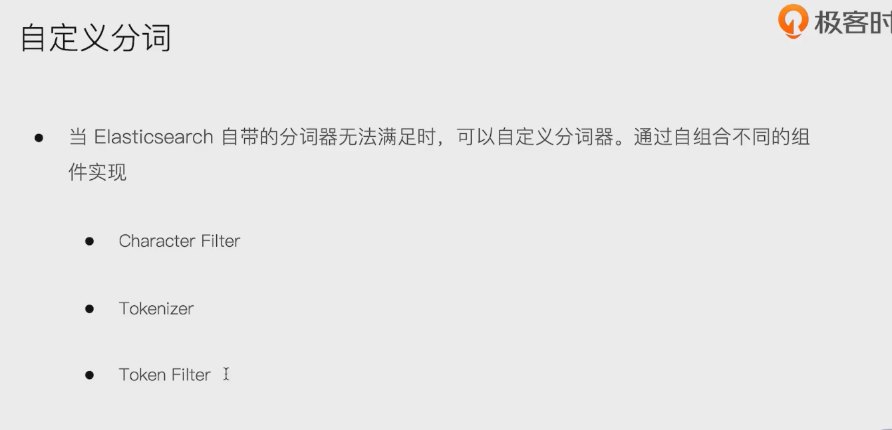
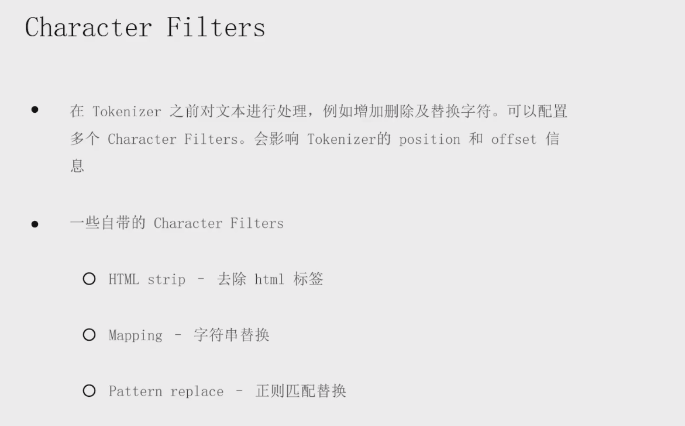
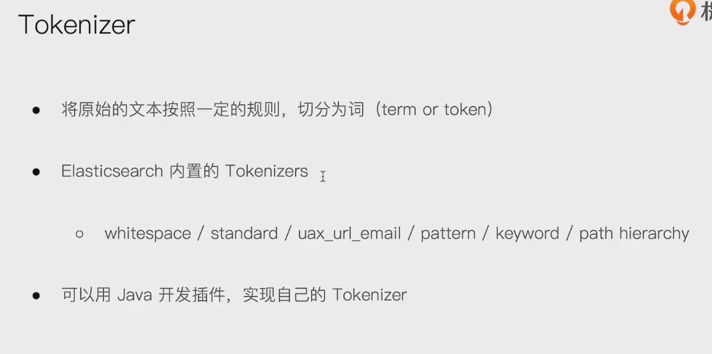
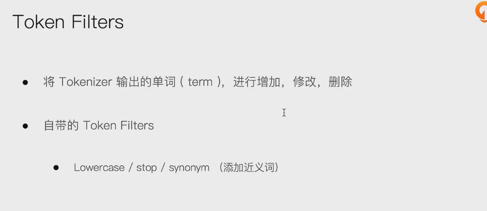
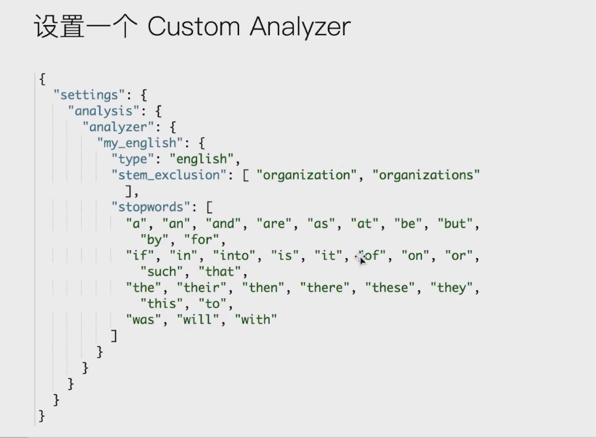

# 多字段类型

- 

# exact values VS  Full text

- 

## exact values 不需要被分词

- 

# 自定义分词

- 
- character filters
  - 
  - 

- tokenizer
  - 

- token filters
  - 

## 设置一个自定义分词器

- 具体看教程 有示例

- 

```
PUT logs/_doc/1
{"level":"DEBUG"}

GET /logs/_mapping

POST _analyze
{
  "tokenizer":"keyword",
  "char_filter":["html_strip"],
  "text": "<b>hello world</b>"
}


POST _analyze
{
  "tokenizer":"path_hierarchy",
  "text":"/user/ymruan/a/b/c/d/e"
}


#使用char filter进行替换
POST _analyze
{
  "tokenizer": "standard",
  "char_filter": [
      {
        "type" : "mapping",
        "mappings" : [ "- => _"]
      }
    ],
  "text": "123-456, I-test! test-990 650-555-1234"
}

//char filter 替换表情符号
POST _analyze
{
  "tokenizer": "standard",
  "char_filter": [
      {
        "type" : "mapping",
        "mappings" : [ ":) => happy", ":( => sad"]
      }
    ],
    "text": ["I am felling :)", "Feeling :( today"]
}

// white space and snowball
GET _analyze
{
  "tokenizer": "whitespace",
  "filter": ["stop","snowball"],
  "text": ["The gilrs in China are playing this game!"]
}


// whitespace与stop
GET _analyze
{
  "tokenizer": "whitespace",
  "filter": ["stop","snowball"],
  "text": ["The rain in Spain falls mainly on the plain."]
}


//remove 加入lowercase后，The被当成 stopword删除
GET _analyze
{
  "tokenizer": "whitespace",
  "filter": ["lowercase","stop","snowball"],
  "text": ["The gilrs in China are playing this game!"]
}

//正则表达式
GET _analyze
{
  "tokenizer": "standard",
  "char_filter": [
      {
        "type" : "pattern_replace",
        "pattern" : "http://(.*)",
        "replacement" : "$1"
      }
    ],
    "text" : "http://www.elastic.co"
}


```

