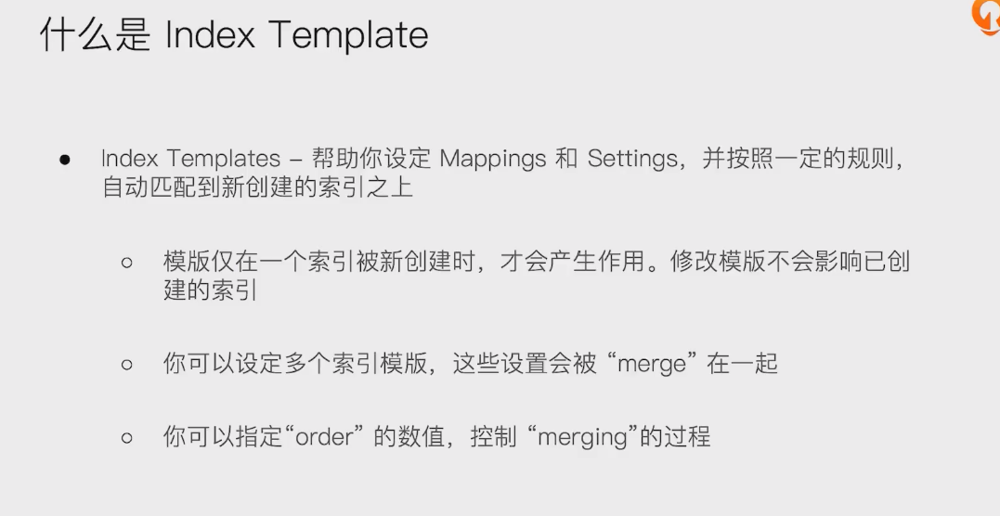
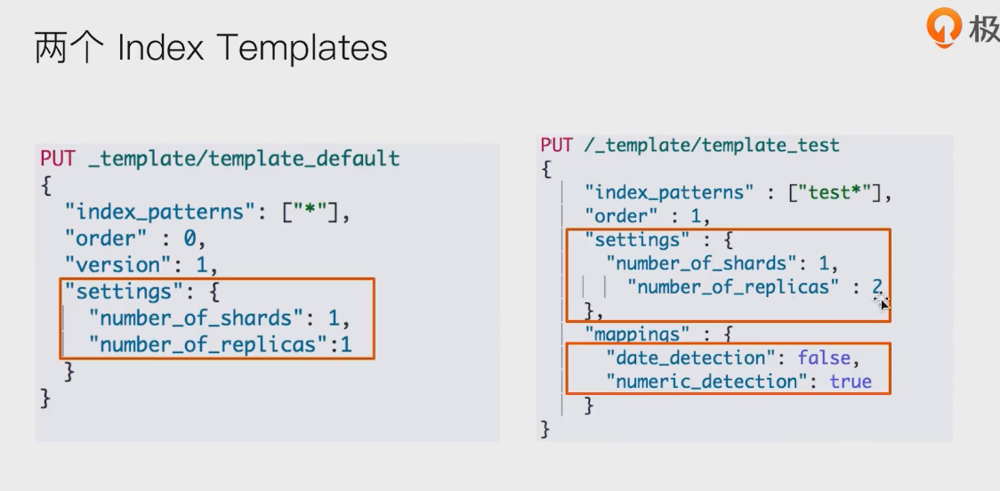
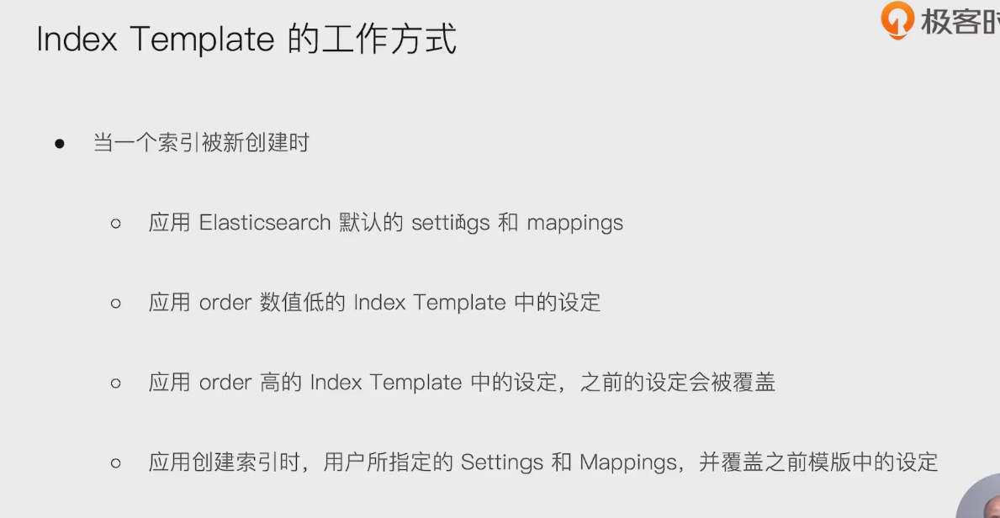
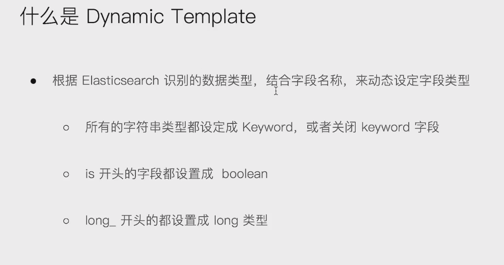
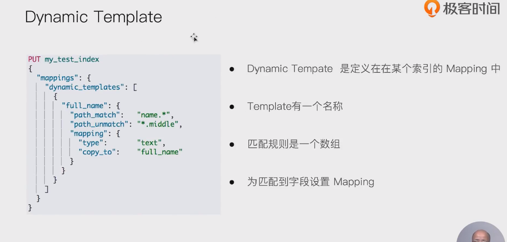

# 什么是index template

- 
- 

- 


# 什么是Dynamic Template

- 

- 

```

#数字字符串被映射成text，日期字符串被映射成日期
PUT ttemplate/_doc/1
{
	"someNumber":"1",
	"someDate":"2019/01/01"
}
GET ttemplate/_mapping


#Create a default template
PUT _template/template_default
{
  "index_patterns": ["*"],
  "order" : 0,
  "version": 1,
  "settings": {
    "number_of_shards": 1,
    "number_of_replicas":1
  }
}


PUT /_template/template_test
{
    "index_patterns" : ["test*"],
    "order" : 1,
    "settings" : {
    	"number_of_shards": 1,
        "number_of_replicas" : 2
    },
    "mappings" : {
    	"date_detection": false,
    	"numeric_detection": true
    }
}

#查看template信息
GET /_template/template_default
GET /_template/temp*


#写入新的数据，index以test开头
PUT testtemplate/_doc/1
{
	"someNumber":"1",
	"someDate":"2019/01/01"
}
GET testtemplate/_mapping
get testtemplate/_settings

PUT testmy
{
	"settings":{
		"number_of_replicas":5
	}
}

put testmy/_doc/1
{
  "key":"value"
}

get testmy/_settings
DELETE testmy
DELETE /_template/template_default
DELETE /_template/template_test


#Dynaminc Mapping 根据类型和字段名
DELETE my_index

PUT my_index/_doc/1
{
  "firstName":"Ruan",
  "isVIP":"true"
}

GET my_index/_mapping
DELETE my_index
PUT my_index
{
  "mappings": {
    "dynamic_templates": [
            {
        "strings_as_boolean": {
          "match_mapping_type":   "string",
          "match":"is*",
          "mapping": {
            "type": "boolean"
          }
        }
      },
      {
        "strings_as_keywords": {
          "match_mapping_type":   "string",
          "mapping": {
            "type": "keyword"
          }
        }
      }
    ]
  }
}


DELETE my_index
#结合路径
PUT my_index
{
  "mappings": {
    "dynamic_templates": [
      {
        "full_name": {
          "path_match":   "name.*",
          "path_unmatch": "*.middle",
          "mapping": {
            "type":       "text",
            "copy_to":    "full_name"
          }
        }
      }
    ]
  }
}


PUT my_index/_doc/1
{
  "name": {
    "first":  "John",
    "middle": "Winston",
    "last":   "Lennon"
  }
}

GET my_index/_search?q=full_name:John
```

