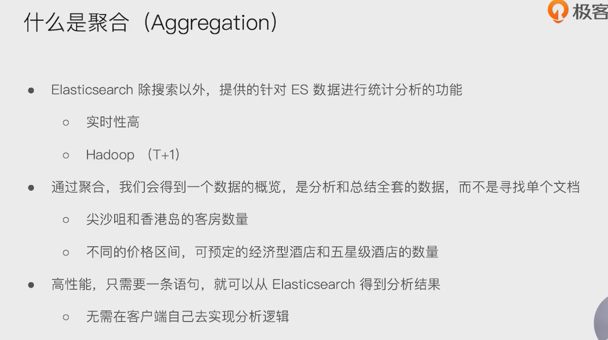
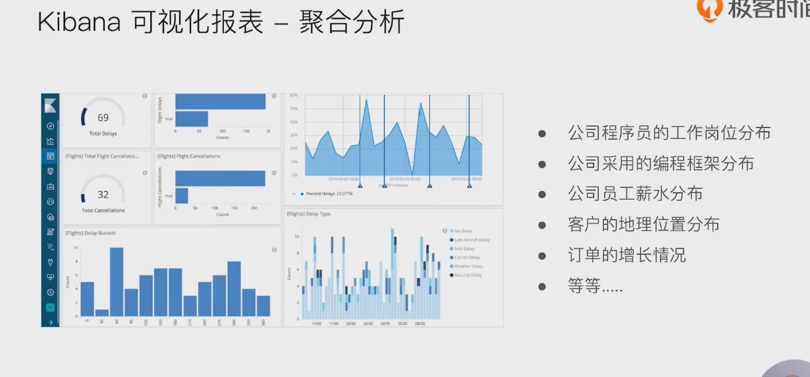
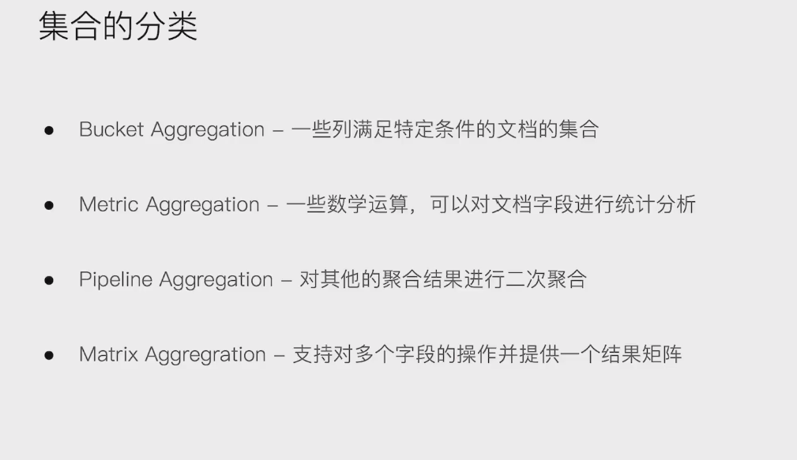
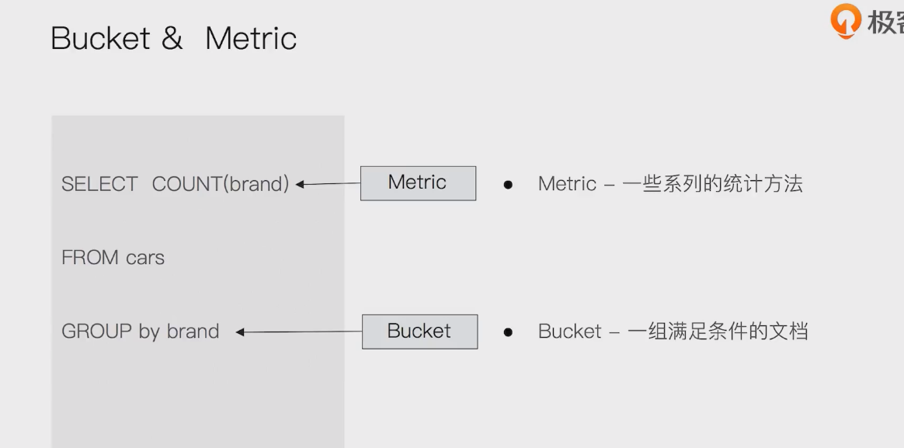
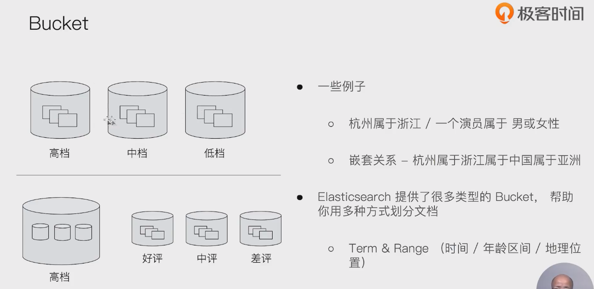
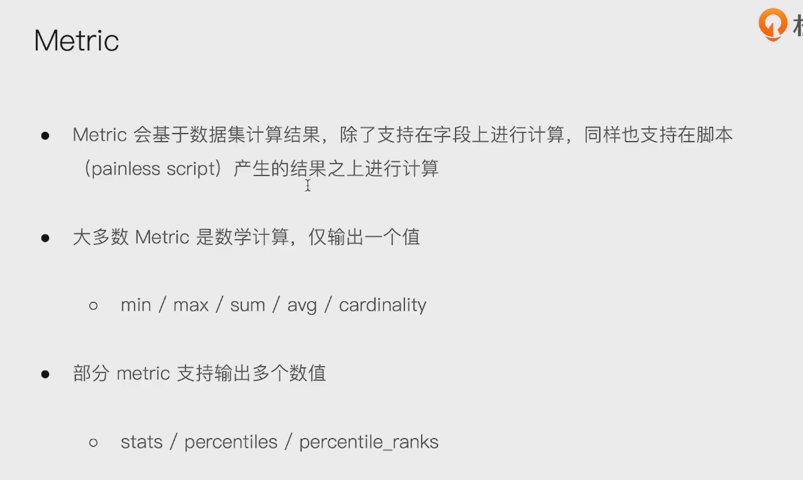
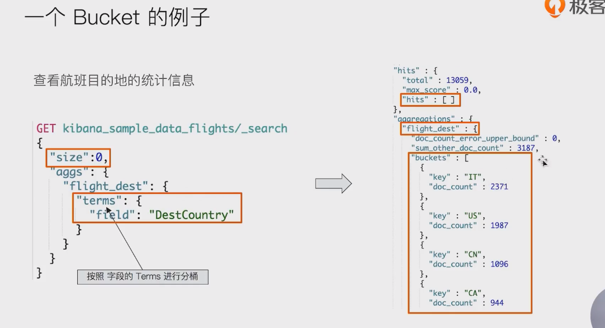
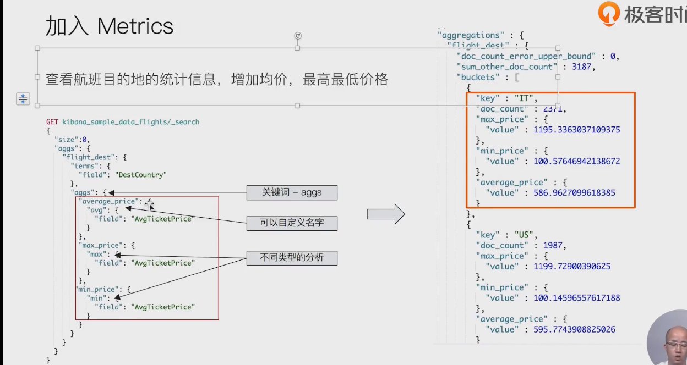
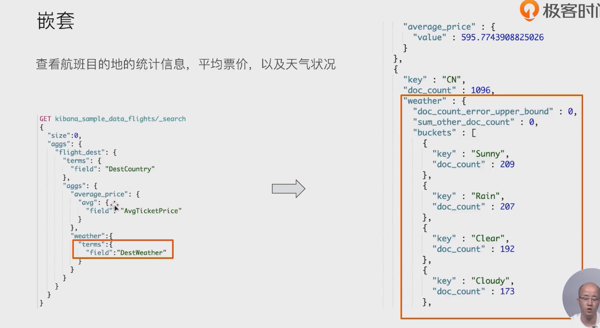
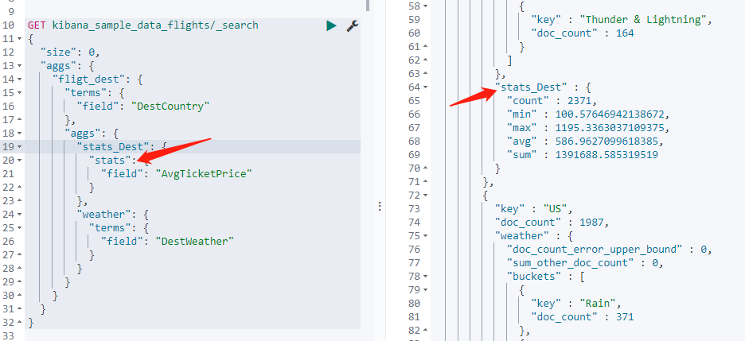

# 什么是聚合

- 
- 

## 集合的分类

- 

# bucket & metric

- 

## bucket

- 

## metric

- 



-  aggs





```
GET kibana_sample_data_flights/_search
{
  "size": 0,
  "aggs": {
    "fligt_dest": {
      "terms": {
        "field": "DestCountry"
      },
      "aggs": {
        "average_price": {
          "avg": {
            "field": "AvgTicketPrice"
          }
        },
        "weather": {
          "terms": {
            "field": "DestWeather"
          }
        }
      }
    }
  }
}
```

