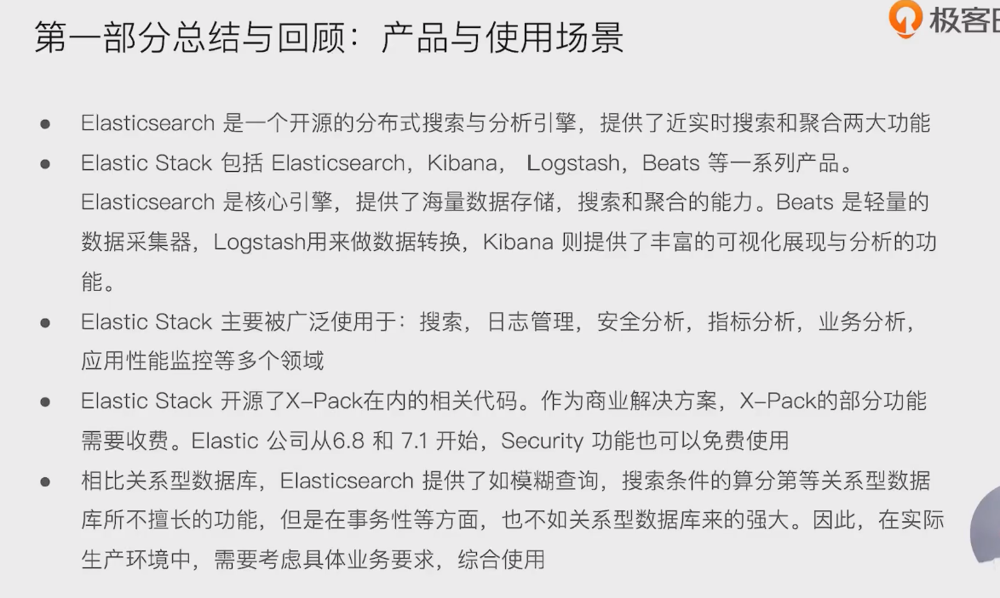
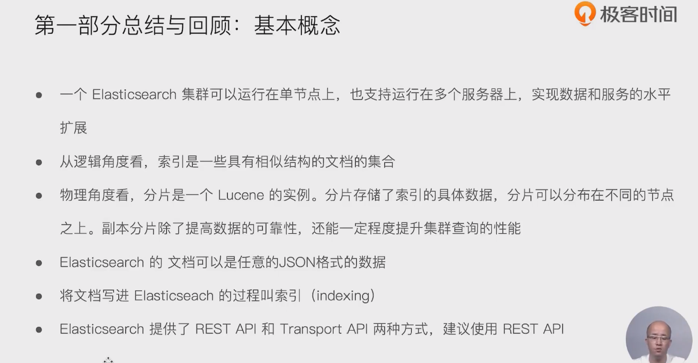
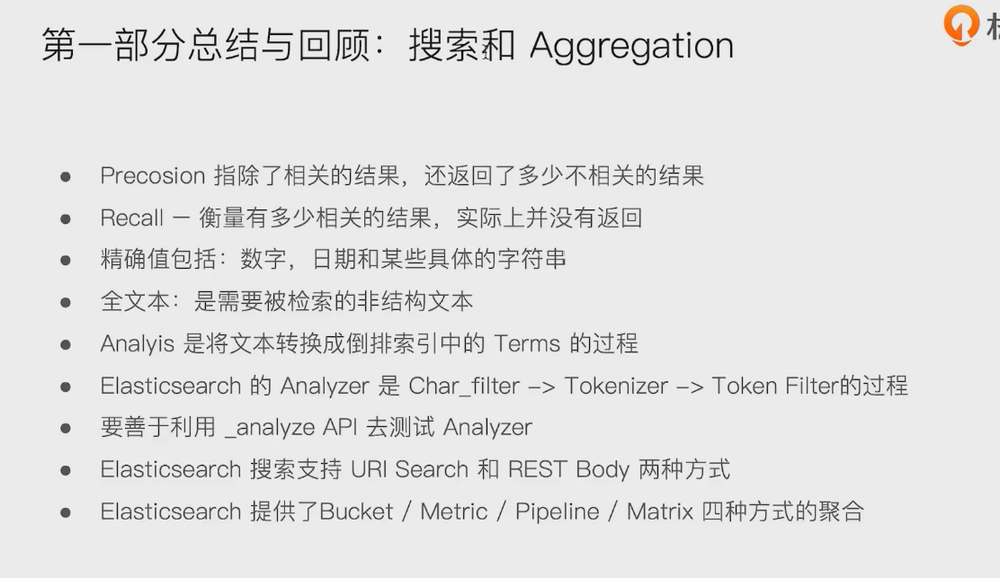
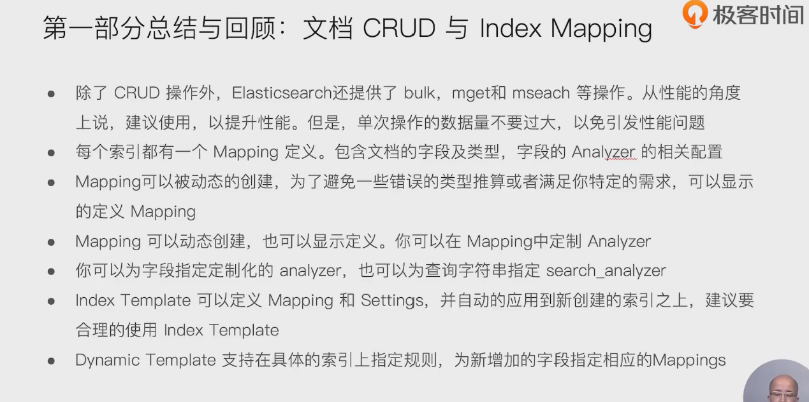
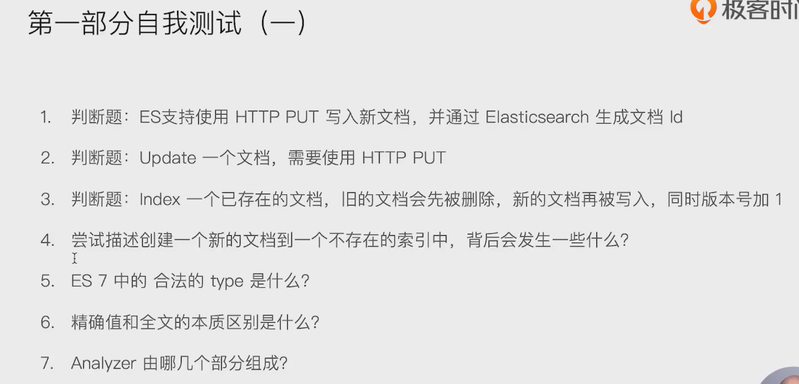
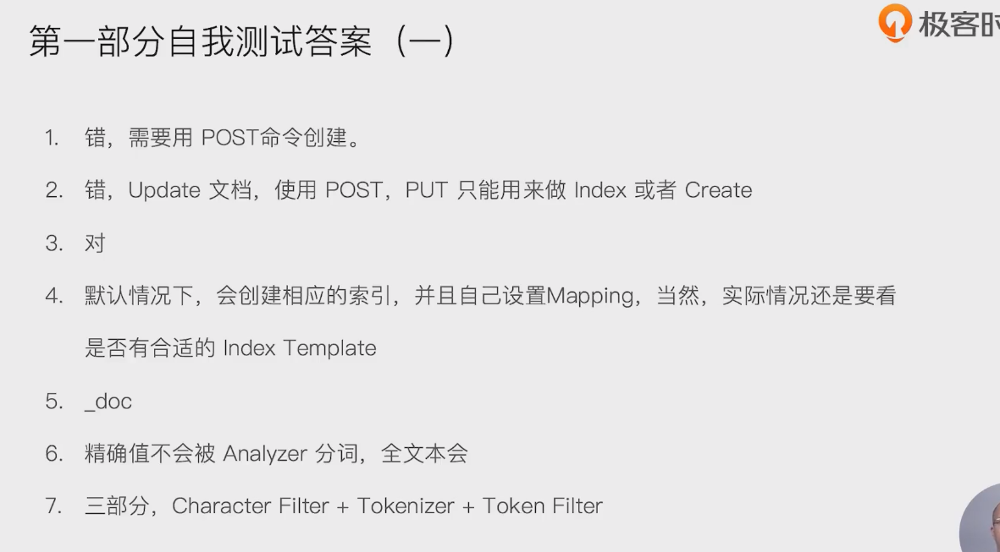
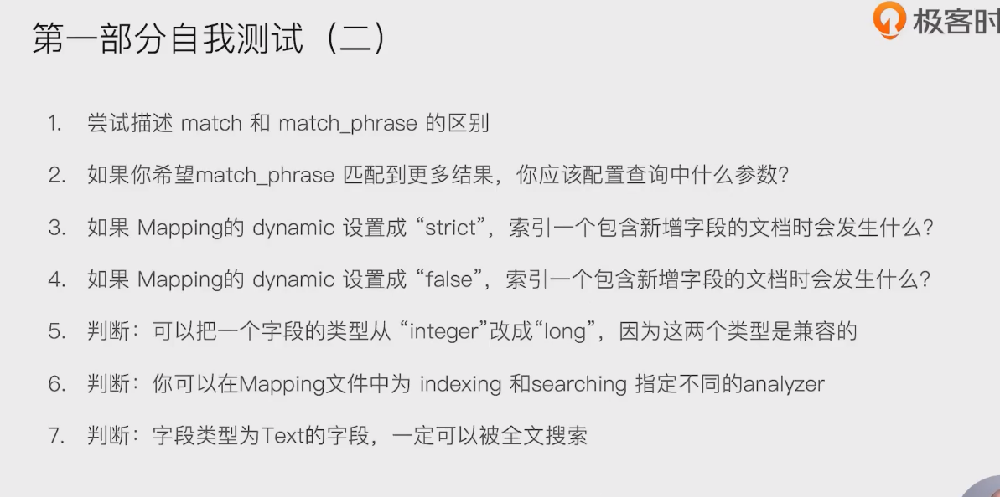
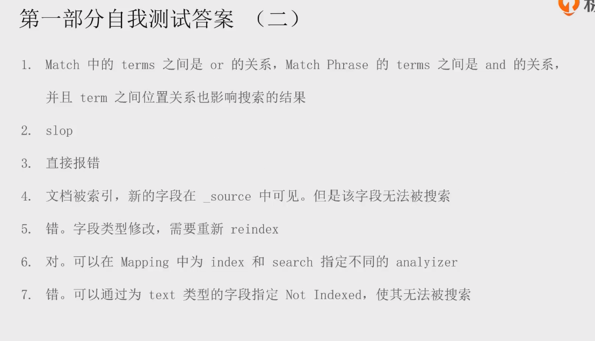

# 总结回顾

## 产品与使用场景

- 

## 基本概念

- 

## 搜索和聚合

- 

## 文档的crud 和 index mapping 

- 

## 自我测试

- 

1. 错，需要使用Post 命令创建
2. 错，用 post update
3. 对
4. 先新建索引，再把文档存入
5. _doc
6. 精确值不被分词，全文本会
7. charater filter/  tokenizer/ token filter

- 

- 

1. match 会分词查询
2. 1
3. 报错
4. 改字段没有建索引，无法通过该字段进行搜索
5. 不可以
6. 可以
7. 不可以，可以设置不索引

- 