# query context & filter context

- 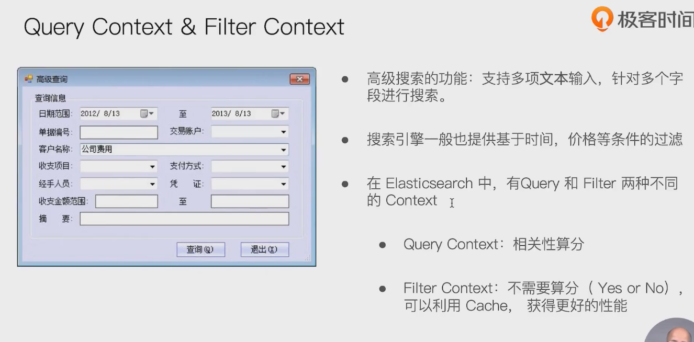
- 

# bool 查询

- 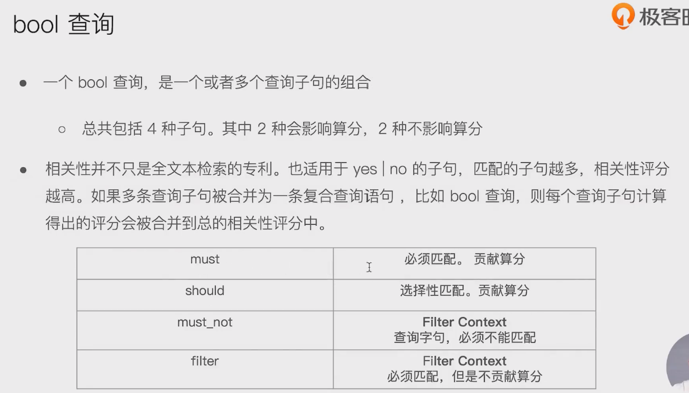
- 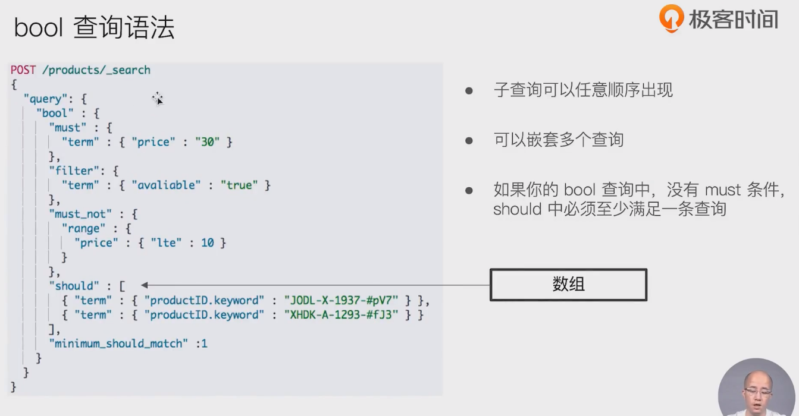

## 如何解决结构化查询 - 包含而不是相等的问题

- 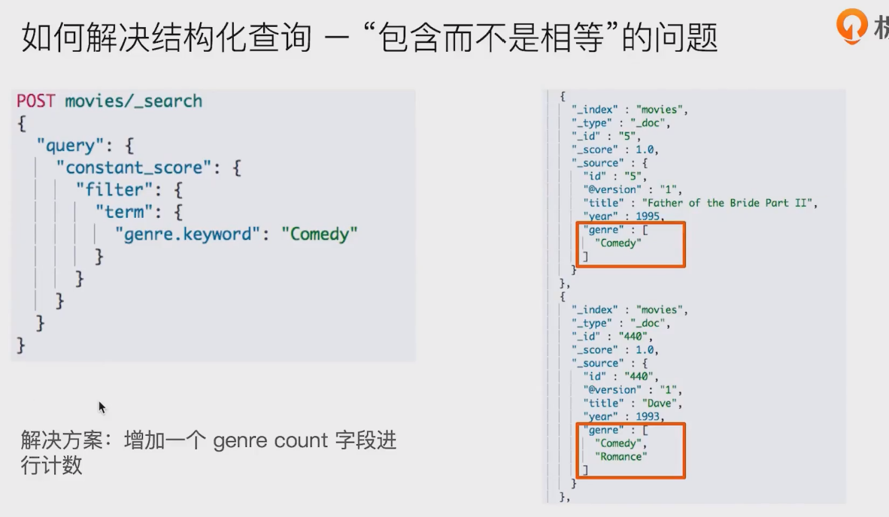

- 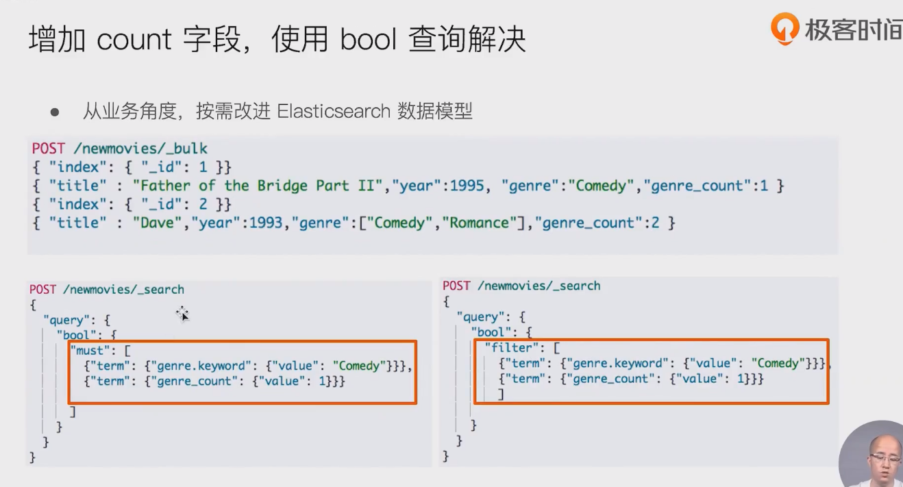

## filter context - 不影响算分

- 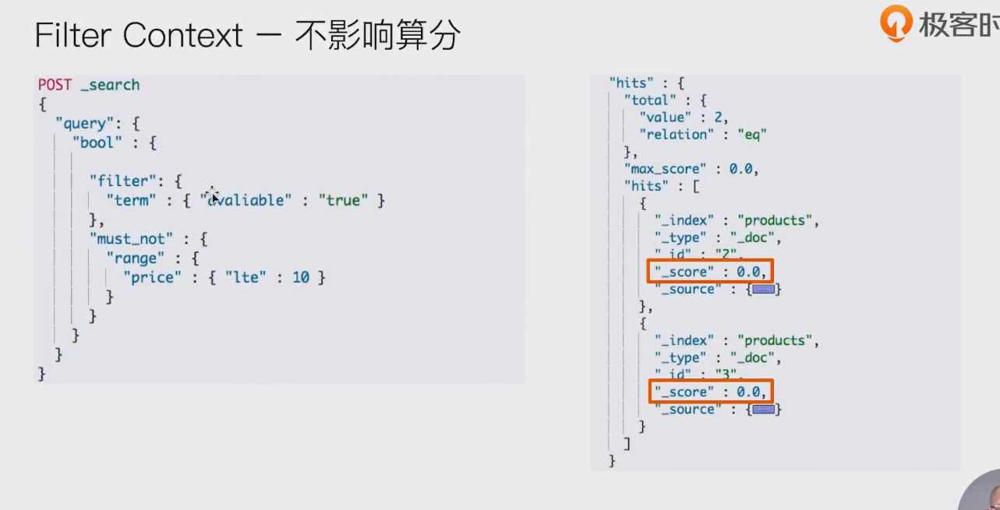

## query context -影响算分

- 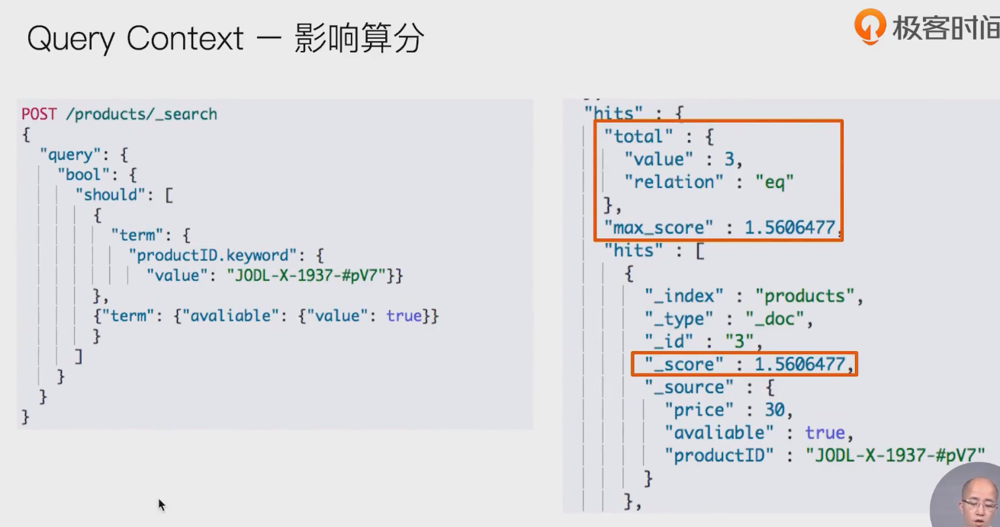
- 

## bool嵌套

- 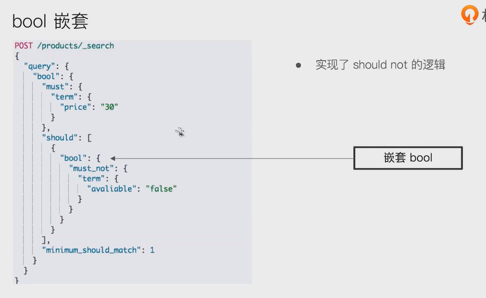

## 查询语句结构，会对相关度算分产生影响

- 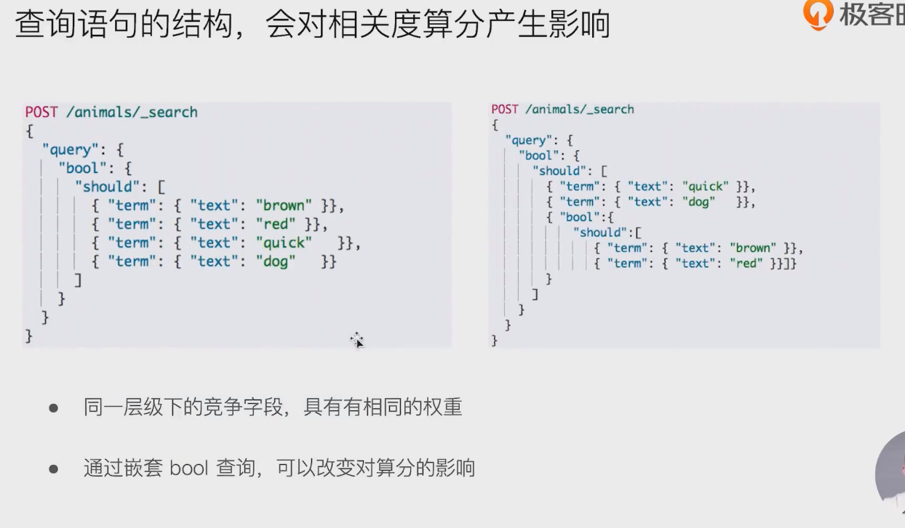

# 控制字段的boosting

- 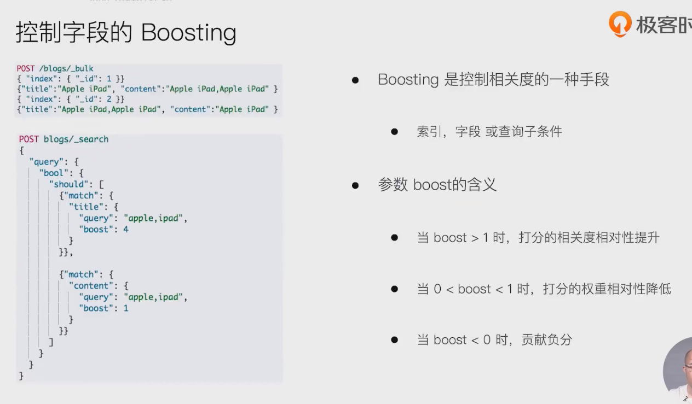

# 控制查询精确度

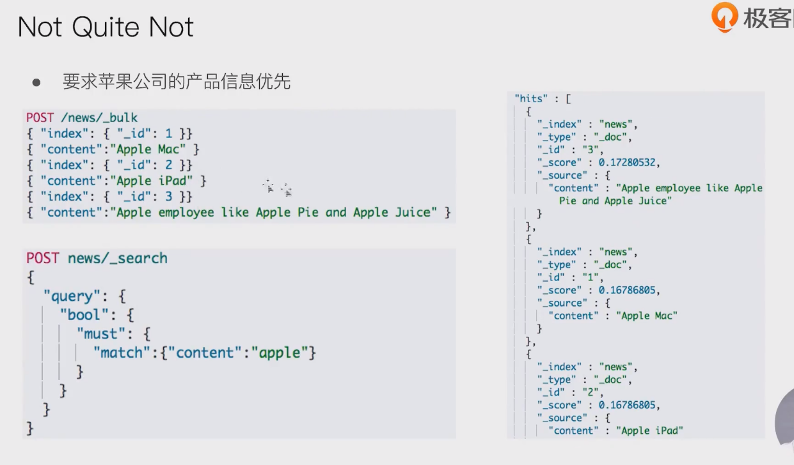

- 去掉 包含pie的

- 把 包含pie 的放在后面： 同时包含apple

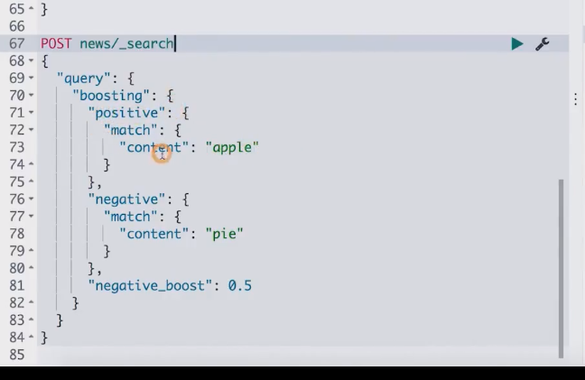

# 总结

- 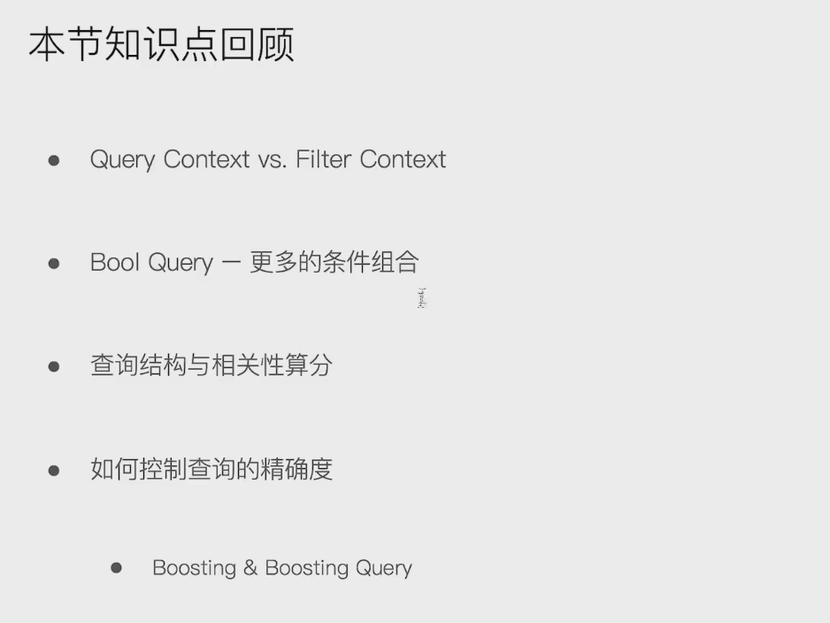