# 1.DIS-Max-Query

## 单字符串查询实例

- 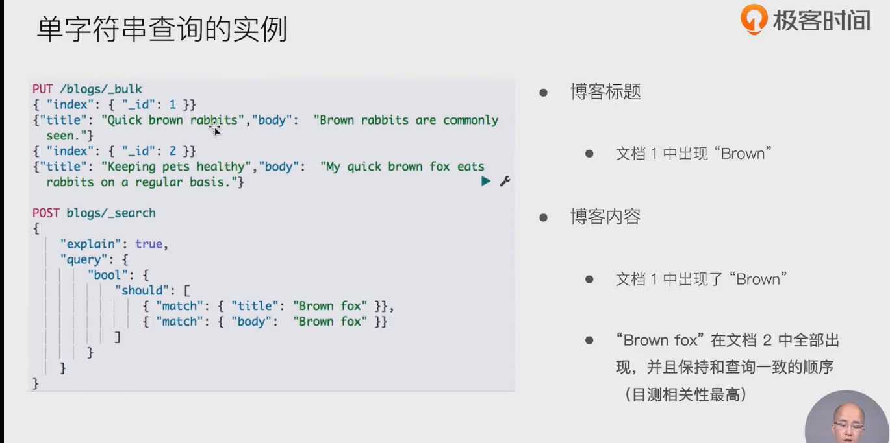

- 结果 文档1分值更高。按理文档2有 brown fox 应该分值高点。

## 算分过程

- 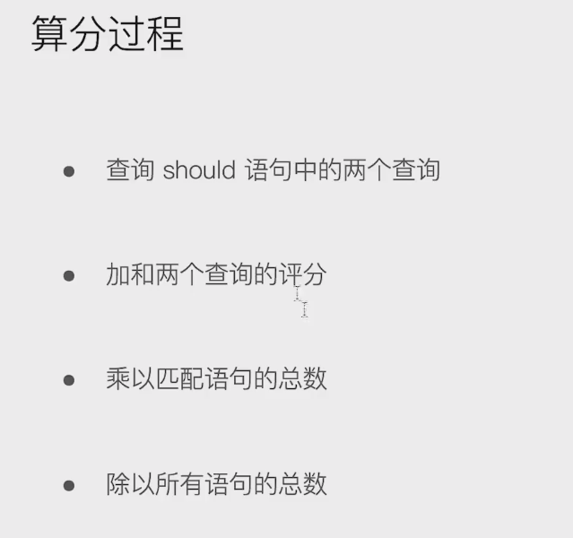

## disjunction  max query

- 找should中最佳的

- 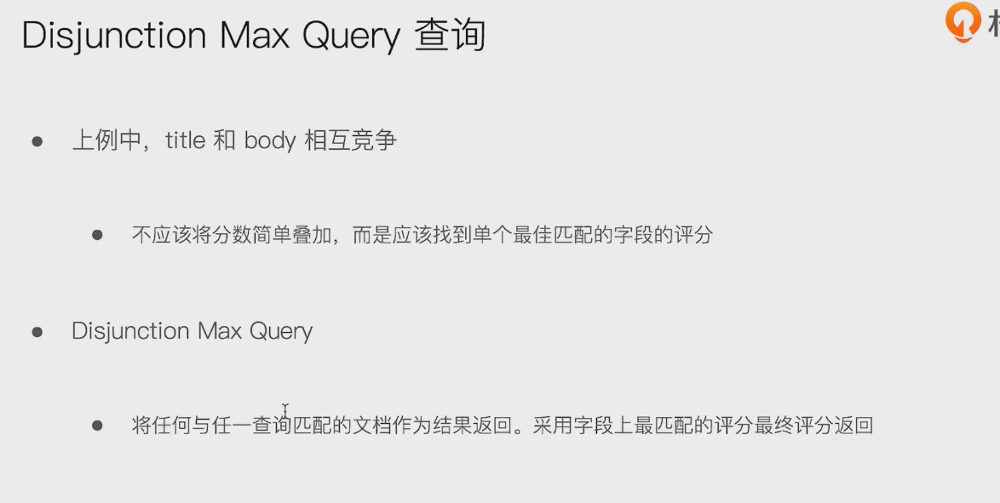

- 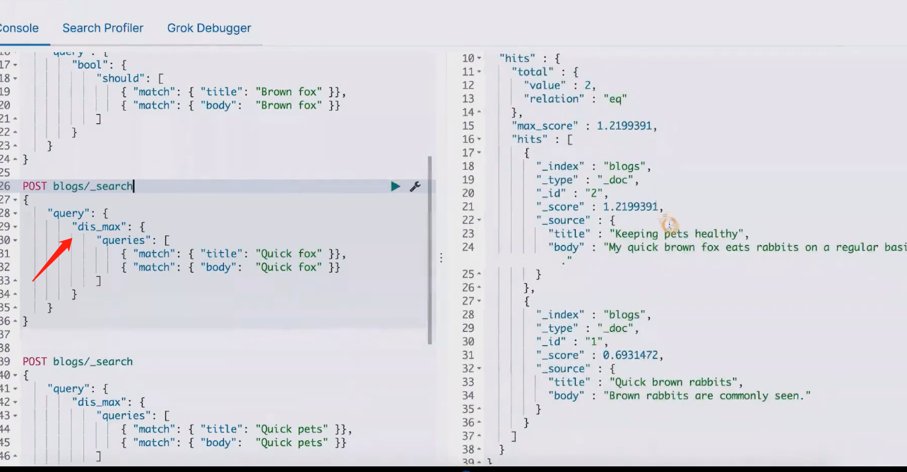

### 通过tie breaker 

- 不加这个参数，使用dis_max时，两分值一样；但语句2 title 和body有包含。通过加tie breaker

- 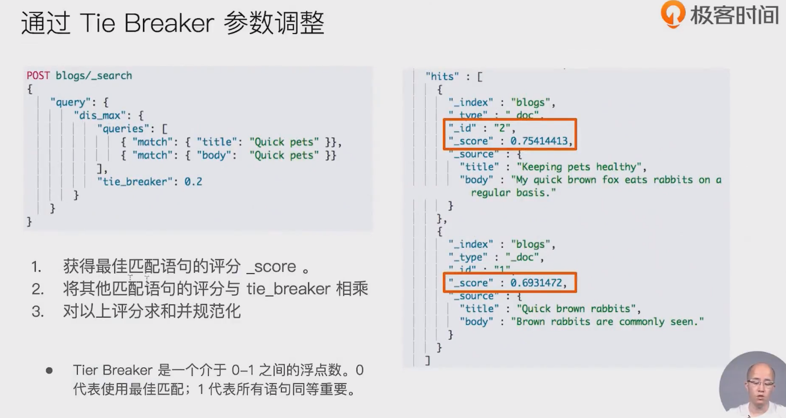

- 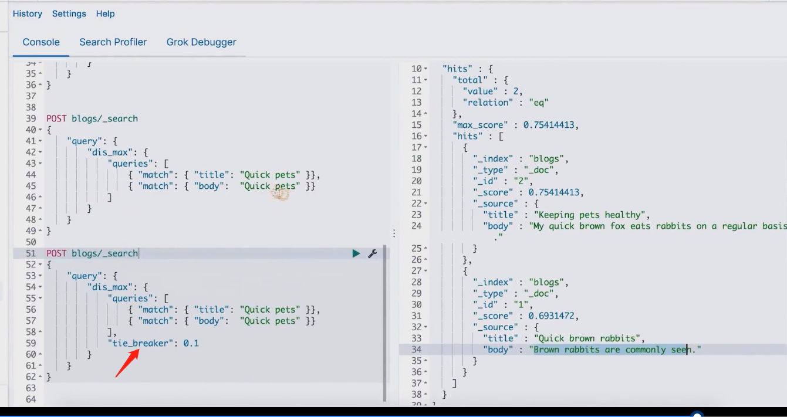

# 2.multi-match

## Best Fields / Most Fields/ Cross Fields

- 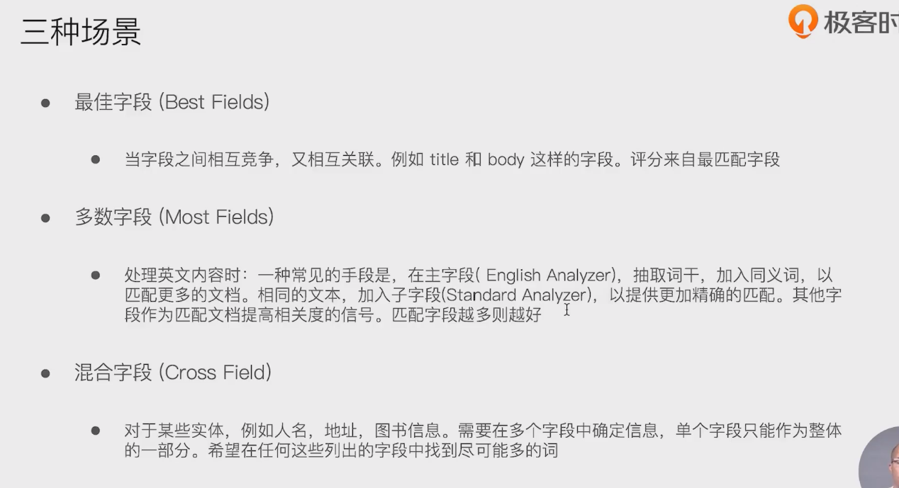

- multi match query
  - 

- 一个查询案例

  -  英文分词器 把 title 分为 bark /dogs两词

  - 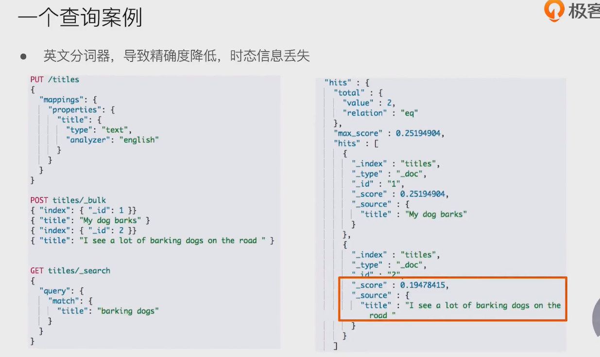

  - english + standard分词器结合

    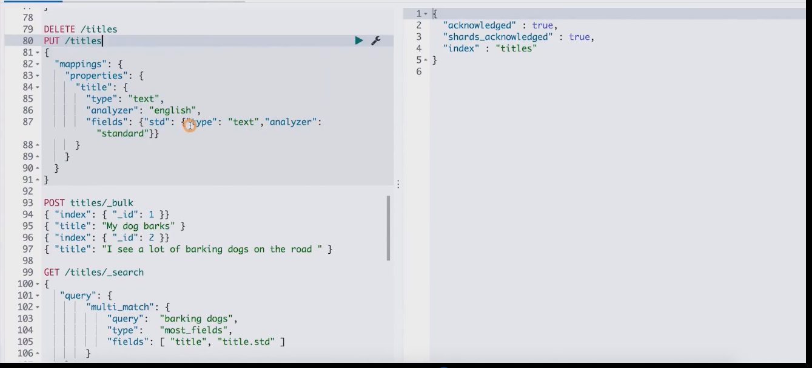

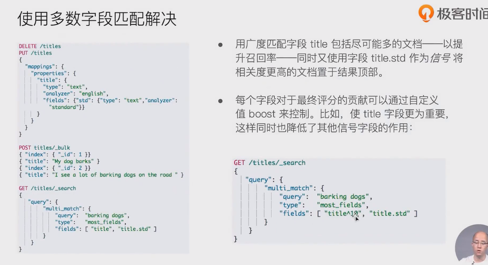

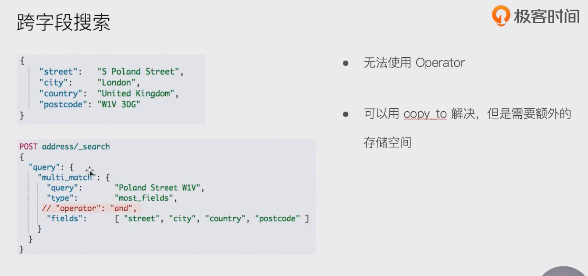

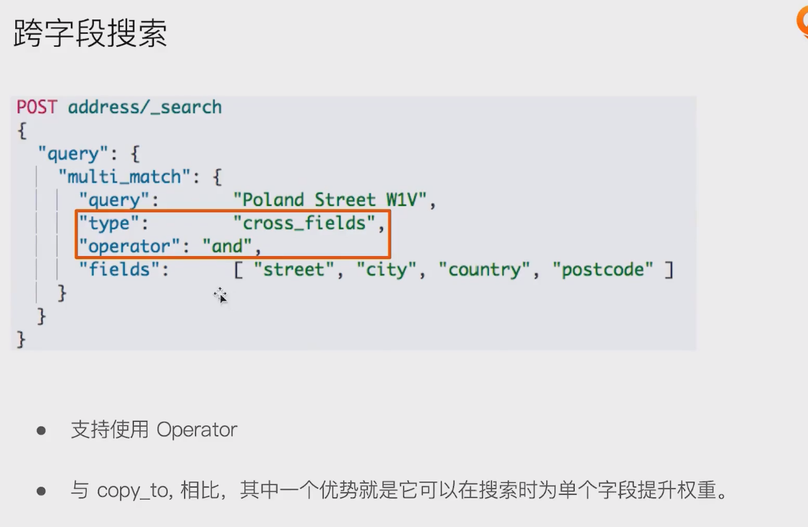