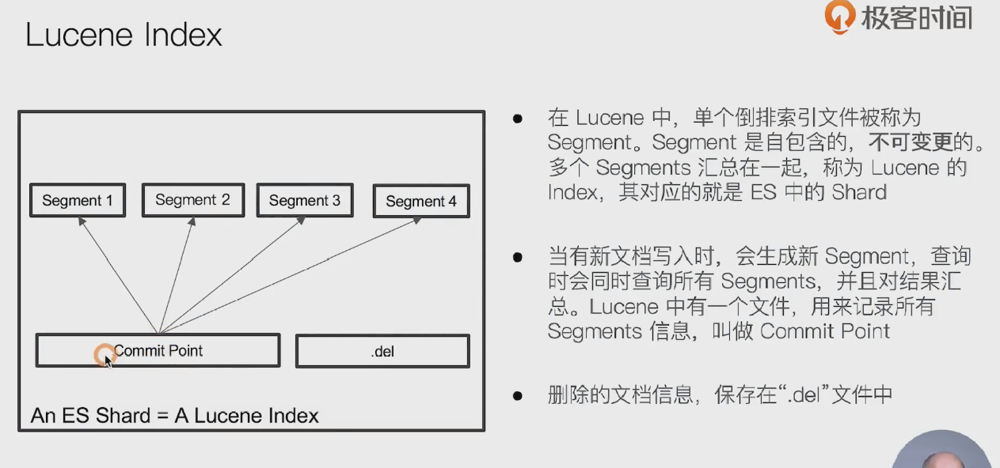

### 1.分片的内部原理

- 
- 

### 2. 倒排索引的不可变性

- 

### 3.lucene index

- 

### 4. 什么是refresh

- 
- 把index buffer 中数据存入segment的过程就是refresh, 在segment中的数据可被搜索到

### 5. 什么是Transaction Log

- 
- 断电 数据不丢失的原因，有transaction log

### 6. 什么是Flush

- 

### 7. merge 

- 