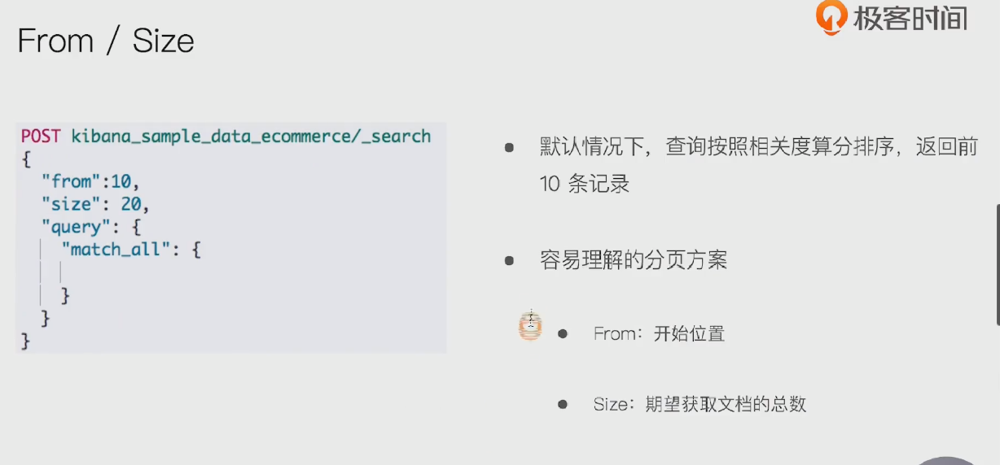
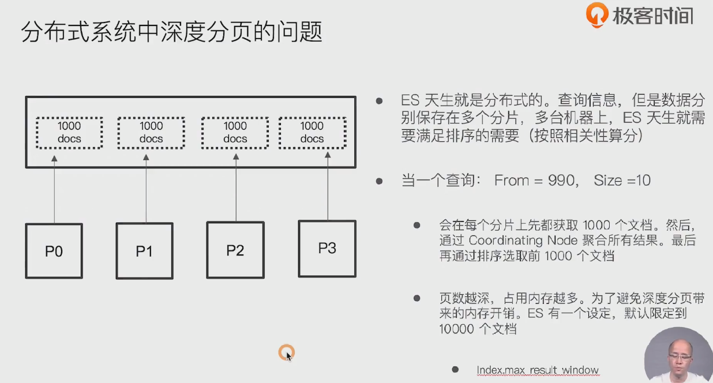
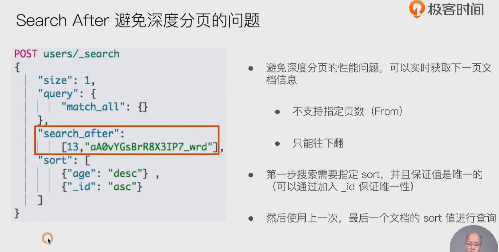
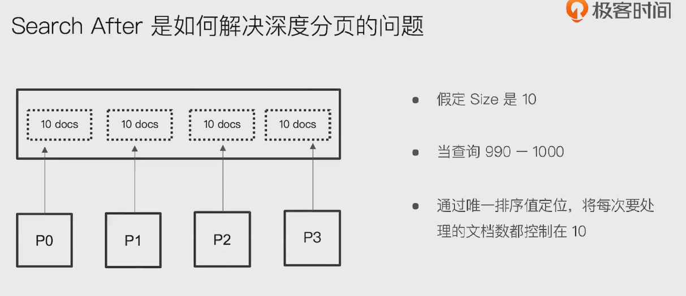
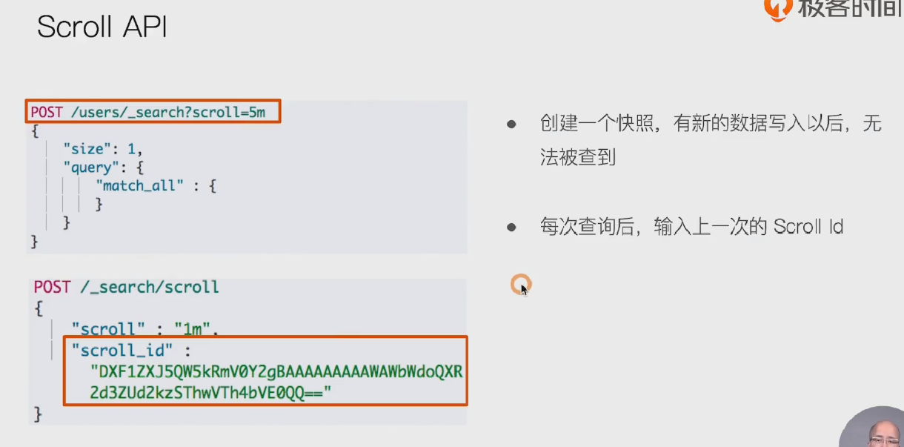
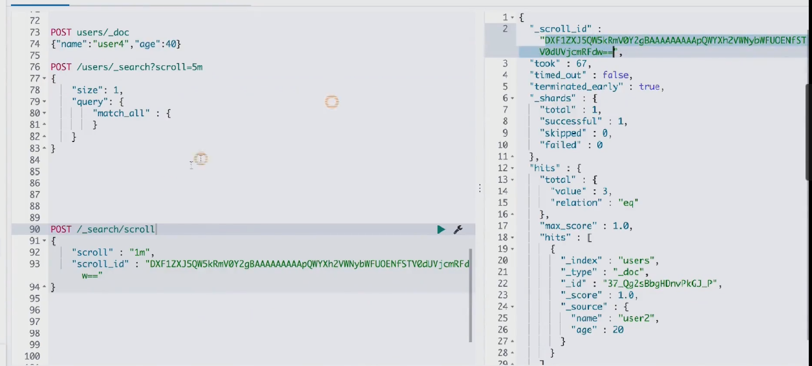
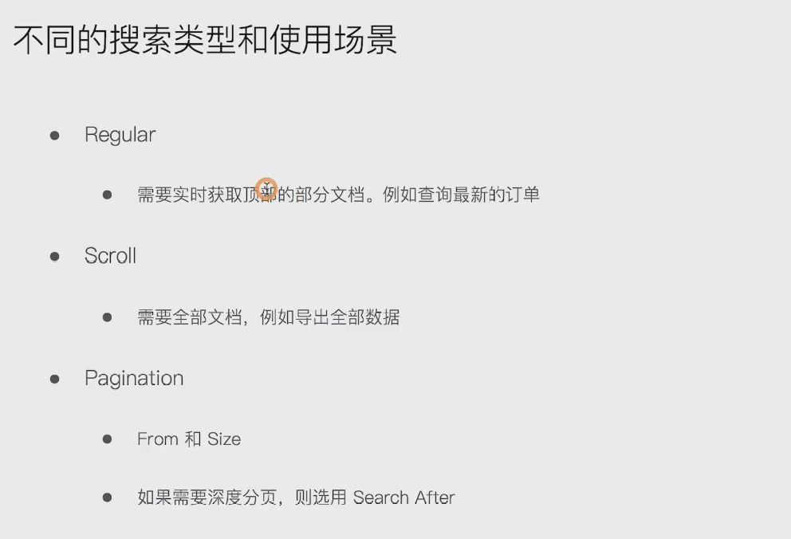

## 1.from /size

- 

### 1. 分布式系统中深度分页的问题

- 

## 2. search after 避免深度分页的问题

- 
- 
  - 通过唯一排序值，先在各个分片去取size个小于或大于唯一排序值的数据。再返回给协调节点进行排序处理返回

## 3. scroll api

- 
- 
- post /user/_search?scroll=5m,创建一个保留5分钟的快照。在创建快照之后新建的数据，通过scroll是查不到的

## 4. 不同搜索类型和使用场景

- 