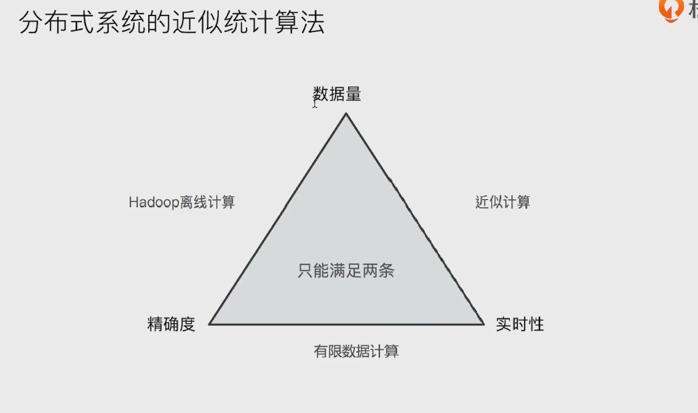
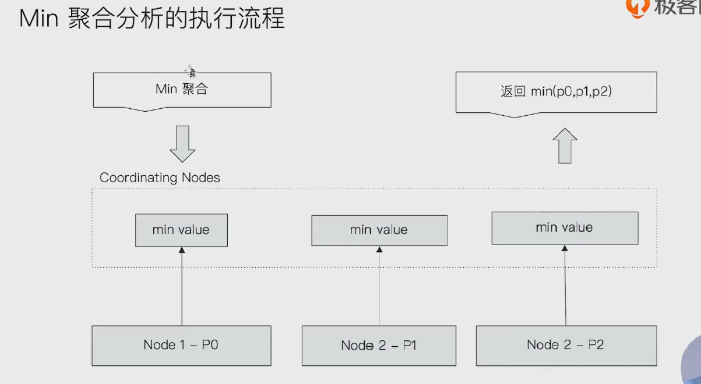
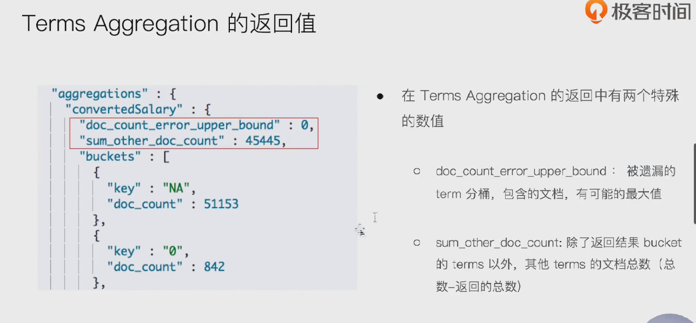
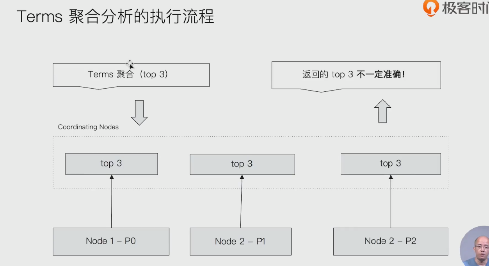
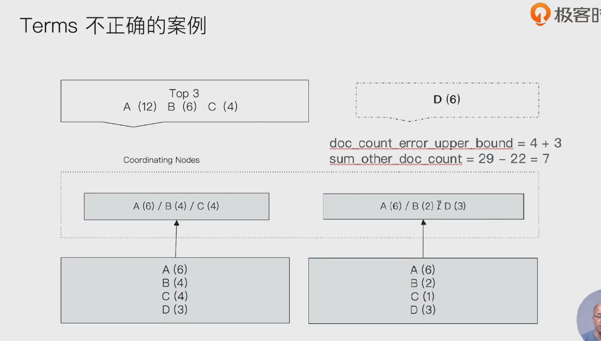
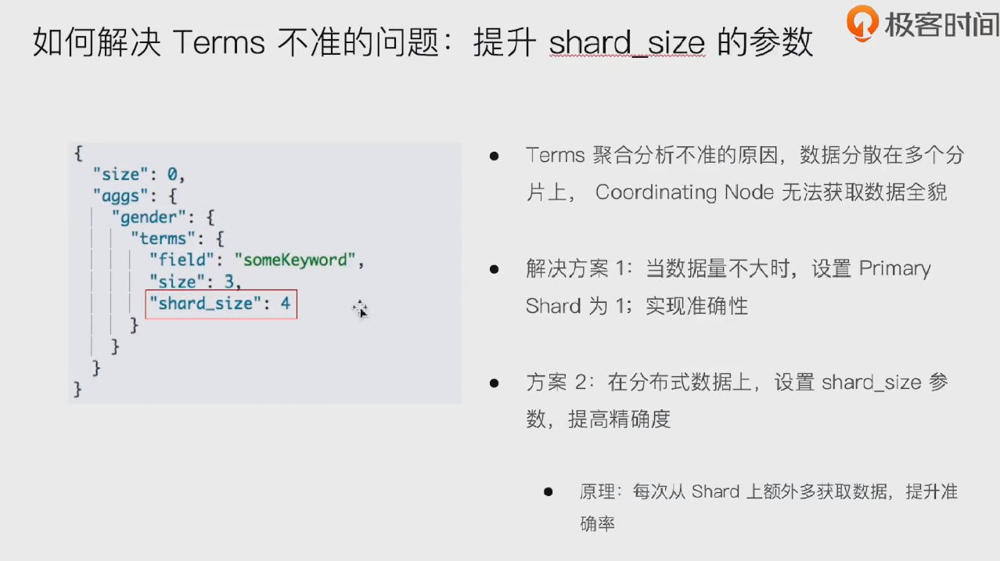
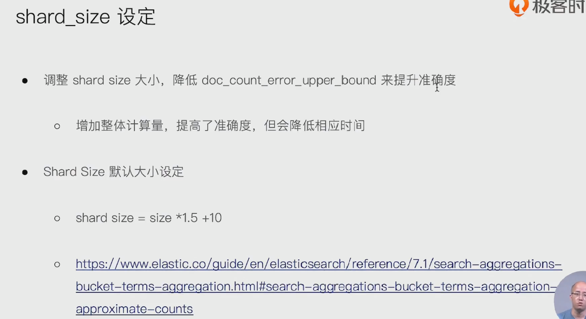

## 分布式系统的近视统计算法

- 

- 如果要追求数据量大以及精确度， 采用Hadoop离线计算。

  

## min 聚合分析的执行流程

- 

- 协调节点， 找各个分片的最小值，找到后，在协调节点进行最小值计算，最后返回

## Terms Aggregation的返回值

- 

## terms 聚合分析的执行流程

- 

- 取文档总数的top3
- 

- 

- 