## 关系型数据库的范式化设计

- 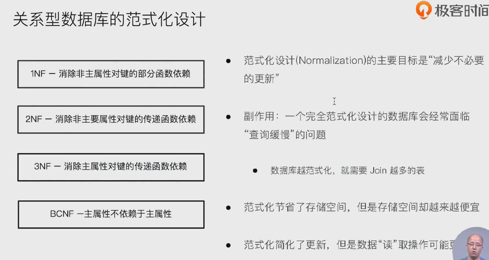

## 反范式化

- 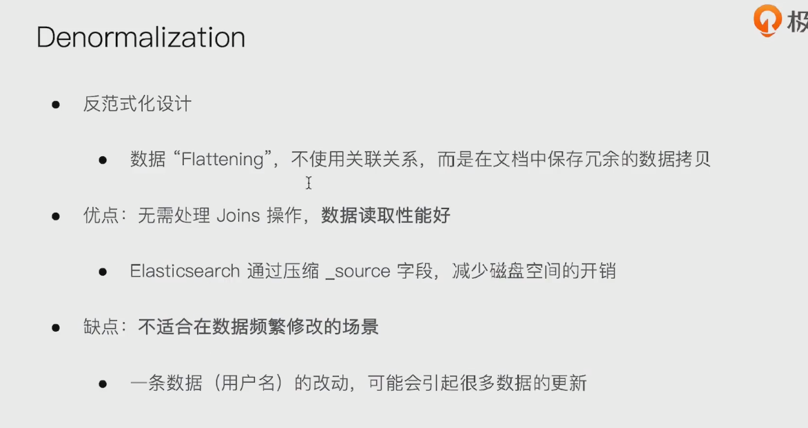

##  在es中处理关联关系

- 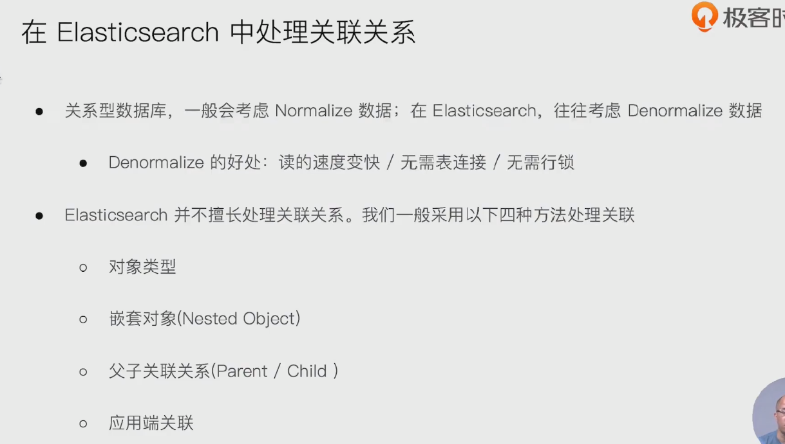

### 案例1

- 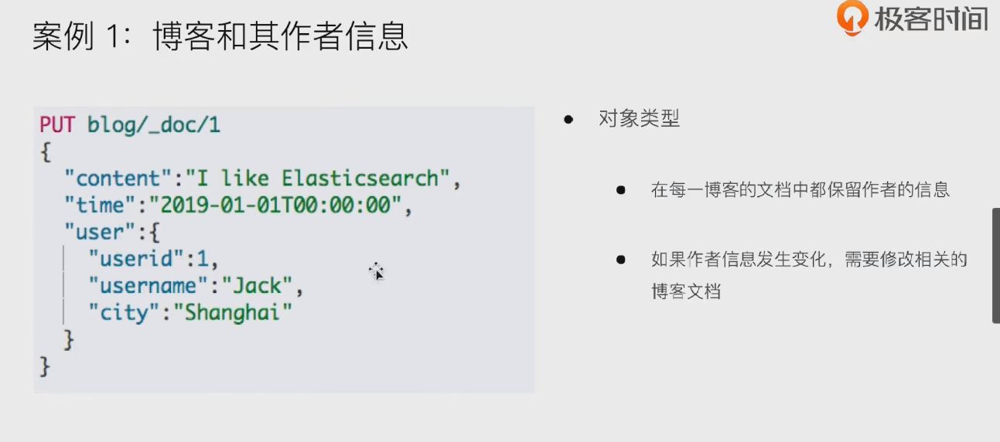

### 案例2: 查到不存在的数据

- 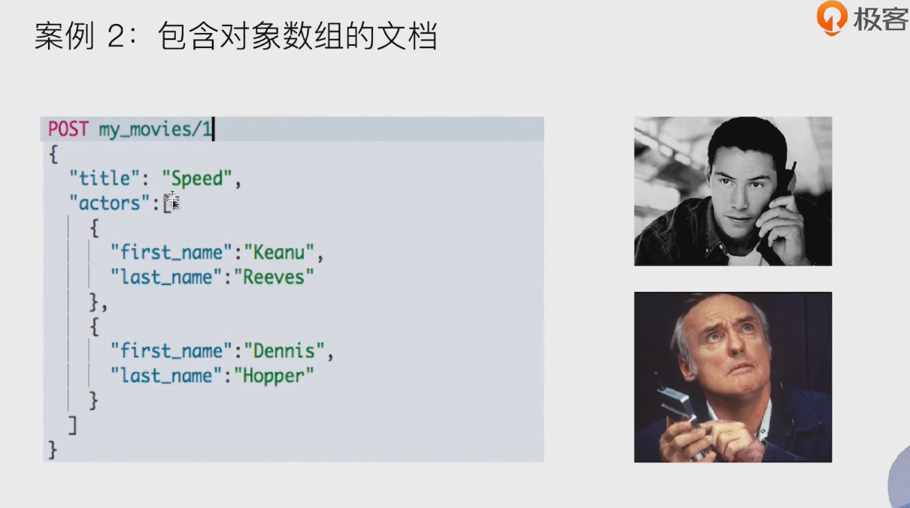

- 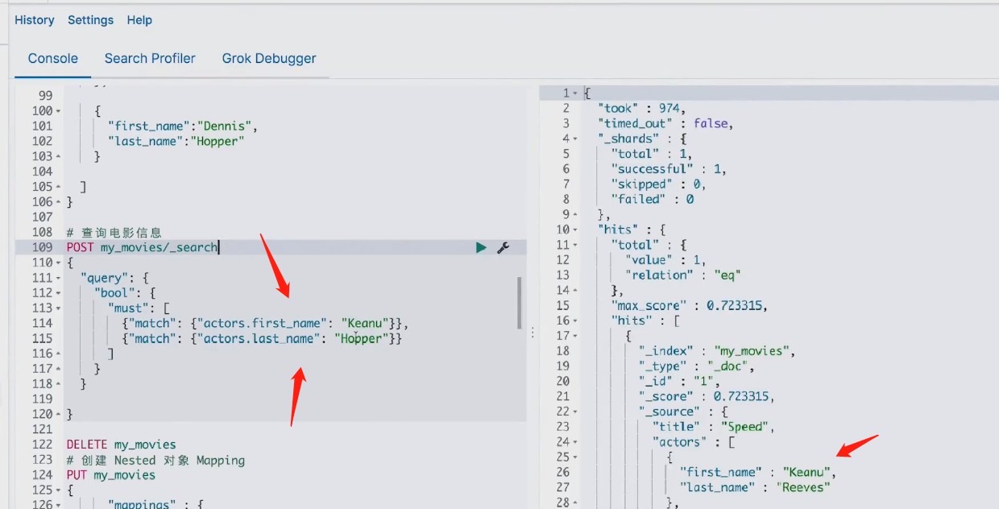
- 查到了不存在的数据
- 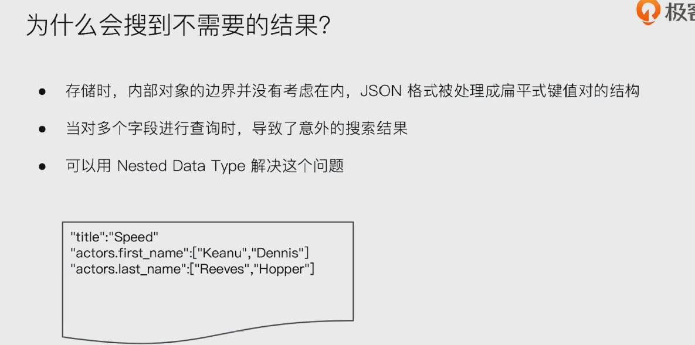

## nested data type

- 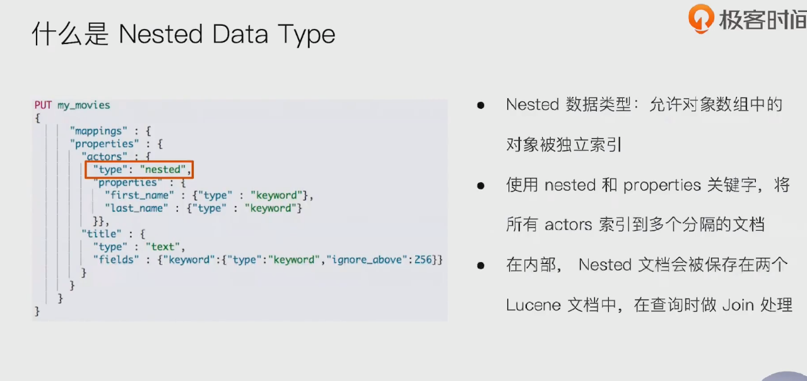

- 指定定义嵌套对象：  nested
  - 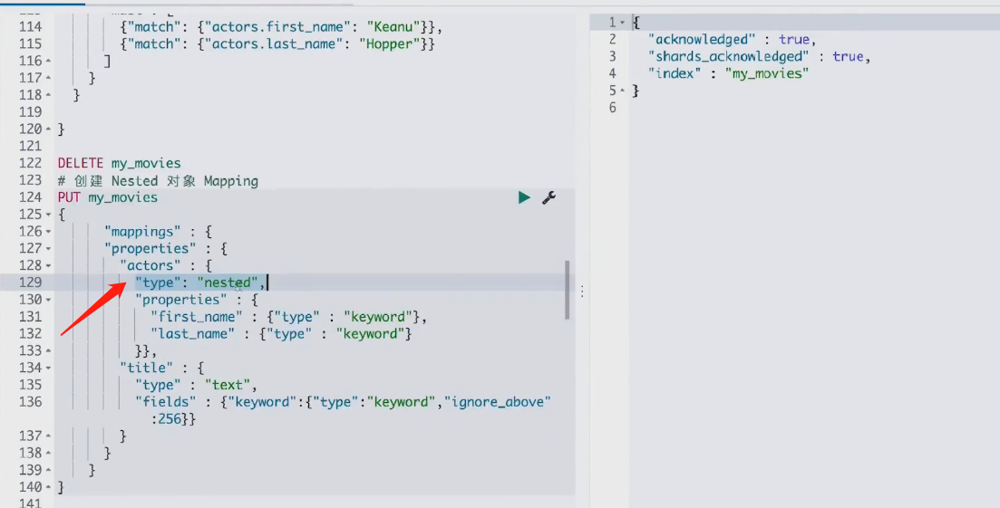

- 嵌套查询
  - 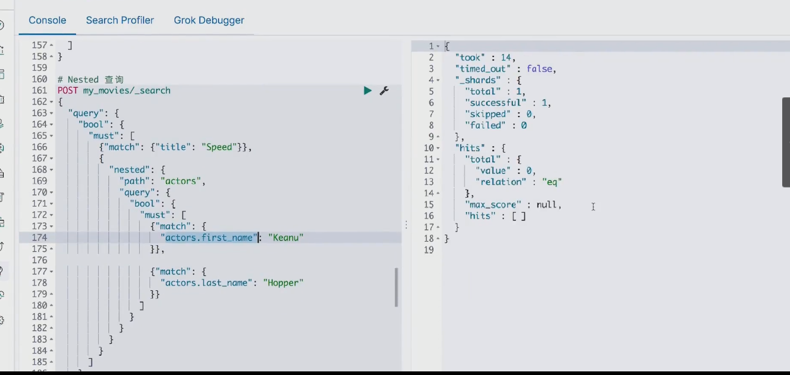

- 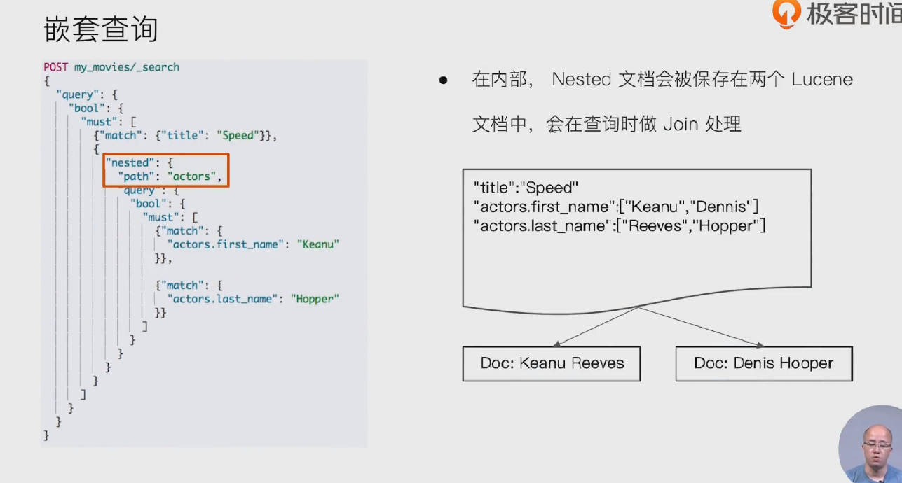

## nested aggregation

- 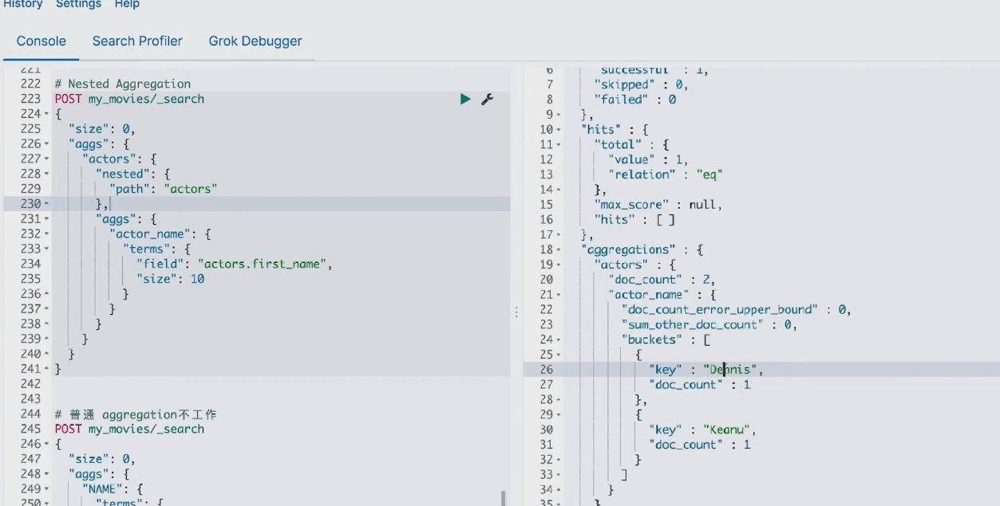

- 普通的aggregation不工作
  - 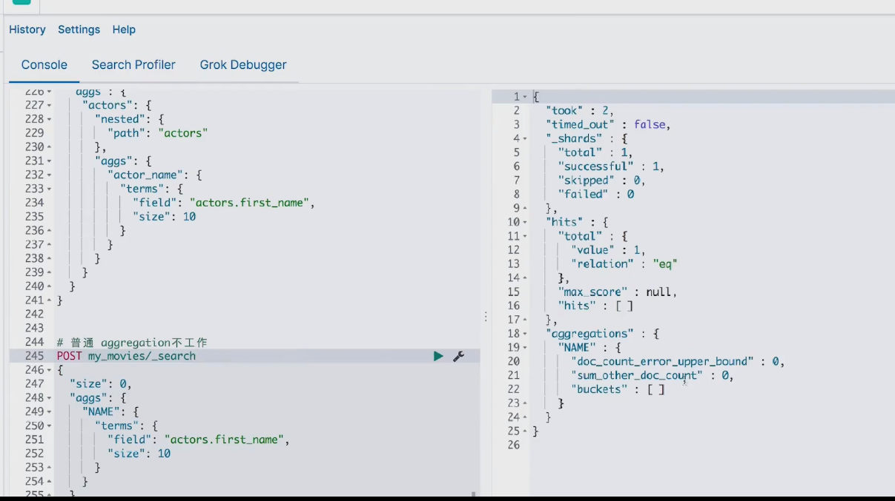