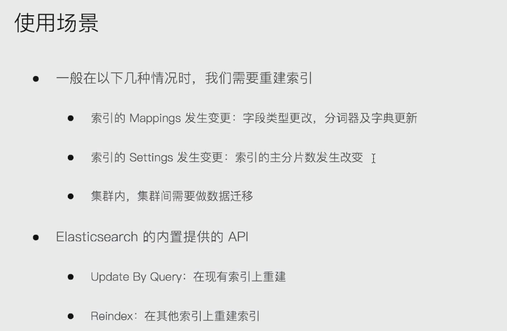
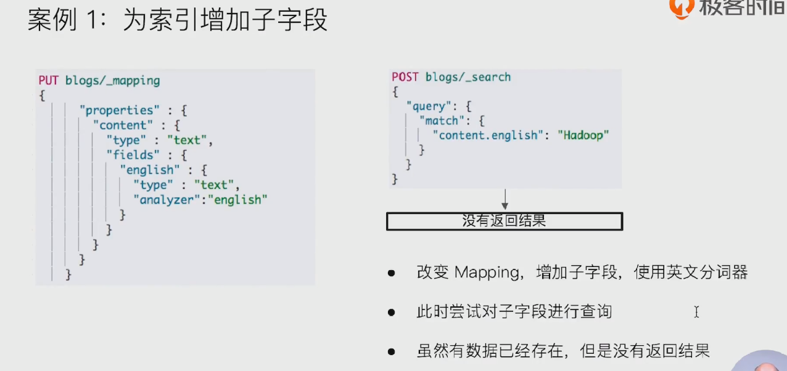
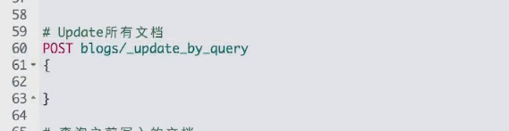
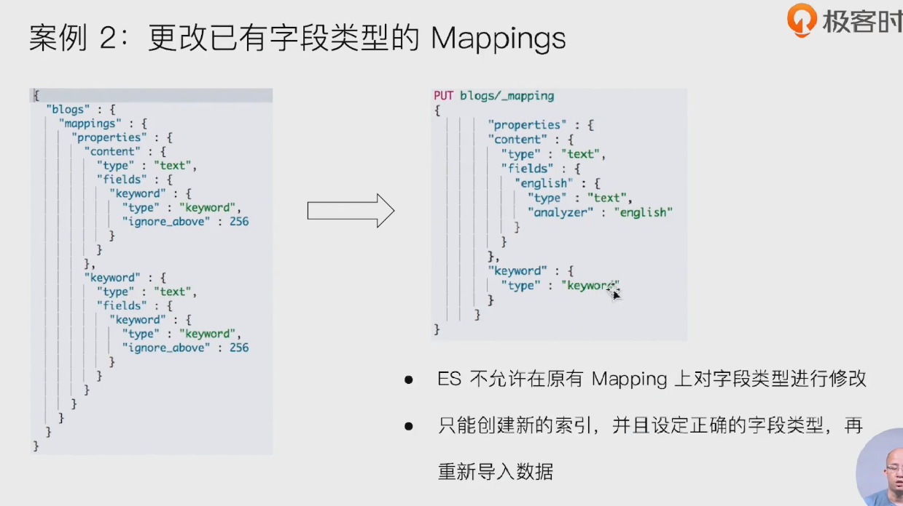
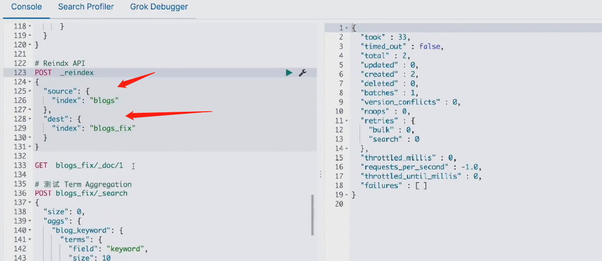
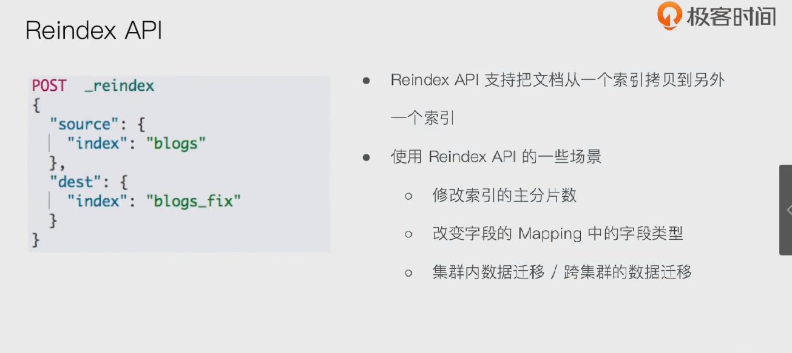
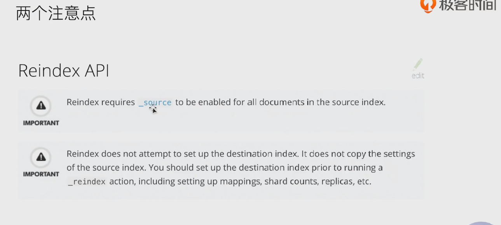
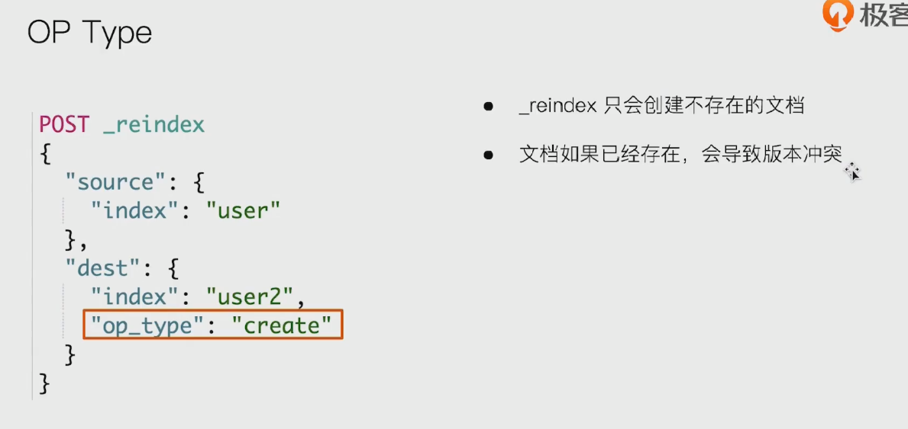
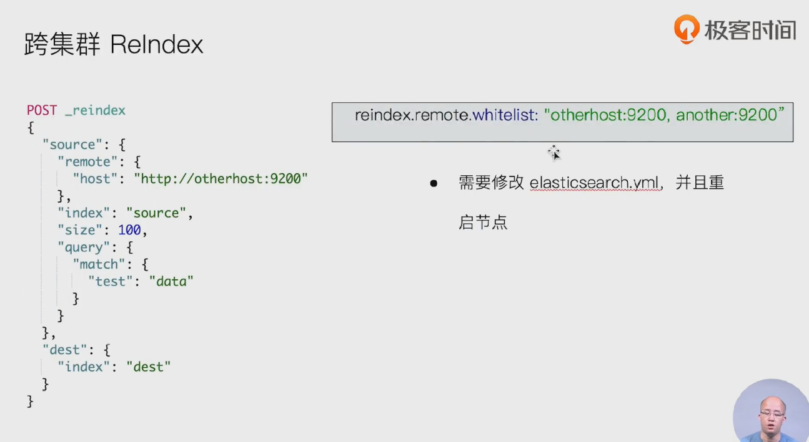
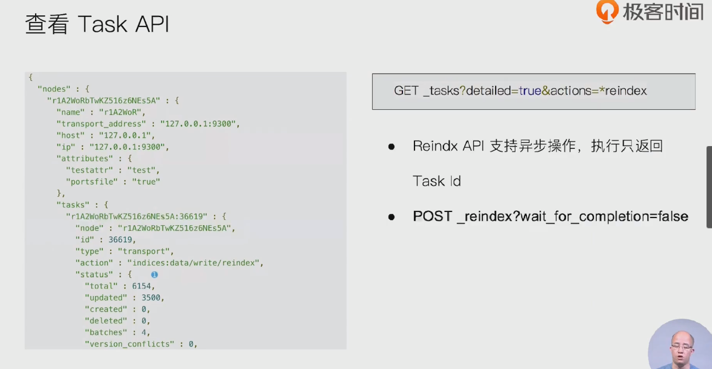

### 使用场景

- 

### 案例1: update by query

- 

- 对原索引执行 update_by_query, 对原有数据进行重建索引操作
  - 

### 案例2: reindex

- 

- _reindex ： 建好新索引blogs_fix 后 ，重新导入数据，reindex api
- 

- 

- 两个注意点
  - 

- 

### 跨集群 reindex 

- 

### reindex 异步操作

