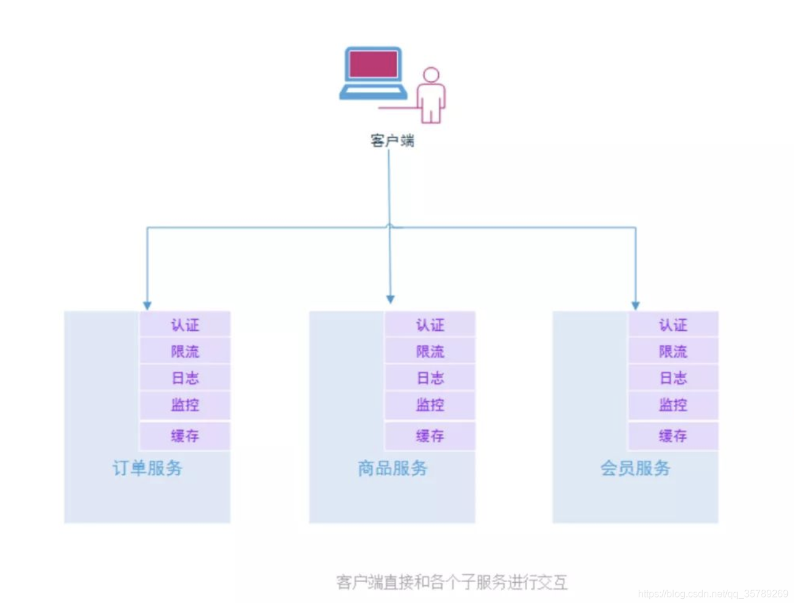
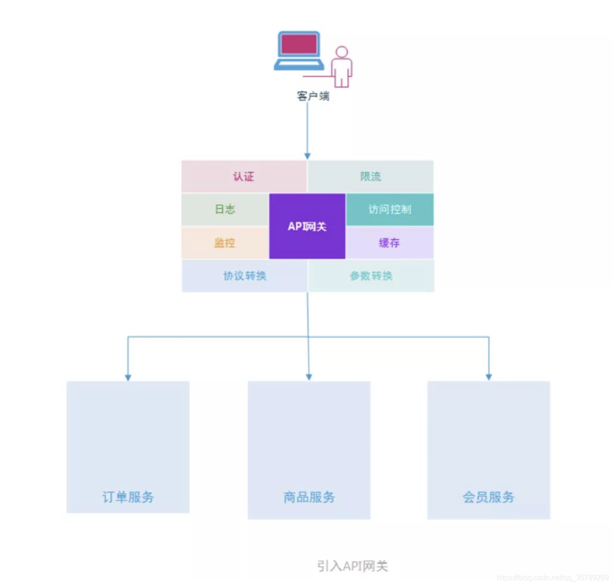

参考： https://blog.csdn.net/qq_35789269/article/details/107737607

### 1、微服务为什么要用网关？（首先要理解网关并不是必须的组件，只是一种设计模式或者设计理念）
客户端直接访问各子服务：

微服务刚刚诞生的时候，人们将服务进行拆分，实现服务之间的松耦合，并且每个服务有专门的团队维护，然后客户端直接和各个子服务进行交互。比如，订单，商品，会员服务。

### 这种客户端直接和后端服务交互的方式会有什么问题呢？

1、客户端需要知道每个服务的地址（如果有网关，分布式部署的话这样可以统一api的ip地址，再由网关去分发，可以通过注册中心获取你需要的服务节点列表，然后给你分配你调用那个节点去调用）

2、每个后端服务都需要实现认证、限流、日志、监控、缓存等功能，重复造轮子大大降低了开发效率，而这些公共业务逻辑完全可以拆分出来。而且会造成的代码复杂度和维护难度上升。

3、假如后端某些服务由之前的http/https调用变成rpc调用，或者某些参数发生改变，则客户端需要做很大调整。

### 这里我觉得还有必要补一篇rpc远程调用和restful请求的区别，这里简单科普一下：

rpc一般用于内部微服务之间的调用，restful请求也就是http请求一般是请求外部服务；

rpc可以像调用本地方法一样去调用其它微服务（在不同的服务器）的方法，原理是一般是cp/ip协议+动态代理。这里就减少了向外暴露的服务。而http请求是基于http协议的，需要暴露给外部，而且需要自己封装请求提和请求参数。rpc只是一种概念，有多种实现方式。

 

### 引入网关可以怎么解决这些问题呢？

1、网关作为边界，分割了内部应用和外部调用。

不同于外部API一般使用HTTP或REST，内部微服务可以从使用不用通讯协议中收获益处。这些协议可以是ProtoBuf或AMQP，甚至是诸如SOAP，JSON-RPC或者XML-RPC这样的系统集成协议。API网关可以对这些协议提供统一的外部REST接口，这就允许开发团队挑选一款最适合于内部架构的协议。

 

2、网关实现了安全层，降低了各子微服务的复杂度

API网关通过提供额外的安全层帮助阻止大规模攻击。这些攻击包括SQL注入，XML解析漏洞和DoS攻击。

微服务中有一些常见的要点，诸如使用API令牌进行授权，访问控制和调用频次限制。这每个点都需要每个服务区增加额外的时间去实现它们。API网关将这些要点从你的代码中提取出来，允许你的服务只关注于它们需要关注的任务。同时可以作为统一收集微服务日志的地方，方便了问题的定位。

 

3、微服务方便了服务的管理，提供了外部请求的统一入口，实现了路由转发，同时降低了对外暴露的服务

如果一个业务功能，调用了n个外部微服务，那边管理和维护起来简直是噩梦，二微服务万贯基于统一的域名和上下文去访问，管理起来更加方便。同时网关还可以实现路由转发和负载均衡的功能，但是并不是最佳的选择，因为有其它开源组件比它更nb，那就是nginx。

2、 有了网关为什么还需要nginx或者ribbon作负载均衡？
你可以理解为基于性能问题。

3、有了网关为什么还要需要有服务注册和发现？
让我们来看看一个同时有网关和服务发现注册中心的请求路径是怎样的？

一个请求过来了，根据网关根据路由规则分析出是请求的哪个服务，然后跟注册中心说：这个XX服务有木有？没有？那404！有？服务下有几个实例，都告诉我我自己找一个或者你告诉我一个能用的。然后把请求往某个服务的某个实例上发送，得到返回值后丢给客户端。       这样就不会出现，某个服务一直被调而一直在等待响应最终造成服务器挂掉的风险。网关保障的是微服务之间的安全和解耦，注册中心是保障微服务的高可用和可靠。但是网关的配置最好更高一点，不然也是一种风险。或者在网关前面挂一个nginx代理，多几套网关实例也行。
————————————————
版权声明：本文为CSDN博主「人工智」的原创文章，遵循CC 4.0 BY-SA版权协议，转载请附上原文出处链接及本声明。
原文链接：https://blog.csdn.net/qq_35789269/article/details/107737607