### 1.批处理& 流处理

- 批处理：处理的是有界离散的数据，比如处理一个文本文件；

  - 批处理架构通常会被设计在以下这些应用场景中：
    - 日志分析：日志系统是在一定时间段（日，周或年）内收集的，而日志的数据处理分析是在不同的时间内执行，以得出有关系统的一些关键性能指标。
    - 计费应用程序：计费应用程序会计算出一段时间内一项服务的使用程度，并生成计费信息，例如银行在每个月末生成的信用卡还款单。
    - 数据仓库：数据仓库的主要目标是根据收集好的数据事件时间，将数据信息合并为静态快照 （static snapshot），并将它们聚合为每周、每月、每季度的报告等。
    - 由 Google MapReduce 衍生出来的开源项目 Apache Hadoop 或者是 Apache Spark 等开源架构都是支持这种大数据批处理架构的。由于完成批处理任务具有高延迟性，一般可以需要花费几小时，几天甚至是几周的时间。

- 流处理：处理的是无界连续的数据，比如每时每刻的支付宝交易数据。
  
  - MapReduce 的一个局限是它为了批处理而设计的，应对流处理的时候不再那么得心应手。即使后面的 Apache Storm、Apache Flink 也都有类似的问题，比如 Flink 里的批处理数据结构用 DataSet，但是流处理用 DataStream。
  
  - 流处理的特点应该是要足够快、低延时，以便能够处理来自各种数据源的大规模数据。流处理所需的响应时间更应该以毫秒（或微秒）来进行计算。像我们平时用到的搜索引擎，系统必须在用户输入关键字后以毫秒级的延时返回搜索结果给用户。
  
  - 流处理速度如此之快的根本原因是因为它在数据到达磁盘之前就对其进行了分析。
  
  - 流处理架构通常都会被设计在以下这些应用场景中：
  
    - 实时监控：捕获和分析各种来源发布的数据，如传感器，新闻源，点击网页等。
    - 实时商业智能：智能汽车，智能家居，智能病人护理等。
    - 销售终端（POS）系统：像是股票价格的更新，允许用户实时完成付款的系统等。
  
    在如今的开源架构生态圈中，如 Apache Kafka、Apache Flink、Apache Storm、Apache Samza 等，都是流行的流处理架构平台。

### 2.SLA（ service-level aggreement (服务等级协议)）

#### 系统架构关注的常见四个指标： 可用性、准确性、系统容量、延迟

- 1.**可用性**：可用性指的是系统服务能正常运行所占的时间百分比。对于许多系统而言，四个 9 的可用性（99.99％ Availability，或每年约 50 分钟的系统中断时间）即可以被认为是**高可用性**（High availability）。“99.9% Availability”指的是一天当中系统服务将会有大约 86 秒的服务间断期。服务间断也许是因为系统维护，也有可能是因为系统在更新升级系统服务。
- 2.**准确性**：准确性指的是我们所设计的系统服务中，是否允许某些数据是不准确的或者是丢失了的。如果允许这样的情况发生，用户可以接受的概率（百分比）是多少？很多时候，系统架构会以**错误率**（Error Rate）来定义这一项 SLA。
  
  - 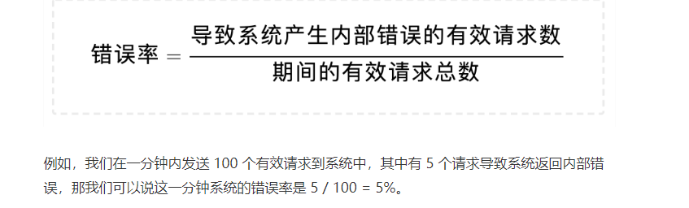
  - 我们可以用错误率来定义准确性，但具体该如何评估系统的准确性呢？一般来说，我们可以采用**性能测试**（Performance Test）或者是**查看系统日志**（Log）两种方法来评估。
- 3.**系统容量（capacity）**:在数据处理中，系统容量通常指的是**系统能够支持的预期负载量是多少**，一般会以每秒的请求数为单位来表示。某个系统的架构可以处理的 QPS （Queries Per Second）是多少又或者 RPS（Requests Per Second）是多少。要怎么给自己设计的系统架构定义出准确的 QPS 呢？
  - 第一种，是使用**限流**（Throttling）的方式。可以使用 Google Guava 库中的 RateLimiter 类来定义每秒最多发送多少请求到后台处理。
  - 第二种，是在系统交付前进行**性能测试**（Performance Test）。使用像 Apache JMeter 又或是 LoadRunner 这类型的工具对系统进行性能测试
  - 第三种，是分析系统在实际使用时产生的**日志**（Log）。不过，这种方法不一定可以得到系统可以承载的最大 QPS。
- **4.延迟（latency）**:延迟指的是**系统在收到用户的请求到响应这个请求之间的时间间隔**。
  
  - 在定义延迟的 SLA 时，我们常常看到系统的 SLA 会有 p95 或者是 p99 这样的延迟声明。这里的 p 指的是 percentile，也就是百分位的意思。如果说一个系统的 p95 延迟是 1 秒的话，那就表示在 100 个请求里面有 95 个请求的响应时间会少于 1 秒，而剩下的 5 个请求响应时间会大于 1 秒。
- **5.可扩展性**：分布式系统的核心就是可扩展性（Scalability）。
  
  - 最基本而且最流行的增加系统容量的模型有两种: 水平扩展（Horizontal Scaling）和垂直扩展（Vertical Scaling）。
- **6.一致性**：可用性对于任何分布式系统都很重要。一般来说，构成分布式系统的机器节点的可用性要低于系统的可用性。举个例子，如果我们想要构建一个可用性 99.999% 的分布式系统（每年约 5 分钟的宕机时间），但是我们使用的单台机器节点的可用性是 99.9%（每年约 8 个小时的宕机时间）。那么想要达到我们的目标，最简单的办法就是增加系统中机器节点的数量。这样即使有部分机器宕机了，其他的机器还在持续工作，所以整个系统的可用性就提高了。

  - 这种情况下，我们要思考一个问题：如何保证系统中不同的机器节点在同一时间，接收到和输出的数据是一致的呢？这时就要引入一致性（Consistency）的概念。
  - 要保证分布式系统内的机器节点有相同的信息，就需要机器之间定期同步。
  - 然而，发送信息也会有失败的可能，比如信息丢失或者有的节点正好宕机而无法接收。因此，一致性在高可用性的系统里是非常核心的概念。
  - 几个在工程中常用的一致性模型，分别是：强一致性（Strong Consistency），弱一致性（Weak Consistency），最终一致性（Eventual Consistency）。
    - **强一致性：**系统中的某个数据被成功更新后，后续任何对该数据的读取操作都将得到更新后的值。所以在任意时刻，同一系统所有节点中的数据是一样的。

    - **弱一致性：**系统中的某个数据被更新后，后续对该数据的读取操作可能得到更新后的值，也可能是更改前的值。但经过“不一致时间窗口”这段时间后，后续对该数据的读取都是更新后的值。

    - **最终一致性：**是弱一致性的特殊形式。存储系统保证，在没有新的更新的条件下，最终所有的访问都是最后更新的值。

      - 在强一致性系统中，只要某个数据的值有更新，这个数据的副本都要进行同步，以保证这个更新被传播到所有备份数据库中。在这个同步进程结束之后，才允许服务器来读取这个数据。

        所以，强一致性一般会牺牲一部分延迟性，而且对于全局时钟的要求很高。举个例子，Google Cloud 的 Cloud Spanner 就是一款具备强一致性的全球分布式企业级数据库服务。

        在最终一致性系统中，我们无需等到数据更新被所有节点同步就可以读取。尽管不同的进程读同一数据可能会读到不同的结果，但是最终所有的更新会被按时间顺序同步到所有节点。所以，最终一致性系统支持异步读取，它的延迟比较小。比如亚马逊云服务的 DynamoDB 就支持最终一致的数据读取。

- **7.持久性**：数据持久性（Data Durability）意味着数据一旦被成功存储就可以一直继续使用，即使系统中的节点下线、宕机或数据损坏也是如此。

  - 想要提高持久性，数据复制是较为通用的做法。因为把同一份数据存储在不同的节点上，即使有节点无法连接，数据仍然可以被访问。

  - 在分布式数据处理系统中，还有一个持久性概念是消息持久性。什么意思呢？在分布式系统中，节点之间需要经常相互发送消息去同步以保证一致性。对于重要的系统而言，常常不允许任何消息的丢失。

    - 分布式系统中的消息通讯通常由分布式消息服务完成，比如 RabbitMQ、Kafka。这些消息服务能支持（或配置后支持）不同级别的消息送达可靠性。消息持久性包含两个方面：

    1. 当消息服务的节点发生了错误，已经发送的消息仍然会在错误解决之后被处理；
    2. 如果一个消息队列声明了持久性，那么即使队列在消息发送之后掉线，仍然会在重新上线之后收到这条消息。

### 3.workflow 处理流

#### 工作流系统的几种设计模式：复制模式、过滤模式、分离模式和合并模式。

- 复制模式
  - 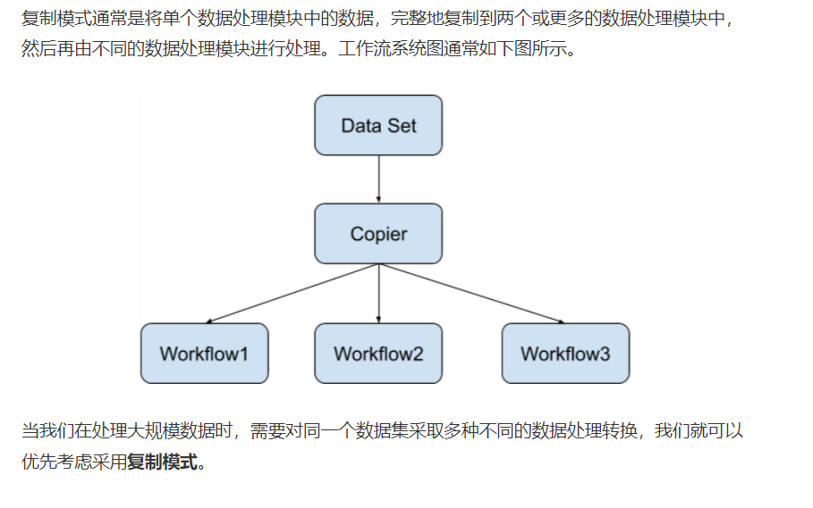

- 过滤模式
  - 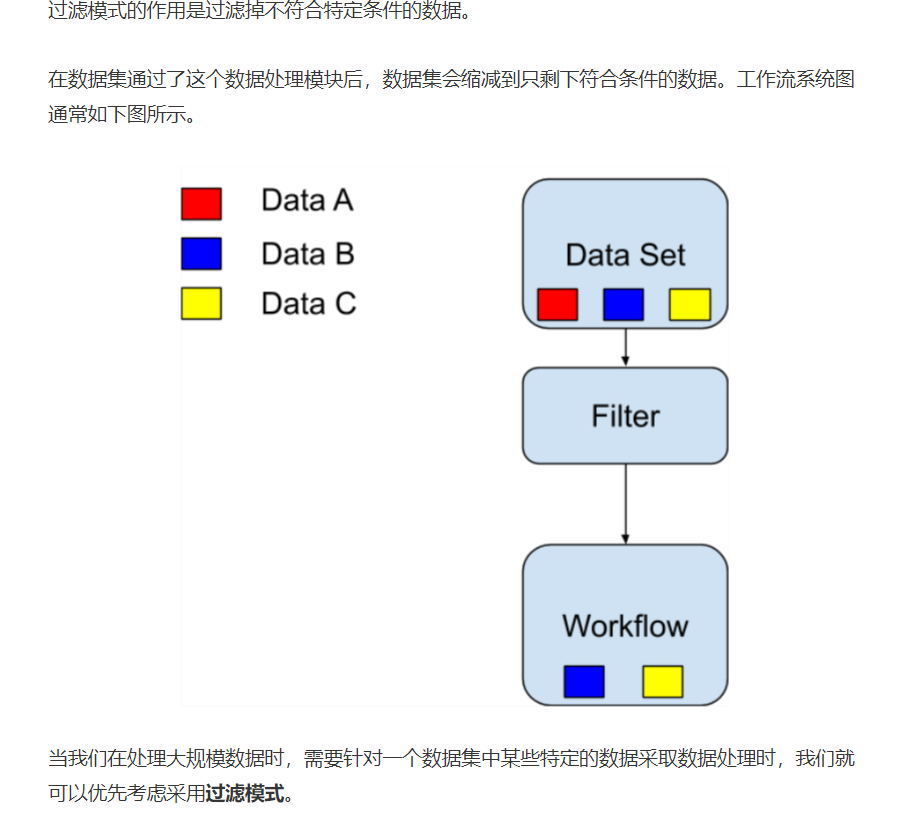

- 分离模式：
  - 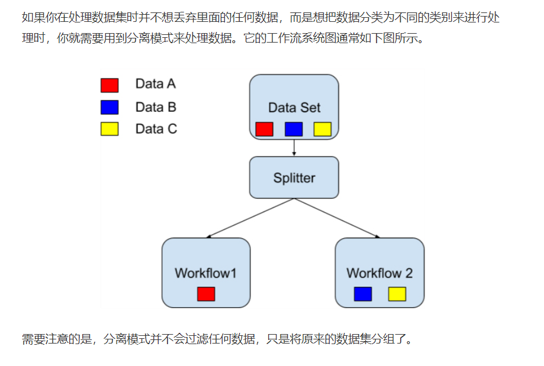

- 合并模式
  - 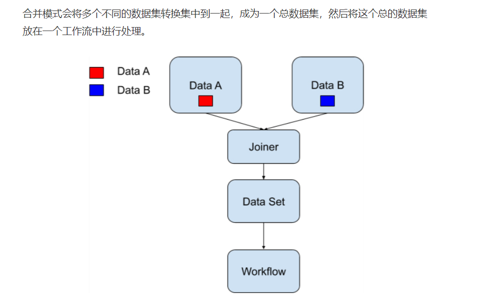

### 4.发布订阅模式数据处理机制

- 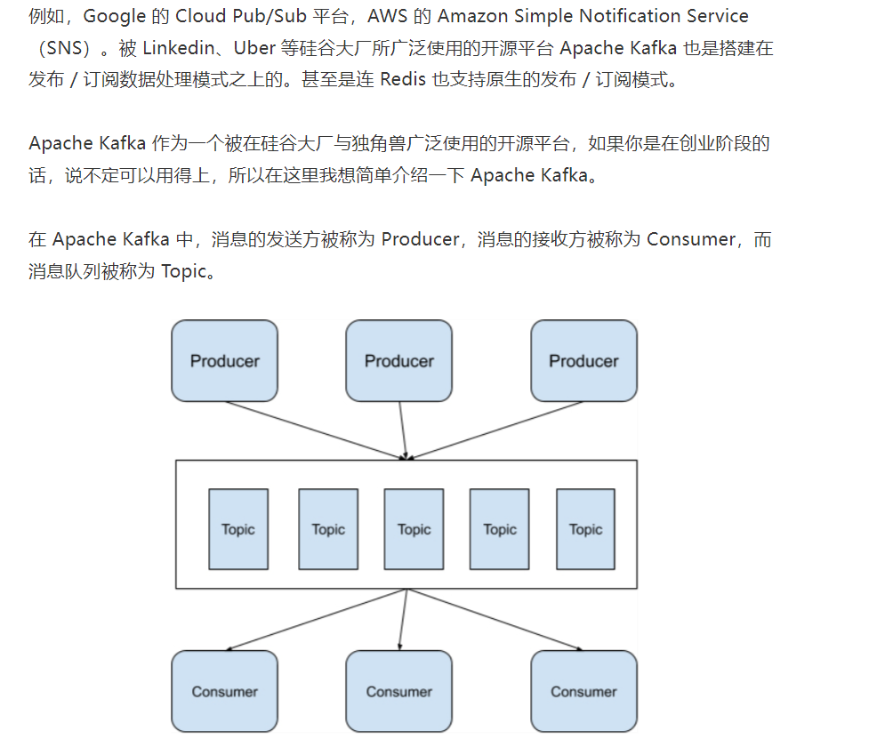

- 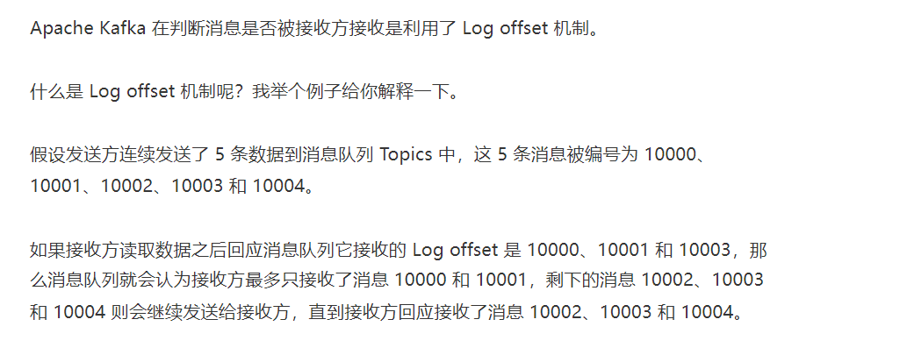

- ## 发布 / 订阅模式的适用场景

  我们说回到发布 / 订阅模式来，看看它能用在哪些场景。

  如果你在处理数据的时候碰到以下场景，那么就可以考虑使用发布 / 订阅的数据处理模式。

  - 系统的发送方需要向大量的接收方广播消息。
  - 系统中某一个组件需要与多个独立开发的组件或服务进行通信，而这些独立开发的组件或服务可以使用不同的编程语言和通信协议。
  - 系统的发送方在向接收方发送消息之后无需接收方进行实时响应。
  - 系统中对数据一致性的要求只需要支持数据的最终一致性（Eventual Consistency）模型。

  要提醒你注意的一点是，如果系统的发送方在向接收方发送消息之后，需要接收方进行实时响应的话，那么绝大多数情况下，都不要考虑使用发布 / 订阅的数据处理模式。

### 5. CAP

- 一致性：
  - 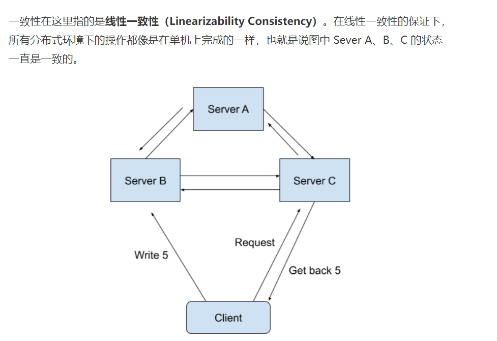

- 可用性：可用性的概念比较简单，在这里指的是**在分布式系统中，任意非故障的服务器都必须对客户的请求产生响应**。
- 分区容错性：
  - 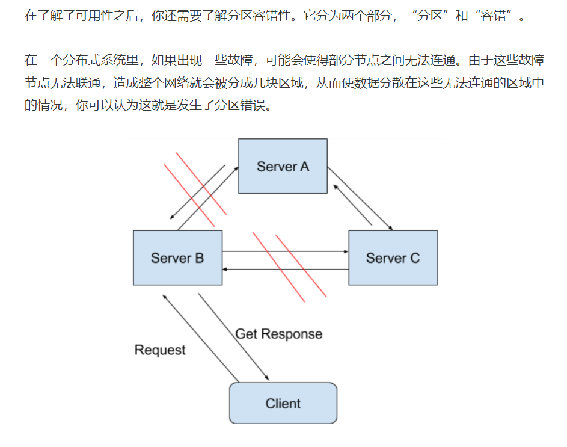
  - 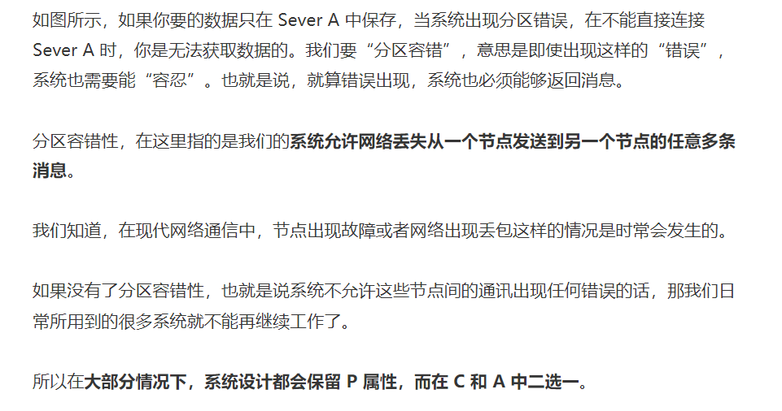

- 应用：
  - 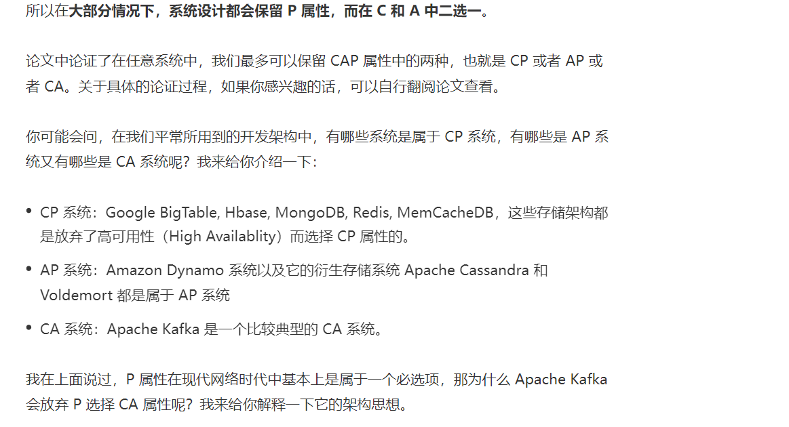
  - 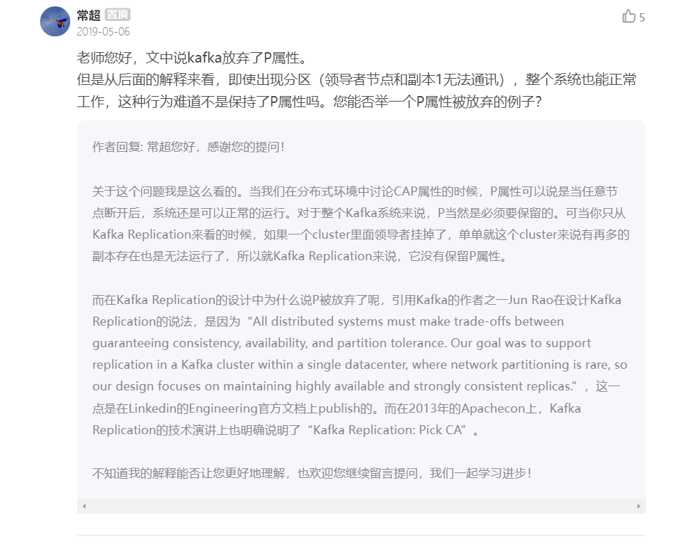
  - 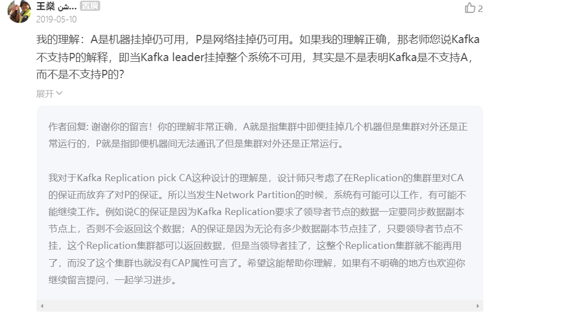

### 6. lambda架构

- lambda 架构使开发人员能够构建大规模分布式数据处理系统。它具有很好的灵活性和可扩展性，也对硬件故障和人为失误有很好的容错性。Lambda 架构总共由三层系统组成：**批处理层**（Batch Layer），**速度处理层**（Speed Layer），以及用于响应查询的**服务层**（Serving Layer）。

- 在 Lambda 架构中，每层都有自己所肩负的任务。

  批处理层存储管理主数据集（不可变的数据集）和预先批处理计算好的视图。

  批处理层使用可处理大量数据的分布式处理系统预先计算结果。它通过处理所有的已有历史数据来实现数据的准确性。这意味着它是基于完整的数据集来重新计算的，能够修复任何错误，然后更新现有的数据视图。输出通常存储在只读数据库中，更新则完全取代现有的预先计算好的视图。

  速度处理层会实时处理新来的大数据。

  速度层通过提供最新数据的实时视图来最小化延迟。速度层所生成的数据视图可能不如批处理层最终生成的视图那样准确或完整，但它们几乎在收到数据后立即可用。而当同样的数据在批处理层处理完成后，在速度层的数据就可以被替代掉了。

  本质上，速度层弥补了批处理层所导致的数据视图滞后。比如说，批处理层的每个任务都需要 1 个小时才能完成，而在这 1 个小时里，我们是无法获取批处理层中最新任务给出的数据视图的。而速度层因为能够实时处理数据给出结果，就弥补了这 1 个小时的滞后。

  所有在批处理层和速度层处理完的结果都输出存储在服务层中，服务层通过返回预先计算的数据视图或从速度层处理构建好数据视图来响应查询。

  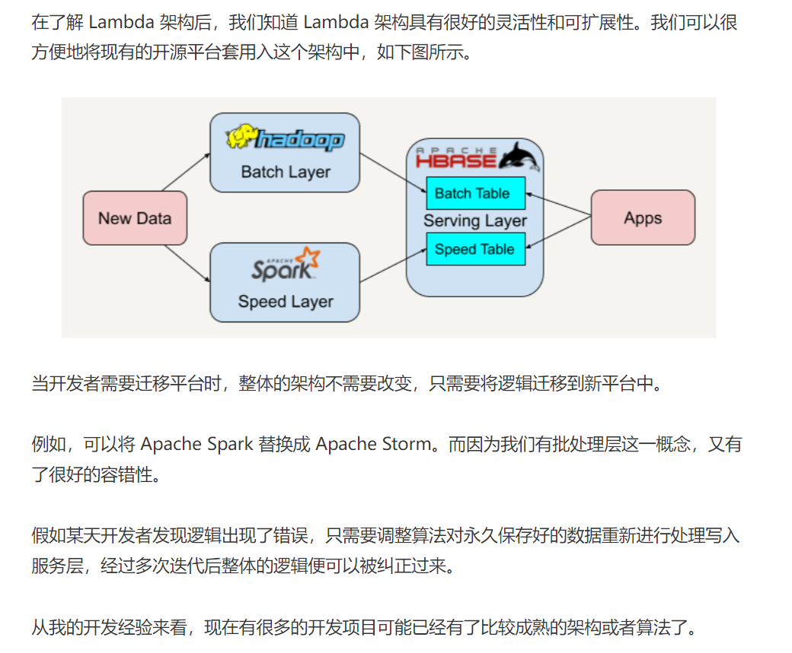

- 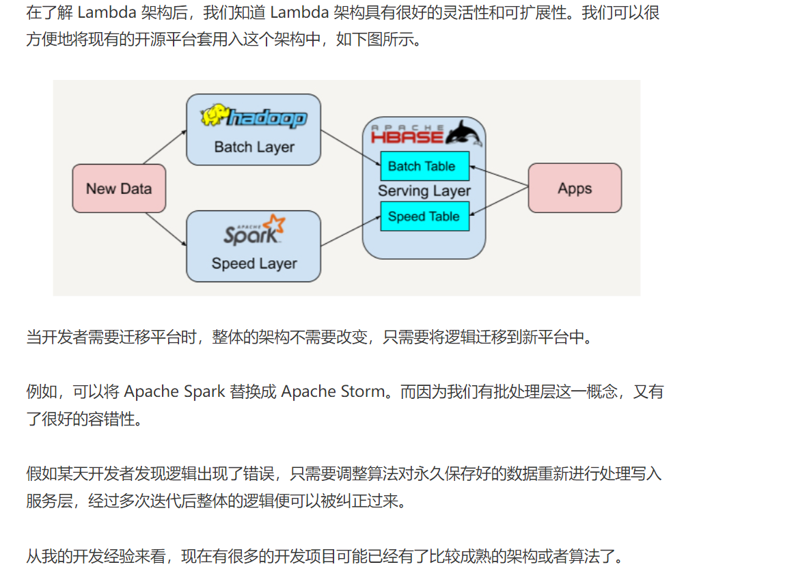

### 7 kappa架构

- 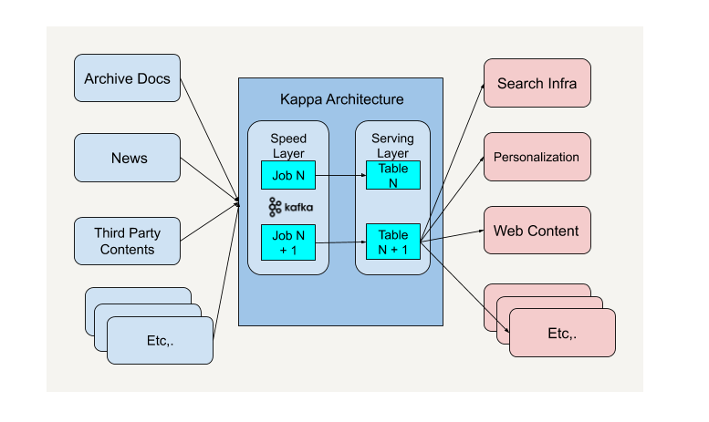

- 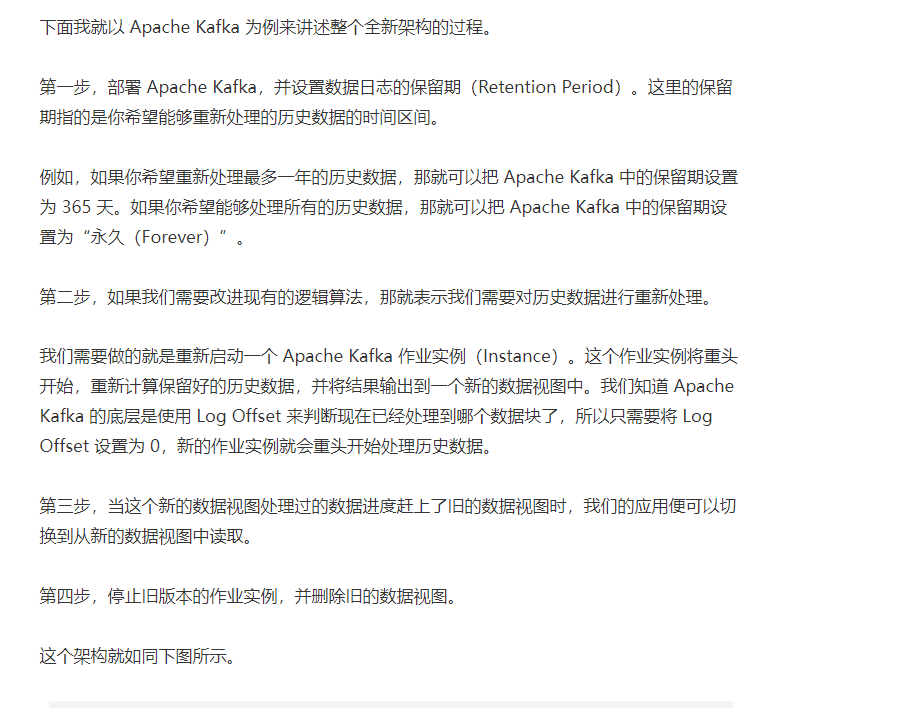

- 