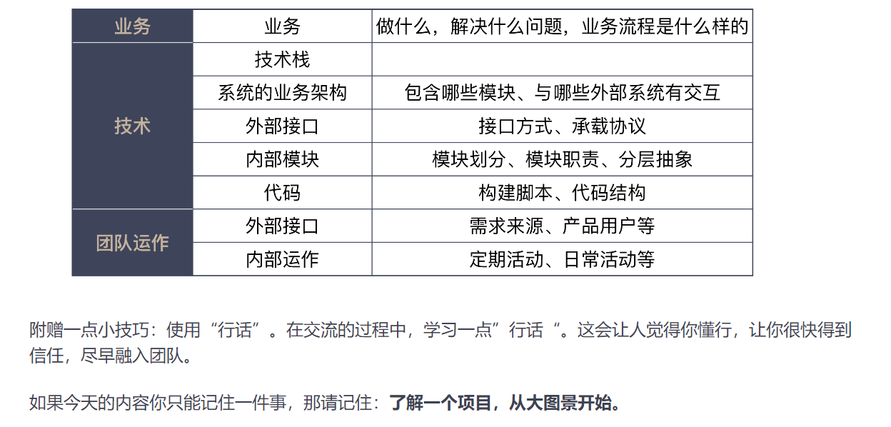

链接：[参考](https://learn.lianglianglee.com/%e4%b8%93%e6%a0%8f/10x%e7%a8%8b%e5%ba%8f%e5%91%98%e5%b7%a5%e4%bd%9c%e6%b3%95/01%2010x%e7%a8%8b%e5%ba%8f%e5%91%98%e6%98%af%e5%a6%82%e4%bd%95%e6%80%9d%e8%80%83%e7%9a%84%ef%bc%9f.md)

### 思考框架

运用这个思考框架，我们需要问自己一些问题：

- Where are we?（我们现在在哪？）
- Where are we going?（我们要到哪儿去？）
- How can we get there?（我们如何到达那里？）

为了把这个框架应用在我们程序员的工作中，我给了你四个思考原则：

- 以终为始，确定好真实目标；
- 任务分解，找到实施路径；
- 沟通反馈，解决与人打交道出现的问题；
- 自动化，解决与机器打交道出现的问题。

如果今天的内容你只能记住一件事，那请记住：**面对问题时，用思考框架问问自己，现状、目标和路径。**

### 以始为终

- 以始为终，就是在做事之前，先想想结果是什么样子的。
- 这个终，是集体想象。对做软件的人来说，应该把**终**定位成做一个对用户有价值的软件，能够为别人带来价值，自己的价值才能体现出来。
- 为了将集体想象统一起来，对应到做软件，我们可以做很多事，比如：
  - 要给用户看产品的样子，可以用原型工具把它做出来，而不是非得把完整功能开发出来；
  - 要呈现服务接口的样子，可以用模拟服务器搭出一个服务，而不用等后端全部开发完毕；
  - 要让程序员知道要开发产品的细节，可以在任务上描述出软件各种场景给出的各种行为。
- **践行“以终为始”就是在做事之前，先考虑结果，根据结果来确定要做的事情。**
- 如果今天的内容你只能记住一件事，那请记住：**遇到事情，倒着想。**

###  DOD (definition of done ) 

完成的定义

**DoD 是一个思维模式，是一种尽可能消除不确定性，达成共识的方式。**我们本着“以终为始”的方式做事情，DoD 让我们能够在一开始就把“终”清晰地定义出来。

- **DoD 是一个清单，清单是由一个个的检查项组成的，用来检查我们的工作完成情况。**DoD 的检查项，就是我们开发产品所需的一系列有价值的活动。比如：编写代码、编写测试代码、通过测试人员验收等。什么样的活动是有价值的，也许每个团队的认识是不同的。但如果你的团队认为除了功能代码，其他都没价值，也许这是个信号，说明你的团队整体上是缺乏职业素养的，在这样的团队工作，前景并不乐观。
- **DoD 的检查项应该是实际可检查的。**你说代码写好了，代码在哪里；你说测试覆盖率达标了，怎么看到；你说你功能做好了，演示一下。
- **DoD 是团队成员间彼此汇报的一种机制。**别把“汇报”想复杂了，最简单的汇报就是说一句“这个功能做完了”。**当我们有了 DoD，做事只有两种状态，即“做完”和“没做完”。**在团队协作中，我们经常会听到有人说“这个事做完了80%”，对不起，那叫没做完，根本没有80%做完的说法。

如果今天的内容你只能记住一件事，那请记住：**在做任何事之前，先定义完成的标准。**

### 接需求任务，先做哪件事

如果今天的内容你只能记住一件事，那请记住：**在做任何需求或任务之前，先定好验收标准。**

在实际的开发过程中，大量的分歧来自于对“需求完成”的定义。当我们把“以终为始”的原则应用在需求领域中，就会注意到，用户故事有一个非常重要的组成部分是验收标准。

验收标准不仅仅描述出了正常流程，也会关注到异常流程的处理，它也是我们验收测试用例的起点。一旦事先定义好验收标准，大量的扯皮工作就随之烟消云散了。

理解了验收标准的作用，即便我们不使用用户故事来定义需求，依然可以把用户故事中的关键点应用到自己的实践中，在功能列表的每个功能定义中，增加验收标准。

### 精益创业

- 如果今天的内容你只记住一件事，那请记住：**默认所有需求都不做，直到弄清楚为什么要做这件事。**

- 比较早成型的面向不确定创造新事物的方法论是精益创业，它提出了“开发（build）-测量（measure）-认知（learn）”这样一个反馈循环和最小可行产品的概念。

  当产品经理让我们做一个新的产品特性时，我们可以从精益创业这个实践上得到启发，向产品经理们问一些问题，帮助我们确定产品经理提出的需求确实是经过严格思考的。

  精益创业提出一个非常重要的概念，最小可行产品，也就是许多人口中的 MVP（Minimum Viable Product）。简言之，少花钱，多办事。

- 比如，你要做这个产品特性，你要验证的东西是什么呢？他要验证的目标是否有数据可以度量呢？要解决的这个问题是不是当前最重要的事情，是否还有其他更重要的问题呢？

  如果上面的问题都得到肯定的答复，那么验证这个目标是否有更简单的解决方案，是不是一定要通过开发一个产品特性来实现呢？

  有了这个基础，回到前面的案例中，我对产品经理提的问题，其实就是在确定这件事要不要做。事实上，他们当时是用一个表单工具在收集用户信息，也就是说，这件事有一个可用的替代方案。鉴于当时还有很多其它需求要完成。我建议把这个需求延后考虑。

### 扩大自己的上下文

- 如果今天的内容你只记住一件事，那请记住：**扩大自己工作的上下文，别把自己局限在一个“程序员”的角色上。**
- 

不同角色工作真正的差异在于上下文的差异。在一个局部上下文难以解决的问题，换到另外一个上下文甚至是可以不解决的。所以说无论单点有多努力也只是局部优化，很难达到最优的效果。

想把工作做好，就需要不断扩大自己工作的上下文，多了解一下别人的工作逻辑是什么样的，认识软件开发的全生命周期。

### 沙盘推演

- 如果今天的内容你只记住一件事，那请记住：**在动手做一件事之前，先推演一番。**
- 这个思想并不难理解，我们可以很容易地将它运用在工作中的很多方面。比如：
  - 在做一个产品之前，先来推演一下这个产品如何推广，通过什么途径推广给什么样的人；
  - 在做技术改进之前，先来考虑一下上线是怎样一个过程，为可能出现的问题准备预案；
  - 在设计一个产品特性之前，先来考虑数据由谁提供，完整的流程是什么样的。

### 数字衡量

- 如果今天的内容你只记住一件事，那请记住：**问一下自己，我的工作是不是可以用数字衡量。**

- 结合着“以终为始”的思考，如果我们可以在一开始，就设计好测量工作有效性的指标，那么就可以更有目的性地去工作了。

  而如果我们习惯了用数字去思考，就可以在很多方面让数字帮助我们。我举了几个小例子，比如：基于数据进行技术决策、预先设定系统指标，以及发现系统中的问题等等。希望你也可以把数字思维带到你的日常工作中。

### 迭代0清单

- 如果今天的内容你只记住一件事，那么请记住：**设计你的迭代0清单，给自己的项目做体检。**

- 我给你介绍了迭代0的概念，它是在正式开发迭代开始之前，进行一些基础准备的实践。我给了一份我自己的迭代0准备清单，这份清单包含了需求和技术两个大方面，你可以参照它设计你自己的迭代0清单。

  

  根据我的经验，对比这个清单，大多数新项目都在一项或几项上准备得不够充分。**即便你做的不是一个从头开始的项目，对照这个清单，也会发现项目在某些项上的欠缺，可以有针对性地做一些补充。**

### 任务分解

- 如果今天的内容你只记住一件事，那么请记住：**动手做一个工作之前，请先对它进行任务分解。**

- 一方面，对复杂工作而言，给出一个分解是巨大的挑战；另一方面，面对日常工作，人们更容易忽略的是，分解的任务要可执行。每个人对可执行的理解不同，只要你清楚地知道接下来的工作该怎么做，任务分解就可以告一段落。

  大多数人对于可执行的粒度认识是不足的，低估了任务分解的程度，做到好的分解你需要达到“微操作”的程度。有了分解得很小的任务，我们就可以很容易完成一个开发循环，也就让计划调整成为了可能。软件行业在倡导拥抱变化，而任务分解是拥抱变化的前提。

### 单元测试

- 如果今天的内容你只能记住一件事，那请记住：**多写单元测试。**

- 随着人们对于测试理解的加深，各种各样的测试都出现了，也开始有了测试的分类：单元测试、集成测试、系统测试等等。越在底层测试，成本越低，执行越快；越在高层测试，成本越高，执行越慢。

  人的时间和精力是有限的，所以，人们开始思考不同的测试如何组合。在这个方面的最佳实践称之为测试金字塔，它强调的重点是，越底层的测试应该写得越多。只有按照测试金字塔的方式写测试，持续集成才能更好地发挥作用。

### TDD

- 一些优秀的程序员不仅仅在写测试，还在探索写测试的实践。有人尝试着先写测试，于是，有了一种实践叫测试先行开发。还有人更进一步，一边写测试，一边调整代码，这叫做测试驱动开发，也就是 TDD。

  从步骤上看，关键差别就在，TDD 在测试通过之后，要回到代码上，消除代码的坏味道。

  测试驱动开发已经是行业中的优秀实践，学习测试驱动开发的第一步是，记住测试驱动开发的节奏：红——绿——重构。把测试放在前面，还带来了视角的转变，要编写可测的代码，为此，我们甚至需要调整设计，所以，有人也把 TDD 称为测试驱动设计。

  如果今天的内容你只能记住一件事，那请记住：**我们应该编写可测的代码。**

  如果今天的内容你只能记住一件事，那请记住：**将任务拆小，越小越好。**

  如果今天的内容你只能记住一件事，那请记住：**按照完整实现一个需求的顺序去安排分解出来的任务。**

  所有分解出来的任务，都是独立的。也就是说，**每做完一个任务，代码都是可以提交的。**只有这样，我们才可能做到真正意义上的小步提交。

  如果今天的内容你只能记住一件事，那请记住：**要想写好测试，就要写简单的测试。**

### 需求管理

- 如果今天的内容你只能记住一件事，那请记住：**想要管理好需求，先把需求拆小。**

- 需求分解之后，最重要的是，排列需求的优先级。优先级的排列方式有很多，我们可以借鉴时间管理的方法，把事情按照重要和紧急的维度进行划分，得到了四个象限。我们要尽可能把精力放在重要的事情上，而不是把紧急的事情当成优先级排序的方式。

  需求分解成一个个小块，其实也分解了原本合一的上下文。如果想要有效地管理需求，尤其是确定事情的重要程度，一种方式是找回丢失的上下文。如果我们自己无法判断上下文，一种好的办法是，引入外部更大的上下文。（老板视角，**当员工想不明白的事，换成老板的视角就全明白了。**）

  如果今天的内容你只能记住一件事，那请记住：**尽量做最重要的事。**

### 最小可行产品 mvp

- 如果今天的内容你只能记住一件事，那请记住：**做好产品开发，最可行的方式是采用 MVP。**

- 产品同样需要分解，目前在探索产品的不确定性上的最佳实践是精益创业，而精益创业就包含了将庞大的产品分而治之的方式：最小可行产品（Minimum Viable Product，MVP）。最小可行产品就是“刚刚好”满足客户需求的产品。

  **想要在实践中运用好最小可行产品的理念，就是要用最小的代价找到一条可行的路径。**最小的代价就是能不做的事就不做，能简化的事情就简化。

  程序员通常愿意用自己的代码解决问题，而写代码通常是代价非常高的解决方案，它应该成为最后的产品解决方案。

  可行的路径，是一条完整的用户体验路径，至少在用户眼中是这样的。我们常常会想给客户一个完整的系统，但在时间有限的情况下，我们必须学会分解。

### 沟通反馈

- 如果今天的内容你只能记住一件事，那请记住：**通过沟通反馈，不断升级自己的编解码能力。**
- 如果今天的内容你只能记住一件事，那请记住：**用业务的语言写代码。**
  - 对于命名，最粗浅的理解是不要起无意义的名字，遵循编码规范。但名字起得是否够好，主要看是否还需要额外的解释。很多程序员起名字习惯于采用面向实现的名字，比如，采用数据结构的名字。
- 如果今天的内容你只能记住一件事，那请记住：**多面对面沟通，少开会。**
  - 因为会议是一种重量级的沟通方式，很多人参加会议时，并不能很好地参与其中。
  - 如果你想用会议的形式与别人讨论问题，最好放弃这种打算，面对面的沟通是最好的方式。因为面对面沟通很轻，人数相对少，每个人参与度就会高很多
  - 站会。之所以采用站会的方式，就是要控制时间。在站会上每个人说什么，我给了你一个建议的格式：
    - 我昨天做了什么？
    - 我今天打算做什么？
    - 我在过程中遇到了什么问题，需要请求帮助。
  - 如果今天的内容你只能记住一件事，那请记住：**多尝试用可视化的方式进行沟通。**
    - 技术雷达就是一种将技术信息组织起来的方式。它通过将技术按照“象限”和“圆环”两个维度进行分类，让人可以直观地看到并理解不同的技术所处的发展阶段。
    - 还是有一些利用“可视化”的方法，比如，流程图、UML 等。
    - 最后，我给你介绍了一个利用可视化进行信息沟通的实践：看板。看板把工作分成了几个不同的阶段，在看板上对应不同的列，然后，每个任务作为一张卡贴在上面。每完成一张卡，就把这张卡挪到下一个阶段。

- 在做软件这件事上，我们不会用对与错去衡量，我只能说，这种做法是可行的，但它不是最佳实践。我希望你去思考，有没有比这更好的做法呢？

### 持续集成

- 如果今天的内容你只能记住一件事，那请记住：**做好持续集成的关键在于，快速反馈。**
- 想要做好持续集成，还要有一些纪律要遵循：
  - 只有 CI 服务器处于绿色的状态才能提交代码；
  - CI 服务器一旦检查出错，要立即修复。

### 复盘

- 如果今天的内容你只能记住一件事，那请记住：**定期复盘，找准问题根因，不断改善。**

- 复盘，就是过程还原，进行研讨与分析，找到自我改进方法的一个方式。这种方式使我们拥有了客体化的视角，能够更客观地看待曾经发生过的一切。这种方法在很多领域中都得到了广泛的应用，比如股市和企业管理。

  在软件开发中，也有一些复盘的实践。我给你详细介绍了“回顾会议”这种形式。

  无论哪种做法，分析问题，找到根因是一个重要的环节。“5个为什么”就是一个常用的找到根因的方式

### 走近用户

- 如果今天的内容你只能记住一件事，那请记住：**多走近用户。**
- 无论是自己做用户，还是找机会接触已有用户，亦或是没有用户创造用户。只有多多听取来自真实用户的声音，我们才不致于盲目自信或是偏颇地相信产品经理。**谁离用户近，谁就有发言权，无论你的角色是什么。**

### 尽早暴露问题

- 如果今天的内容你只记住一件事，那请记住：**事情往前做，有问题尽早暴露。**

- 一方面，事前我们要通过“以终为始”和“任务分解”早点发现问题；另一方面，在做事过程中，一旦在有限时间内搞不定，尽早让其他人知道。

  这个原则在写程序中的体现就是 Fail Fast，很多程序员因为没有坚持这个原则，不断妥协，造成了程序越来越复杂，团队就陷入了无尽的泥潭。

### 结构化文档

- 有结构的知识会让新知识的学习变得更加容易，今天很多人抱怨新知识层出不穷，就是因为知识过于零散，当知识有结构之后，学习新知识就只是在学习增量，效率自然就会大幅度提升。

  输出是一种很好的方式，帮助你把知识连接起来，写作和做公开演讲都是很好的输出方式。

  阻碍很多人进行知识输出的一个重要原因是缺乏输出的模型，金字塔原理就给出一个从中心论点到分论点，再到论据的模型，帮助我们将知识梳理出来。

  而想要做好知识输出，还需要不断地进行练习，写作和做公开演讲都是可以通过练习提高的。

  如果今天的内容你只能记住一件事，那请记住：**多输出，让知识更有结构。**

### 懒惰

- 在我看来，**做有价值的事是重要的，这里面的有价值，不仅仅是“做”了什么，通过“不做”节省时间和成本也是有价值的**。

- 你要懒惰，花大力气去规避精力消耗。

- 我们学习自动化，先要知道哪些东西不要自动化，尽最大的努力不做浪费时间的事。一方面，我们要从需求上规避那些没必要做的事；另一方面，我们也从自身防止 NIH 综合症（Not Invented Here Syndrome），争取做一个懒惰的程序员。

  对于要自动化的事，我们需要反思一下，在为别人打造自动化工具的同时，我们自己的工作过程有没有很好地自动化。而如果我们想拥有打造良好的自动化工具，我们需要对软件设计有着充分地理解。

  如果今天的内容你只能记住一件事，那请记住：**请谨慎地将工作自动化。**

- 如果今天的内容你只能记住一件事，那请记住：**将你的工作过程自动化。**

- 如果今天的内容你只能记住一件事，那请记住：**将部署纳入开发的考量。**

### 验收测试

- 编写 BDD 测试用例的最佳实践：用业务的视角描述测试用例。在编写步骤定义时，还要考虑设计自己的业务测试模型。
- 如果今天的内容你只能记住一件事，那请记住：**将验收测试自动化。**

### 代码混乱

- 我也认为很多程序员是不负责任，一开始就没有把代码写好，后来，我才知道很多代码其实只是每次加一点。你要知道，一个产品一旦有了生命力，它就会长期存在下去，代码也就随着时间逐渐腐烂了。

- 而几乎每个程序员的理由都是一样的，他们也很委屈，因为他们只改了一点点。

  这样的问题有解吗？一个解决方案自然就是我们前面说过的重构，但重构的前提是，你得知道代码驶向何方。对于这个问题，更好的答案是，你需要了解一些软件设计的知识。

### 软件设计

- 今天，我讲的内容是软件设计，很多代码的问题就是因为对设计思考得不足导致的。

  许多程序员学习设计是从设计模式起步的，但这种学法往往会因为缺乏结构，很难有效掌握。设计原则，是一个更好的体系，掌握设计原则之后，才能更好地理解设计模式这些招式。Robert Martin 总结出的“SOLID”是一套相对完整易学的设计原则。

  我以“SOLID” 中的单一职责原则为例，给你稍做展开，更多的内容可以去看 Robert Martin 的书。不过，我也给你补充了一些维度，尤其是从“小”的角度告诉你，你能看到多小，就能发现代码里多少的问题。

  如果今天的内容你只能记住一件事，那请记住：**把函数写短。**

- 人们尝试着用各种方法拆解这个高远的目标，而比较能落地的一种做法就是 Robert Martin 提出的面向对象设计原则：[SOLID](http://butunclebob.com/ArticleS.UncleBob.PrinciplesOfOod)，这其实是五个设计原则的缩写，分别是

  - 单一职责原则（Single responsibility principle，SRP）
  - 开放封闭原则（Open–closed principle，OCP）
  - Liskov 替换原则（Liskov substitution principle，LSP）
  - 接口隔离原则（Interface segregation principle，ISP）
  - 依赖倒置原则（Dependency inversion principle，DIP）

  早在1995年，Robert Martin 就提出了[这些设计原则的雏形](https://groups.google.com/forum/?hl=en#!topic/comp.object/WICPDcXAMG8)，然后在他的《[敏捷软件开发：原则、实践与模式](https://groups.google.com/forum/?hl=en#!topic/comp.object/WICPDcXAMG8)》这本书中，比较完整地阐述了这五个原则。后来，他有把这些原则进一步整理，成了今天的 “SOLID”。

### 领域模型

- 分层，更关键的是，提供抽象。这种分层抽象在计算机领域无处不在，无论是编程语言，还是网络协议，都体现着分层抽象的价值。有了分层抽象，人们才能更好地在抽象的基础上构建更复杂的东西。

  在日常工作中，我们应该把精力重点放在构建自己的领域模型上，因为它才是工作最核心、不易变的东西。

  如果今天的内容你只能记住一件事，那请记住：**构建好你的领域模型。**

### 业务&技术

- **淘宝的工程师之所以要改进系统，真实的驱动力不是技术，而是不断攀升的业务量带来的问题复杂度。**

  所以，评估系统当前所处的阶段，采用恰当的技术解决，是我们最应该考虑的问题。

- 今天，我以淘宝的系统为例，给你介绍了一个系统逐渐由简单变复杂的发展历程，希望你能认清不同业务量级的系统本质上就不是一个系统。

  一方面，有人会因为对业务量级理解不足，盲目低估其他人系统的复杂度；另一方面，也有人会盲目应用技术，给系统引入不必要的复杂度，让自己陷入泥潭。

  作为拥有技术能力的程序员，我们都非常在意个人技术能力的提升，但却对在什么样情形下，什么样的技术更加适用考虑得不够。采用恰当的技术，解决当前的问题，是每个程序员都应该仔细考虑的问题。

  如果今天的内容你只能记住一件事，那请记住：**用简单技术解决问题，直到问题变复杂。**

### 领域驱动设计

- 微服务是很多团队的努力方向，然而，现在市面上对于微服务的介绍多半只停留在技术层面上，很多人看到微服务的好，大多数是结果，到自己团队实施起来却困难重重。想要做好微服务，关键在于服务的划分，而划分服务，最好先学习 DDD。

  Eric Evans 2003年写了《[领域驱动设计](http://book.douban.com/subject/1629512/)》，向行业介绍了DDD 这套方法论，立即在行业中引起广泛的关注。但实话说，Eric 在知识传播上的能力着实一般，这本 DDD 的开山之作写作质量难以恭维，想要通过它去学好 DDD，是非常困难的。所以，在国外的技术社区中，有很多人是通过各种交流讨论逐渐认识到 DDD 的价值所在，而在国内 DDD 几乎没怎么掀起波澜。

  2013年，在 Eric Evans 出版《领域驱动设计》十年之后，DDD 已经不再是当年吴下阿蒙，有了自己一套比较完整的体系。Vaughn Vernon 将十年的精华重新整理，写了一本《[实现领域驱动设计](http://book.douban.com/subject/25844633/)》，普通技术人员终于有机会看明白 DDD 到底好在哪里了。所以，你会发现，最近几年，国内的技术社区开始出现了大量关于 DDD 的讨论。

  再后来，因为《实现领域驱动设计》实在太厚，Vaughn Vernon 又出手写了一本精华本《[领域驱动设计精粹](http://book.douban.com/subject/30333944/)》，让人可以快速上手 DDD，这本书也是我向其他人推荐学习 DDD 的首选。

  即便你学了 DDD，知道了限界上下文，也别轻易使用微服务。我推荐的一个做法是，先用分模块的方式在一个工程内，让服务先演化一段时间，等到真的觉得某个模块可以“毕业”了，再去开启微服务之旅。

  如果今天的内容你只能记住一件事，那请记住：学习领域驱动设计。

### 刚入职，快速进入状态

- 大多数程序员习惯的工作方式，往往是从细节入手，很难建立起一个完整的图景，常常是“只见树木不见森林”，而我的方式则是**从大到小、由外而内**，将要了解的内容层层分解，有了大图景之后，很容易知道自己做的事情到底在整体上处于什么样的位置。我把上面的内容总结了成一份供你参考。

- 

### 改造遗留系统

- 只要产品还在发展，系统改造就是不可避免的。改造遗留系统，前提条件是要弄清楚现状，知道系统为什么要改造，是架构有问题，还是领域模型混乱，只有知道根因，才可能有的放矢地进行改造。

  改造遗留系统，我给你几个建议：

  - 构建测试防护网，保证新老模块功能一致；
  - 分成小块，逐步替换；
  - 构建好领域模型；
  - 寻找行业中关于系统构建的最新理解。

  如果今天的内容你只能记住一件事，那请记住：**小步改造遗留系统，不要回到老路上。**

### 在学习区成长

- 从目前的发展来看，IT 行业依然是一个非常有前景的行业，但想在这条路上走好，需要我们成为 “T ”型人才，也就是“一专多能”。一专多能的前提是“一专”，让自己成为某个方面的专家。这个专家要放在行业的标准去看，这才能降低因为一个公司的波动而造成的影响。

  成为行业专家，要向行业的大师学习，给自己定下一个高的目标，然后是脚踏实地，找适合自己的问题去解决，让自己一直在学习区成长。

  如果今天的内容你只能记住一件事，那请记住：**在学习区工作和成长。**

- 我们要踏上征程，怎么才能让自己的水平不断提高呢？我的答案是，找一个好问题去解决，解决了一个好的问题能够让你的水平快速得到提升。什么是好问题？就是比你当前能力略高一点的问题，比如：

  - 如果你还什么都不会，那有一份编程的工作就好。
  - 如果你已经能够写好普通的代码，就应该尝试去编写程序库。
  - 如果实现一个具体功能都没问题了，那就去做设计，让程序有更好的组织。
  - 如果你已经能完成一个普通的系统设计，那就应该去设计业务量更大的系统。

  为什么要选择比自己水平高一点的问题？这与我们学习成长的方式有关。Noel Tichy 提出了一个“学习区”模型，如下图所示：

  

  - 最内层是舒适区（Comfort Zone），置身其中会让人感觉良好，但也会因为没有挑战，成长甚微，你可以把它理解成做你最熟悉的事情。
  - 最外层是恐慌区（Panic Zone），这是压力极大的地方，完全超出了你的能力范围，你在其中只会感到无比的焦虑。
  - 中间的是学习区（Learning Zone），事情有难度，又刚好是你努力一下可以完成的，这才是成长最快的区域。

  根据这个模型，只有一直身处学习区才能让人得到足够的成长，所以，我们应该既选择比自己能力高一点的问题去解决，不要总做自己习惯的事，没有挑战，也不要好大喜功，一下子把自己的热情全部打散。

### 有效工作

- **有效工作，需要我们把力量聚焦到正确的地方，做本质复杂度（Essential Complexity）的事情，少做无意义的事情。**
- 怎么才能有效工作呢？我在专栏中已经给你讲了很多，小结一下就是：
  - 拓展自己的上下文，看到真正的目标，更好地对准靶子，比如，多了解用户，才不至于做错了方向；站在公司的层面上，才知道哪个任务优先级更高；站在行业的角度，而不局限于只在公司内成为高手，等等。
  - 去掉不必要的内容，减少浪费，比如，花时间分析需求，不做非必要的功能；花时间做好领域设计，别围着特定技术打转；花时间做好自动化，把精力集中在编码上，等等。