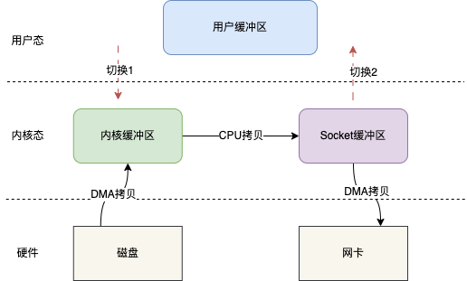

`mmap`和`sendfile`都是在操作系统中用于处理文件的技术，常用于提高文件读写性能和降低资源消耗。

1. `mmap`（内存映射）技术：
   - `mmap`允许将文件的一部分或整个文件映射到进程的虚拟地址空间，从而使得文件的内容可以像内存一样被访问。当进程需要访问映射区域时，操作系统会将相应的文件内容从磁盘读取到内存中，实现了对文件的按需读取。
   - 使用`mmap`可以避免将整个文件读入内存，从而减少了内存的占用，并且由于是内存操作，读写速度较快。
   - `mmap`常用于处理大文件和共享内存的场景，如数据库文件、日志文件等。

2. `sendfile`技术：
   - `sendfile`是一种在Linux系统下的系统调用，用于在网络通信中直接将文件内容发送到网络连接中，而无需先将数据从内核缓冲区拷贝到用户态缓冲区再发送。它实现了零拷贝的特性，提高了数据传输的效率。
   - `sendfile`适用于在网络传输中发送文件内容，例如在Web服务器中将静态文件（如图片、视频、音频等）发送给客户端。
   - 使用`sendfile`可以减少数据在用户态和内核态之间的拷贝，降低了CPU的开销和内存的占用，提高了网络传输的性能。

总结：
- `mmap`是将文件映射到进程的虚拟内存空间，适用于文件读写和共享内存的处理。
- `sendfile`是直接在网络通信中发送文件内容，适用于网络传输中的零拷贝操作。


##### 零拷贝

零拷贝技术是一个思想，指的是指计算机执行操作时，CPU不需要先将数据从某处内存复制到另一个特定区域。

实现零拷贝的有以下几种方式

- mmap()
- sendfile()

###### mmap()

mmap（memory map）是一种内存映射文件的方法，即将一个文件或者其它对象映射到进程的地址空间，实现文件磁盘地址和进程虚拟地址空间中一段虚拟地址的一一对映关系。

简单地说就是内核缓冲区和应用缓冲区共享，从而减少了从读缓冲区到用户缓冲区的一次CPU拷贝。

比如基于mmap，上述的IO读写模型就可以变成这样。


基于mmap IO读写其实就变成mmap + write的操作，也就是用mmap替代传统IO中的read操作。

当用户发起mmap调用的时候会发生上下文切换1，进行内存映射，然后数据被拷贝到内核缓冲区，mmap返回，发生上下文切换2；随后用户调用write，发生上下文切换3，将内核缓冲区的数据拷贝到Socket缓冲区，write返回，发生上下文切换4。

整个过程相比于传统IO主要是不用将内核缓冲区的数据拷贝到用户缓冲区，而是直接将数据拷贝到Socket缓冲区。上下文切换的次数仍然是4次，但是拷贝次数只有3次，少了一次CPU拷贝。

在Java中，提供了相应的api可以实现mmap，当然底层也还是调用Linux系统的mmap()实现的

```java
FileChannel fileChannel = new RandomAccessFile("test.txt", "rw").getChannel();
MappedByteBuffer mappedByteBuffer = fileChannel.map(FileChannel.MapMode.READ_WRITE, 0, fileChannel.size());
```

如上代码拿到MappedByteBuffer，之后就可以基于MappedByteBuffer去读写。

###### sendfile()

sendfile()跟mmap()一样，也会减少一次CPU拷贝，但是它同时也会减少两次上下文切换。



如图，用户在发起sendfile()调用时会发生切换1，之后数据通过DMA拷贝到内核缓冲区，之后再将内核缓冲区的数据CPU拷贝到Socket缓冲区，最后拷贝到网卡，sendfile()返回，发生切换2。

同样地，Java也提供了相应的api，底层还是操作系统的sendfile()

```
FileChannel channel = FileChannel.open(Paths.get("./test.txt"), StandardOpenOption.WRITE, StandardOpenOption.CREATE);
//调用transferTo方法向目标数据传输
channel.transferTo(position, len, target);
```

通过FileChannel的transferTo方法即可实现。

transferTo方法（sendfile）主要是用于文件传输，比如将文件传输到另一个文件，又或者是网络。

在如上代码中，并没有文件的读写操作，而是直接将文件的数据传输到target目标缓冲区，也就是说，sendfile是无法知道文件的具体的数据的；但是mmap不一样，他是可以修改内核缓冲区的数据的。假设如果需要对文件的内容进行修改之后再传输，只有mmap可以满足。

通过上面的一些介绍，主要就是一个结论，那就是基于零拷贝技术，可以减少CPU的拷贝次数和上下文切换次数，从而可以实现文件高效的读写操作。