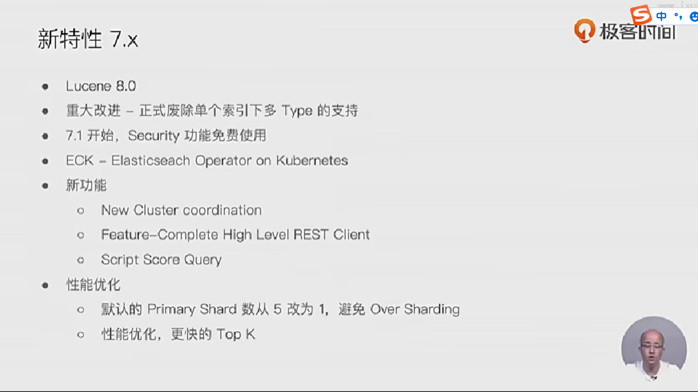

## 分布式架构

## 支持多种方式集成接入

- 多种编程语言类库
  - java/.net/python/ruby/php/groovy/perl

- restful api   vs   transport api
  - 9200 vs 9300(建议使用restful api)

- jdbc  & odbc

## 主要功能

- 海量数据的分布式存储以及集群管理、
  - 服务与数据的高可用，水平扩展
- 近实时搜索，性能卓越
  - 结构化、  全文、 地理位置、 自动完成
- 海量数据近实时分析
  - 聚合功能

## 版本与升级

- 0.4： 2010年2月第一次发布

- 1.0：2014年1月

- 2.0： 2015年10月

- 5.0：2016年10月

- 6.0: 2017年10月

- 7.0：2019年4月

## 新特性 

- 

- 

- 