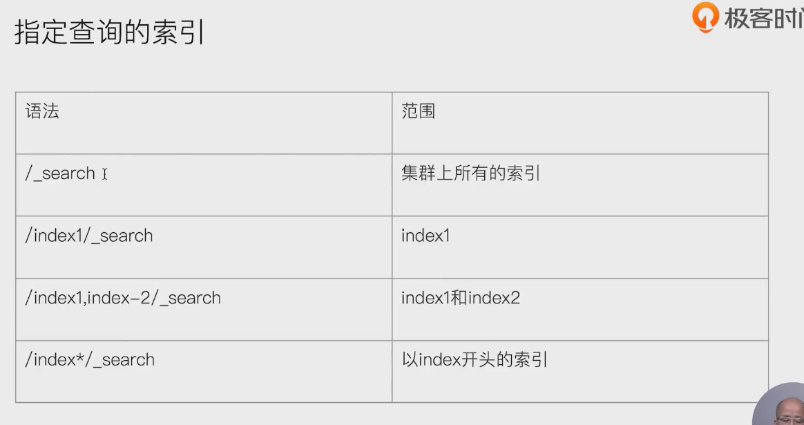
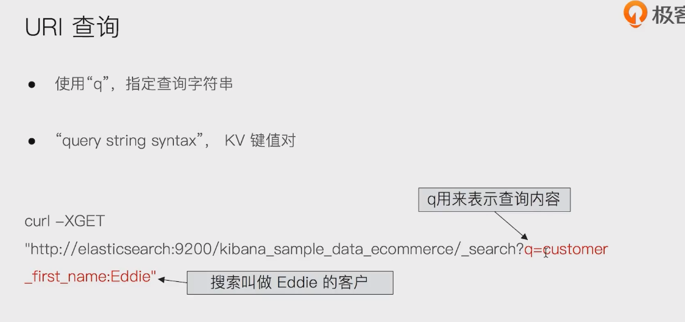
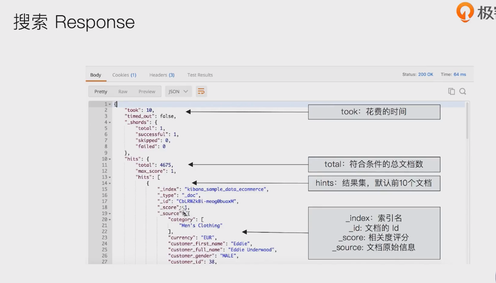
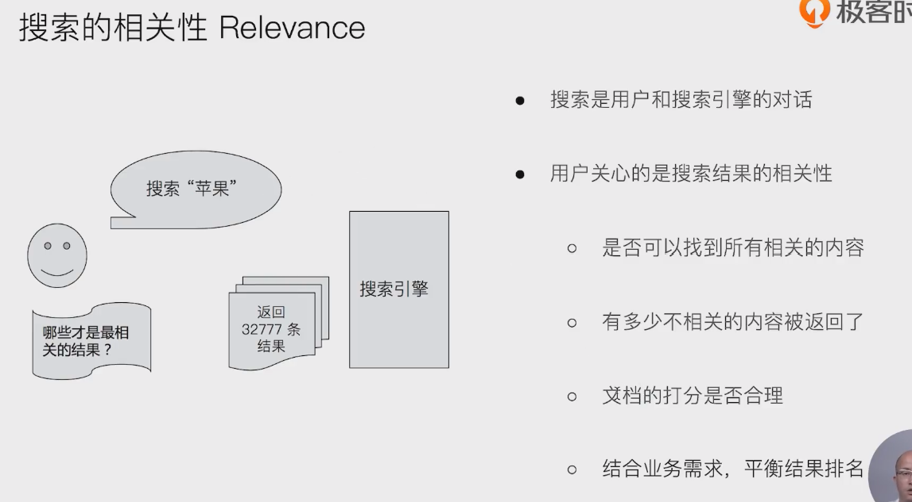
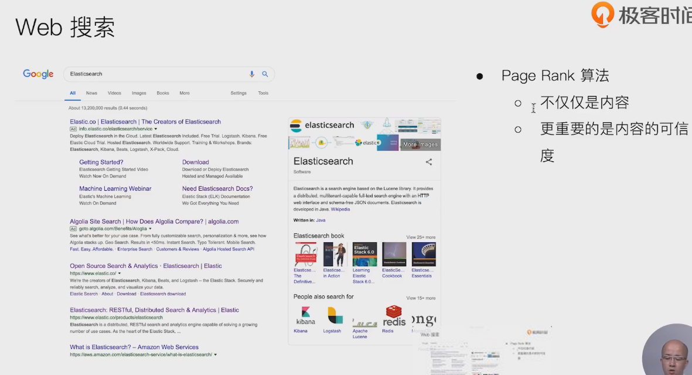
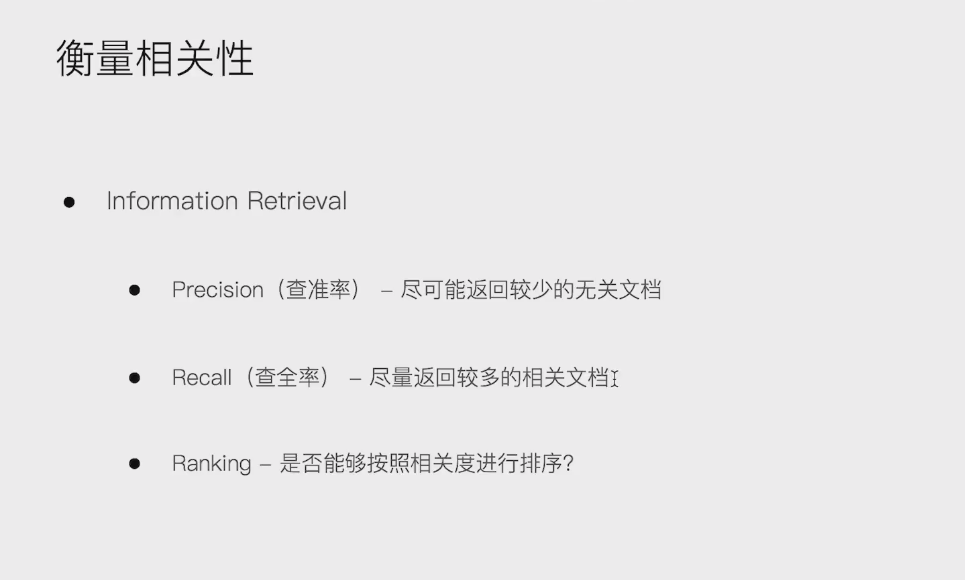
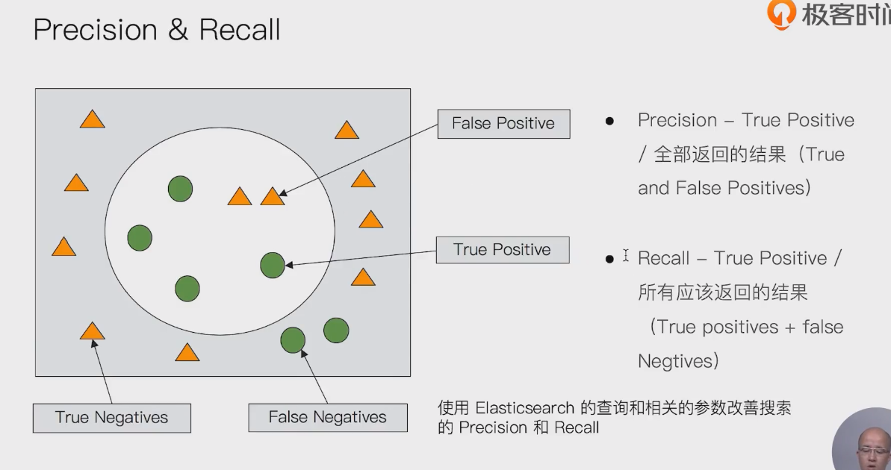
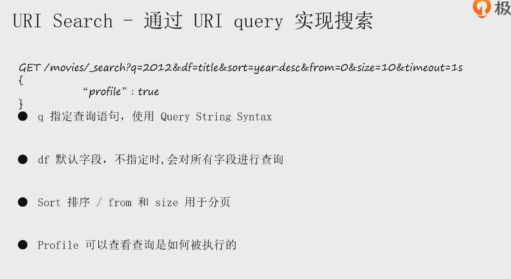
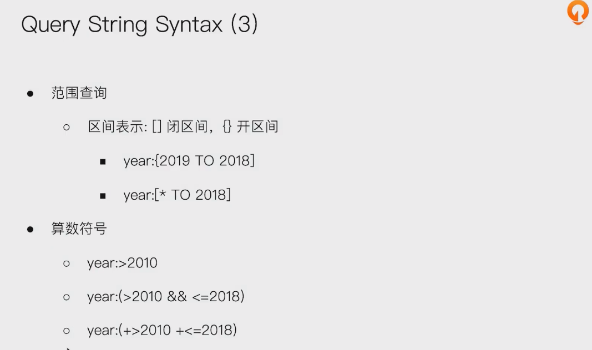
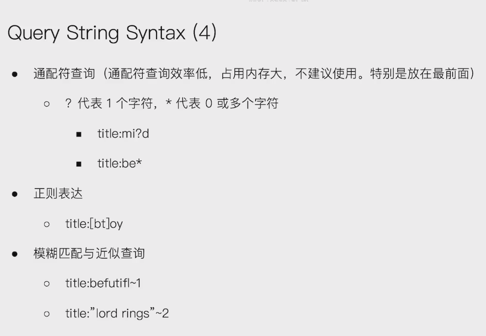

# search api

- uri search
  - 在url中使用查询参数
  - 

- Request Body Search
  -  使用es提供的，基于json格式的更加完备的query domain specific language (DSL)

- 

- 
- 

## 搜索response

- 

## 搜索的相关性 relevance

- 

- 
- 

##   衡量相关性

### 查全率  查准率

- 
- 


# URI Search

- 
- query string syntax
- 

- ```
  GET /movies/_search?q=title:"Beautiful Mind"
  {
    "profile": "true"
  }
  ```

- 

- 

- 

