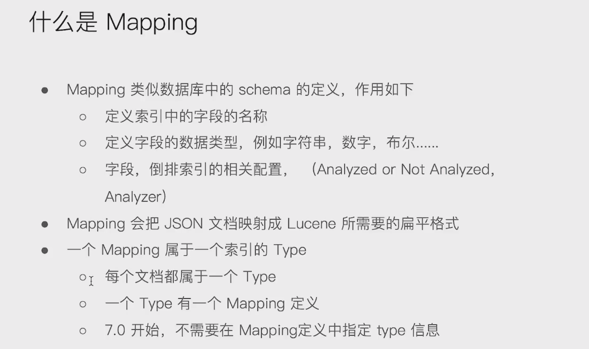
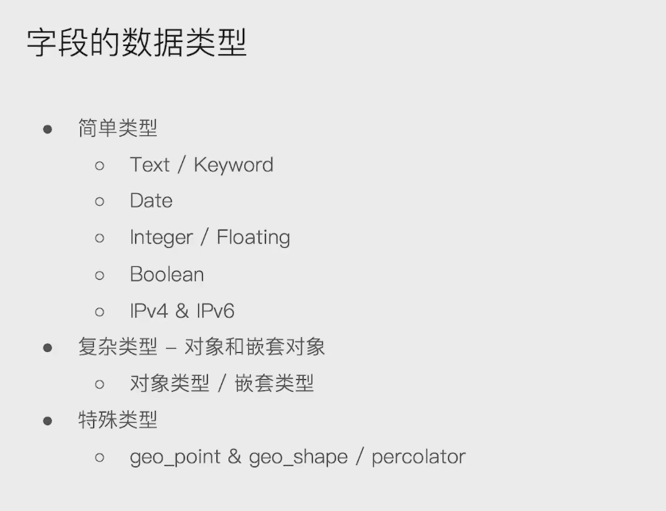
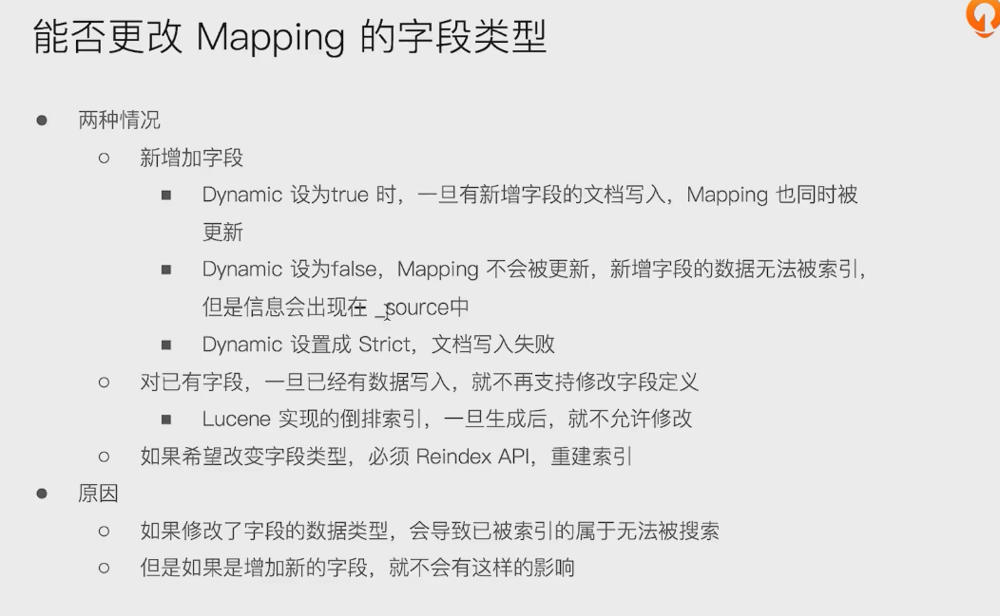
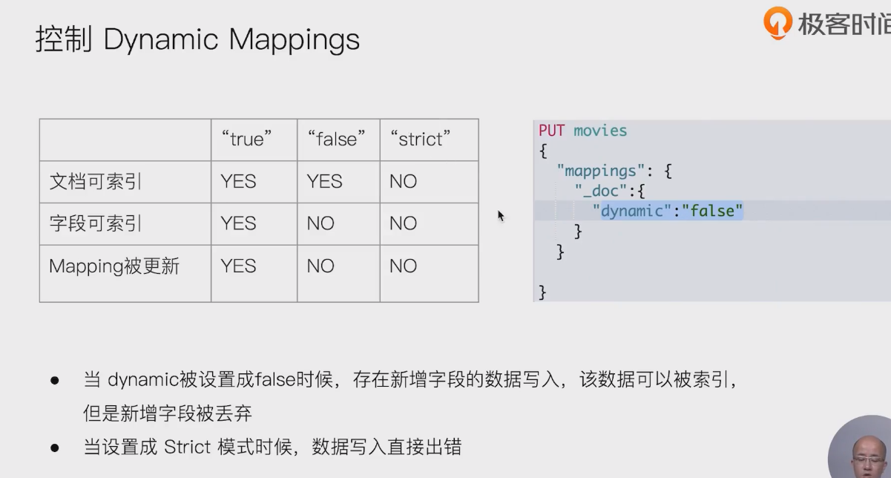

# 什么是Mapping

- 

# 字段数据类型

- 

# 什么是 Dynamic Mapping

- 

- ```
  看字段类型 ： GET mapping_test/_mapping
  
  ```

- 字段没有对应的mapping信息，就不可被按字段 search到

# 能够更改mapping的字段类型吗

- 

# 控制dynamic mappings

- 

```
也可以这个设置
PUT mapping_test/_mapping
{
  "dynamic": "false"
}
```

