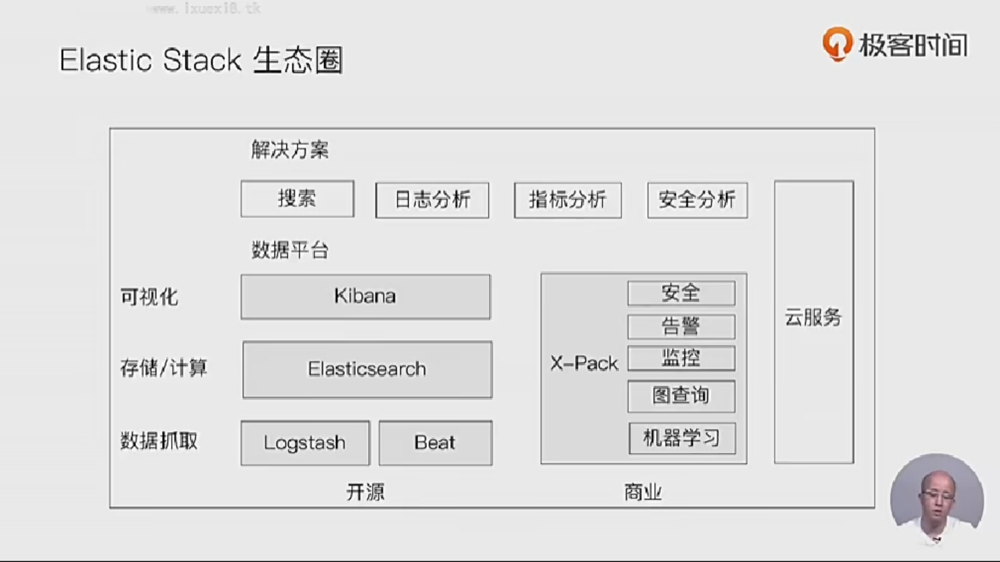
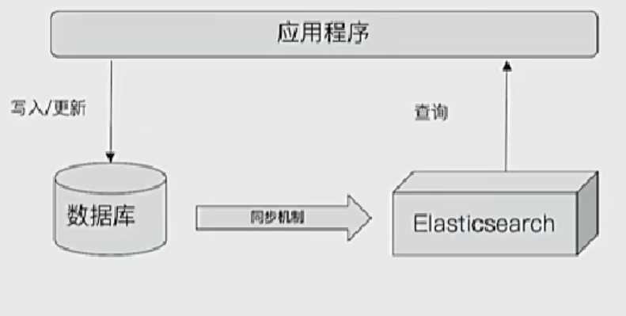
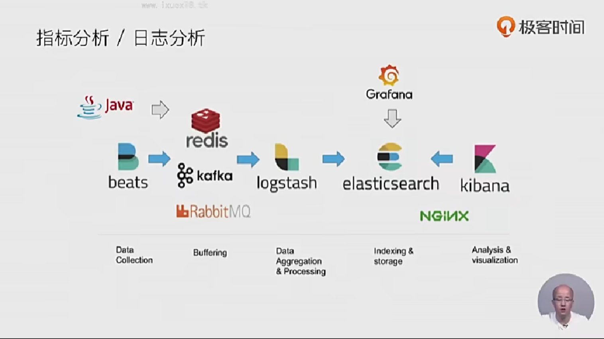

# elastic stack 生态圈

- 

## 1.logstash:数据处理管道

- 开源的服务器端数据处理管道，支持从不同来源采集数据，转换数据，并将数据发送到不同的存储库中
- 诞生于2009年，最初用来做日志的采集与处理
- 创始人 jordan sisel
- 2013年被elasticsearch收购

### logstash 特性

- 实时解析和转换数据
  - 从ip地址破译出地理坐标
  - 从pii数据匿名化，完全排除敏感字段

- 可扩展
  - 200多个插件（日志、数据库、arcsign、netflow）

- 可靠性安全性
  - logstash会通过持久化队列来保证至少将运行中的事件送达一次
  - 数据传输加密

- 监控

## 2.kibana: 可视化分析利器

- kibana含义： kiwifruit+ banana
- 数据可视化工具，帮助用户解开对数据的任何疑问
- 基于logstash的工具，2013年加入elastic公司

## 3. BEATS : 轻量的数据采集器

- go语言开发

## 4.X-pack: 商业化套件

## 5.ELK客户及应用场景

- 网站搜索、垂直搜索、代码搜索
- 日志管理与分析、安全指标监控、应用性能监控、web抓取舆情分析

# 日志的重要性

- 为什么重要

  - 运维：日志就是病人 对自己的陈述
  - 恶意攻击，恶意注册，刷单，恶意密码猜测

- 挑战

  - 关注点很多，任何一个关注点都可能引起问题
  - 日志分散在很多机器，出了问题时，才发现日志被删除了
  - 很多运维人员是消防员，哪里有问题去哪里

  

## 日志管理

- 日志搜集
- 格式化分析
- 全文检索
- 风险告警

# elasticsearch 与数据库的集成

- 
- 单独使用elasticsearch 存储
- 以下情况可考虑与数据库集成
  - 与现有系统的集成
  - 需考虑事务性
  - 数据更新频繁

# 指标分析、日志分析

