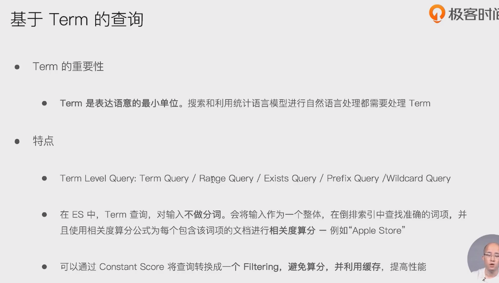
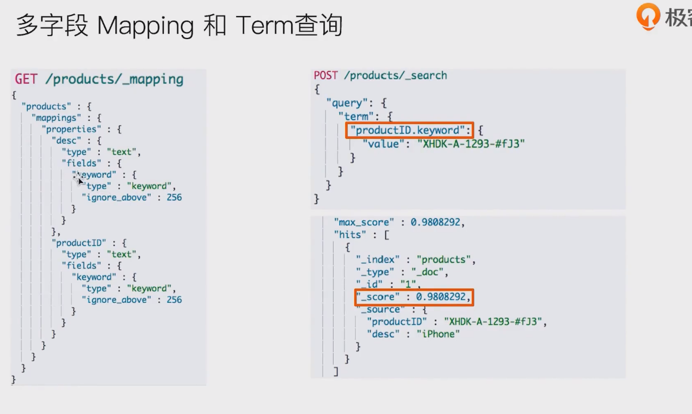
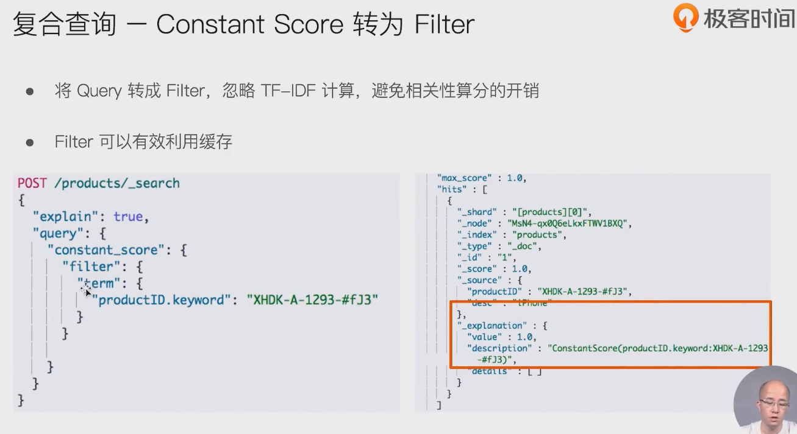
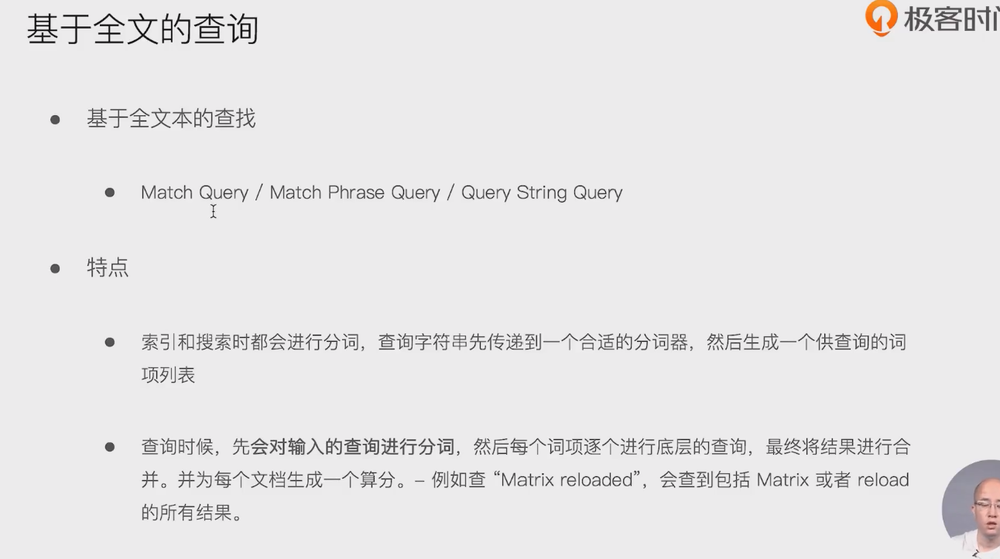
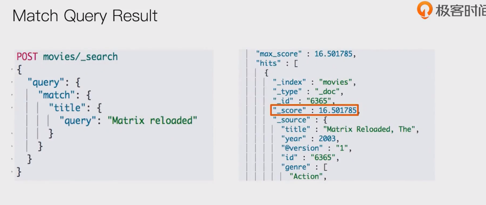
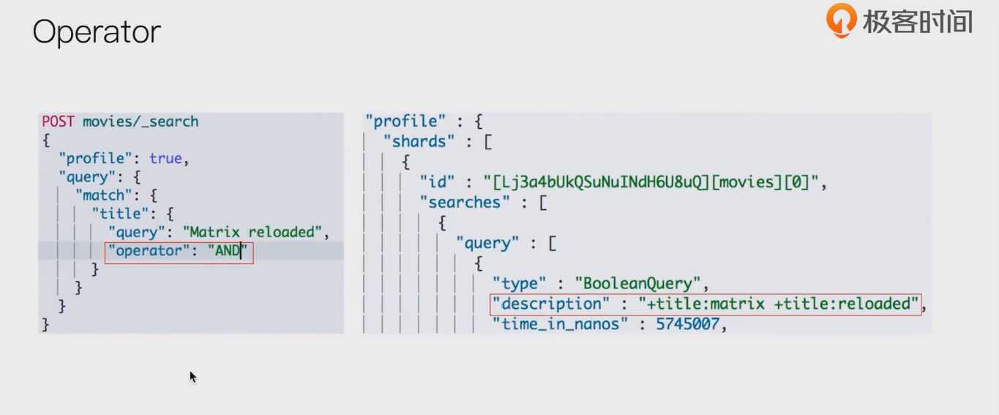
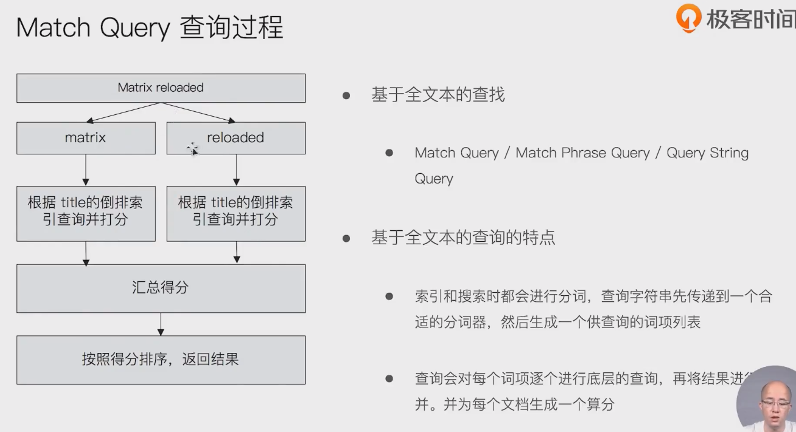

# 基于Term的查询

- 

- 

## 多字段mapping 和 term查询

- 

## 复合查询 -constant score 转为Filter

- 

# 基于全文的搜索

- 
- match query result
  - 
- Operator
  - 

- minimum_should_match
  - 
- match phrase query
  - 

## match query 查询过程

- 

# 回顾

- 