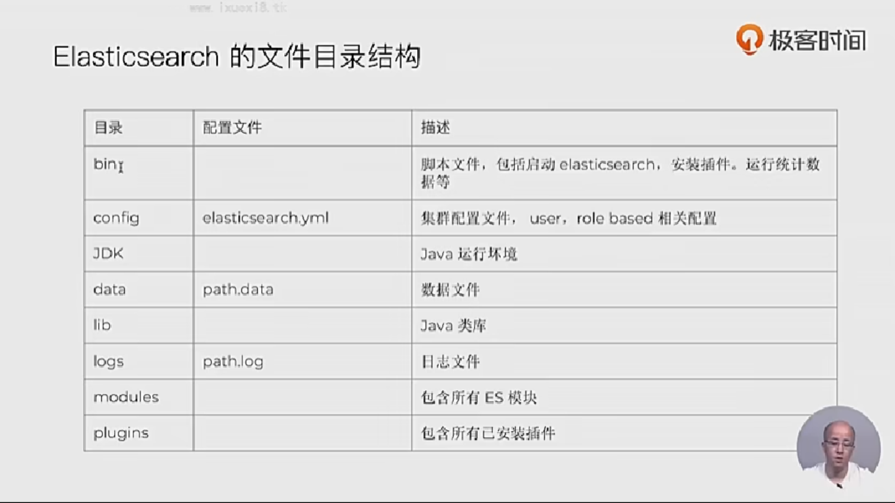

## 文件目录结构

## 安装插件

- bin/elasticsearch-plugin install analysis-icu 7.1.0

- bin/elasticsearch-plugin list 查看插件

  

## 启动节点

bin\elasticsearch.bat -E node.name=node0 -E cluster.name=geektime1 -E path.data=node0_data -d

bin\elasticsearch.bat -E node.name=node1 -E  cluster.name=geektime1 -E path.data=node1_data -d

bin\elasticsearch.bat -E node.name=node2 -E cluster.name=geektime1 -E path.data=node2_data -d

bin\elasticsearch.bat -E node.name=node3 -E cluster.name=geektime1 -E path.data=node3_data -d

## 看服务运行情况

http://localhost:9200/_cat/nodes 

http://localhost:9200/_cat/plugins