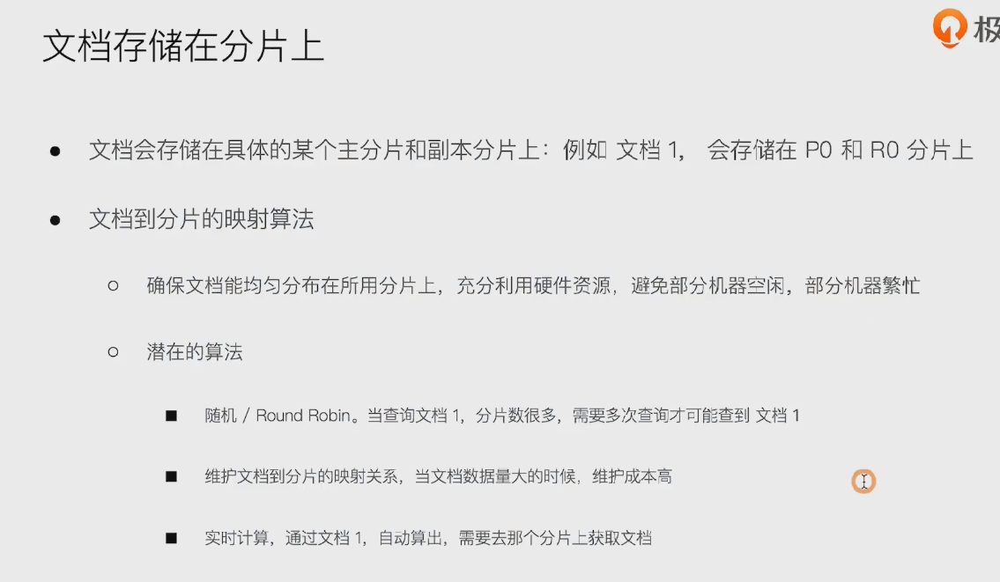
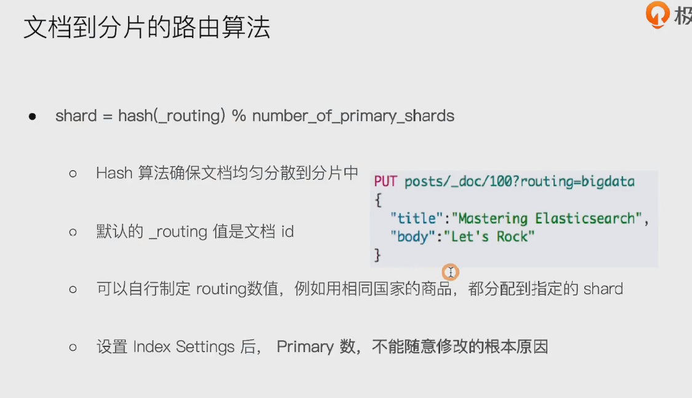
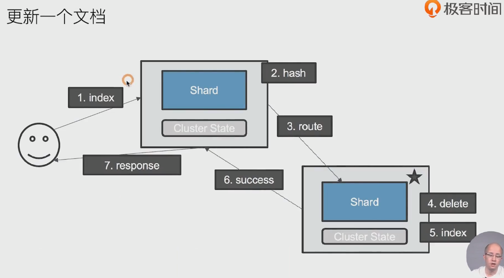
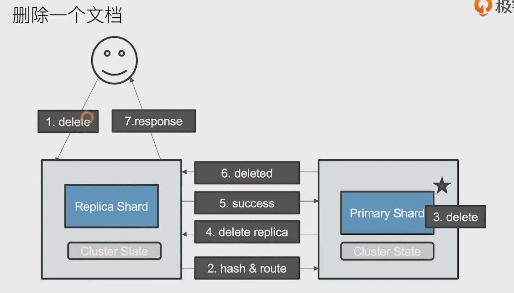

### 1.文档存储在分片上

- 

### 2.ES文档到分片的路由算法: hash路由

- 

### 3.更新一个文档过程

- 
- 请求发送到 coordinating 节点，节点计算哈希路由到对应节点
- 对应节点删除对应文档，再新建文档
- 对应节点返回结果给coordinating节点，再返回给客户端

### 4.删除一个文档过程

- 
- 发送删除请求到 coordinating 协调节点，根据文档id进行hash路由到对应主分片节点，进行删除
- 主分片删除后，根据cluster state保存的信息路由到对应的副本节点，进行数据删除
- 副本删除后，返回给主节点信息
- 主节点在把结果返回给协调节点，协调节点响应客户端