## parent /child

- 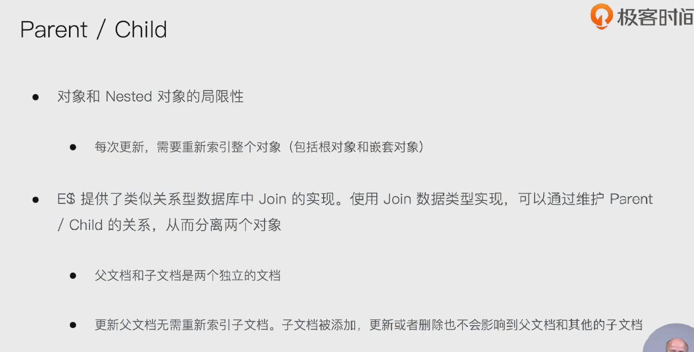

## 父子关系

- 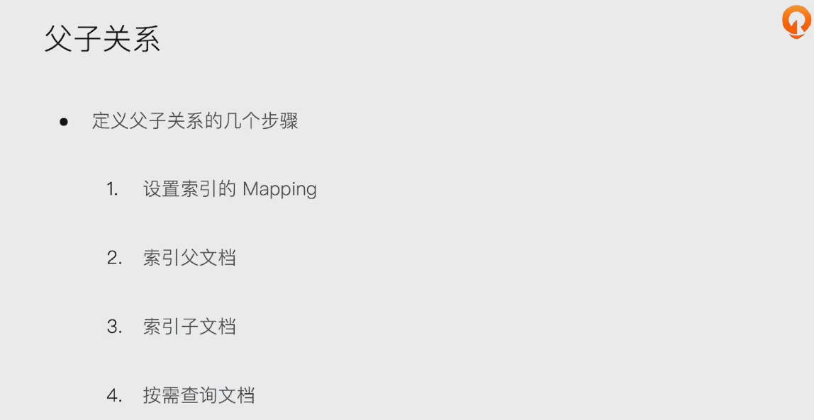

### 设置mapping

- 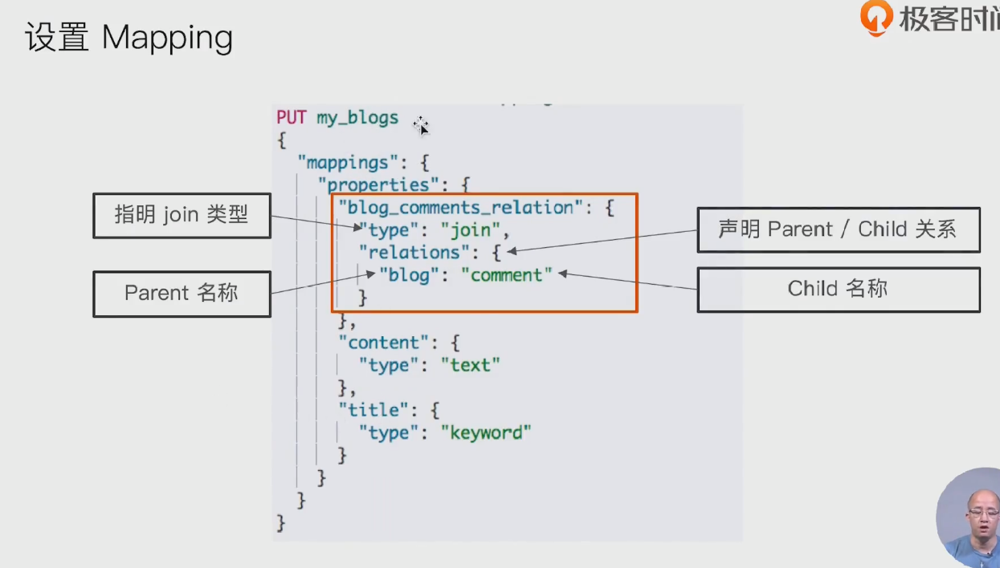

###  索引父文档

- 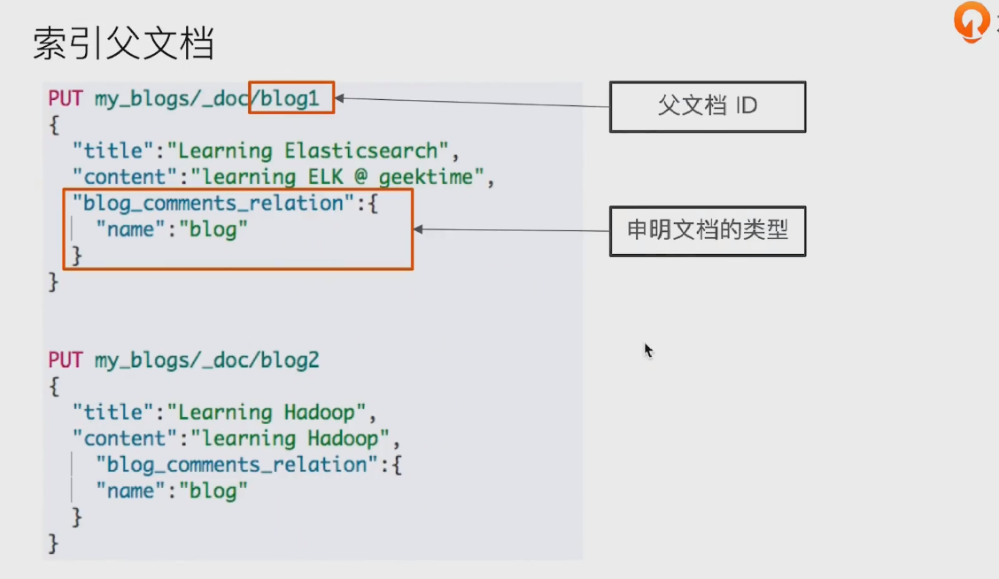

### 索引子文档

- 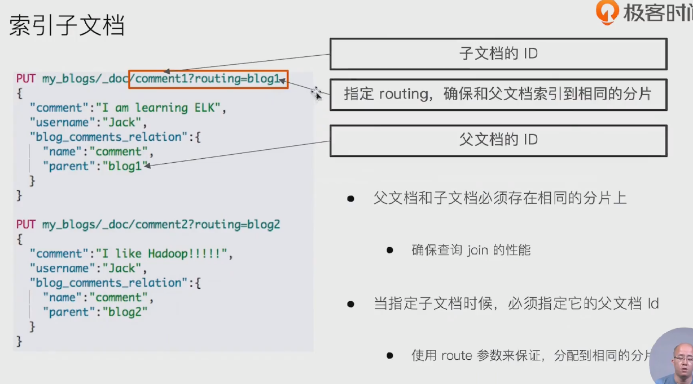

### 通过父文档id查子文档 parent_id

- 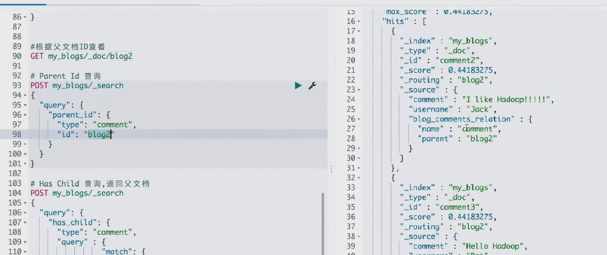

### 通过子文档查父文档 has_child

- 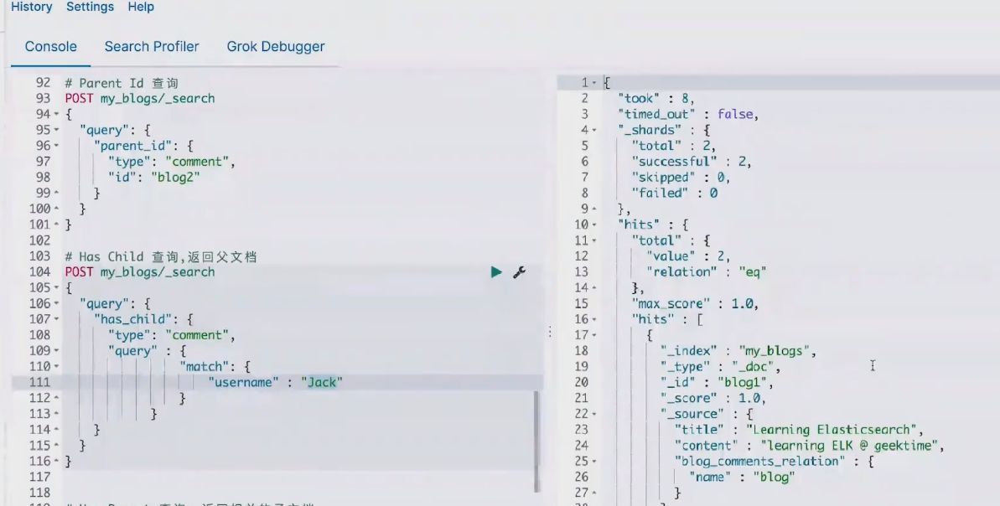

### has_parent: 返回相关子文档

- 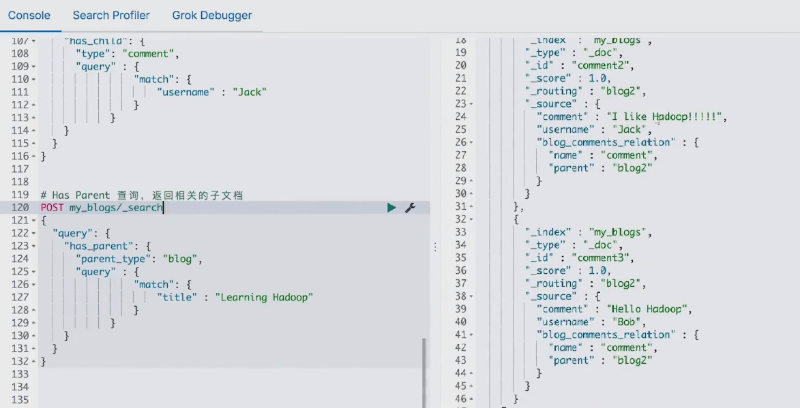

###  通过id 和路由 访问子文档

- 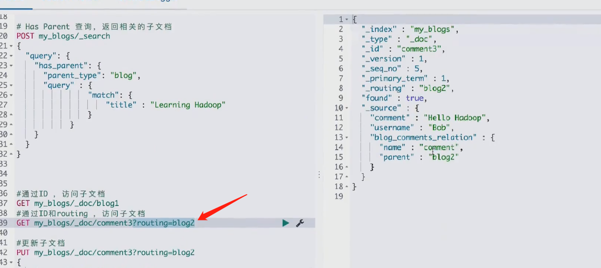

### 更新子文档

- 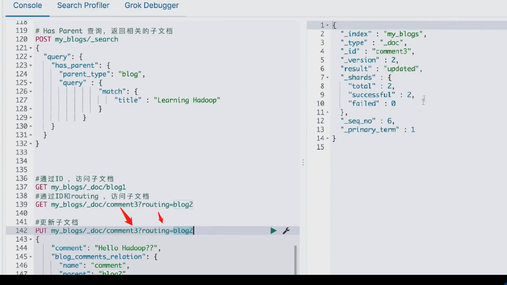

##  嵌套对象 vs 父子文档

- 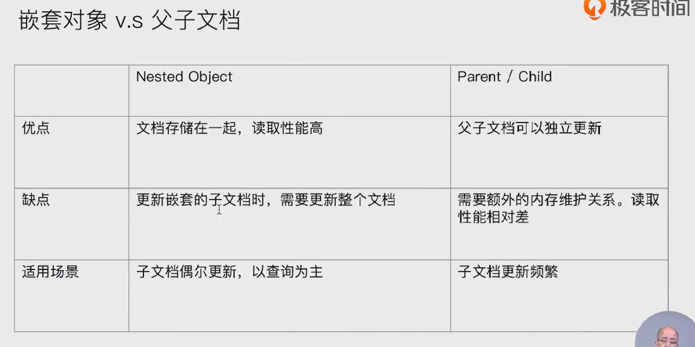