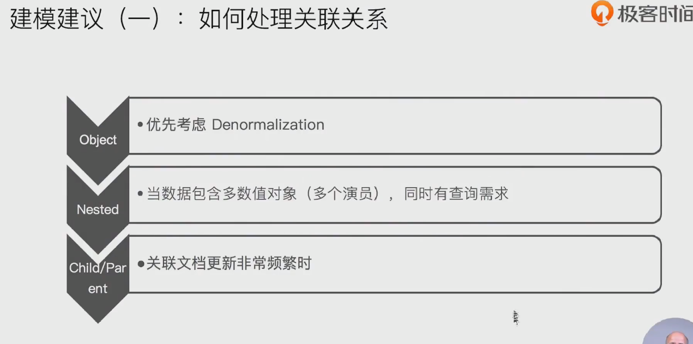
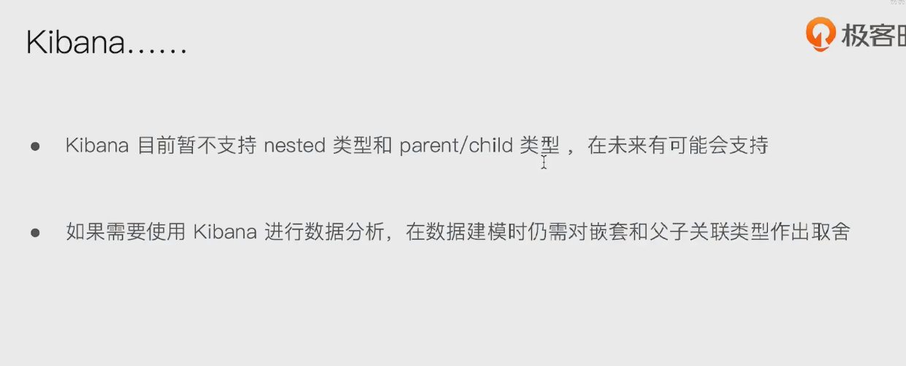
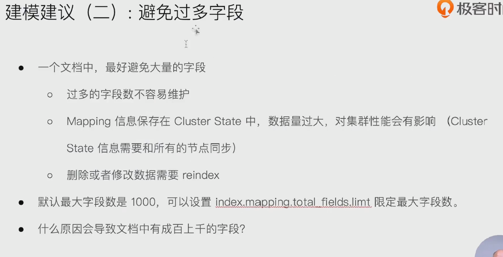
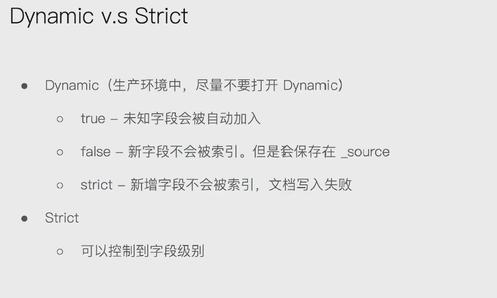
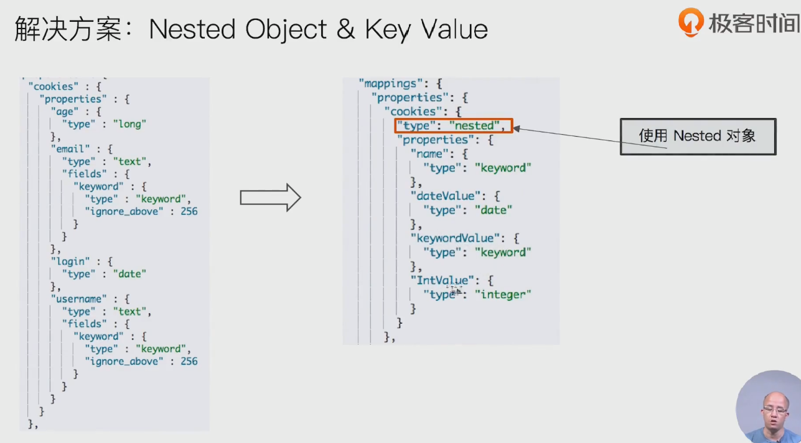
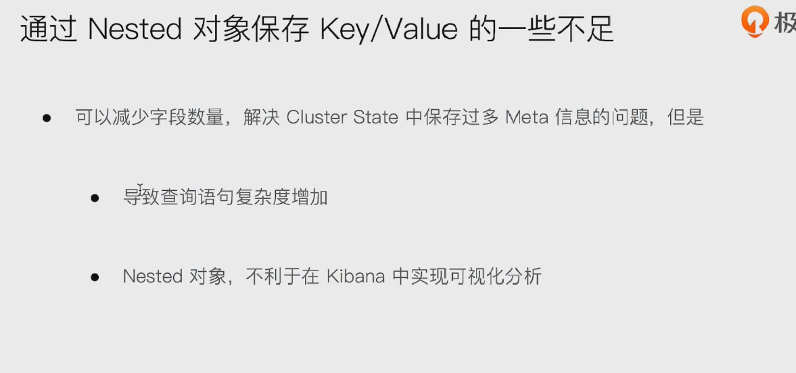
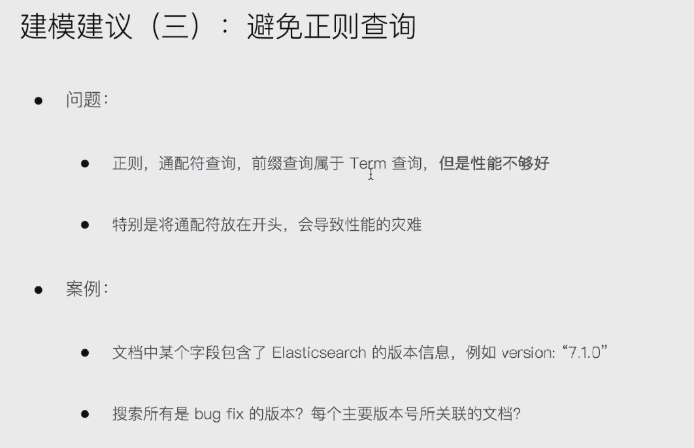
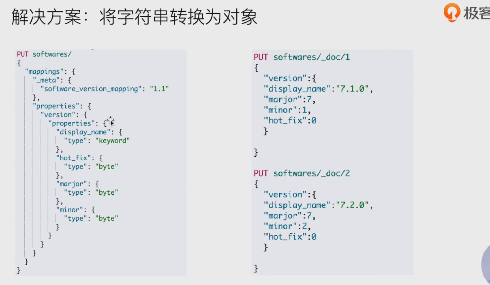
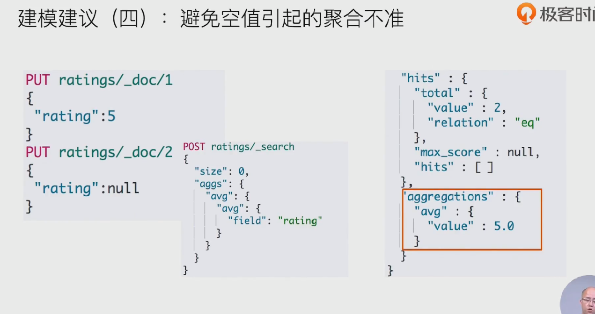
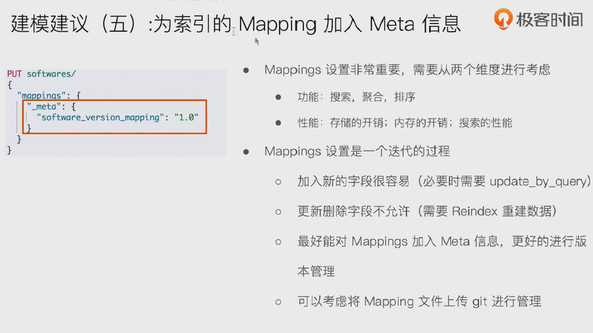

## 1.建模建议一：如何处理关联关系

- 

- 

## 2. 建模建议二： 避免过多字段

- 

- 为啥会这么多字段？
  - 
  - 解决方案：解决mapping中字段过多
  - 
  - 

## 3.建议三：避免正则查询

- 
  - 
  - 

## 4.建模建议4：避免空值引起的聚合不准

- 
  - 

## 5. 建议5： 为索引的mapping加入meta信息

- 