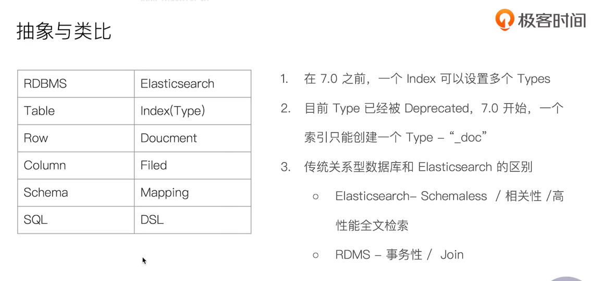
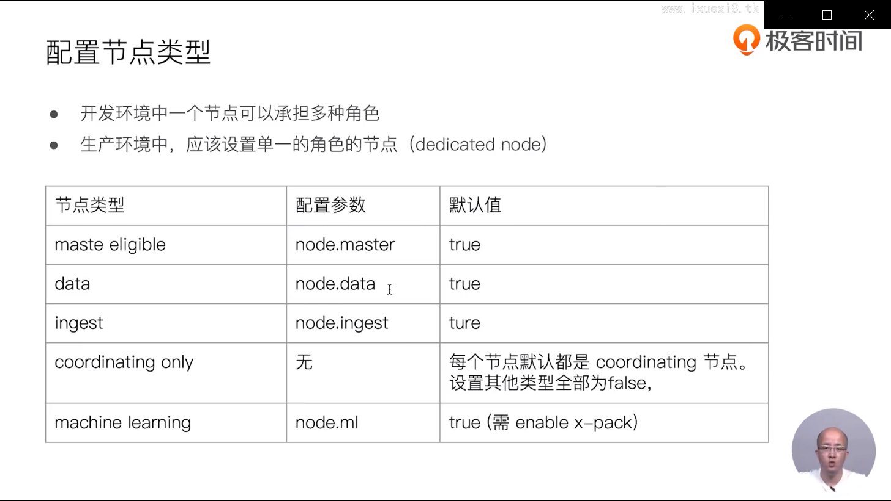
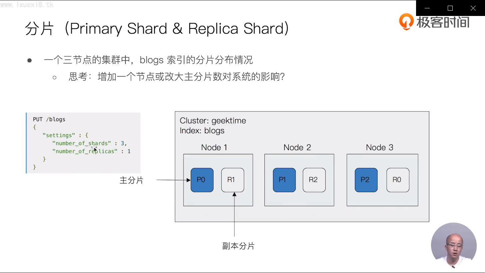

## 文档(Document)

- es是面向文档的，文档是所有可搜索数据的最小单位
- 文档会被序列化为json格式，保存在es中
  - json对象由字段组成
  - 每个字段有对应类型（字符串、数值、布尔、日期、二进制、范围类型）
  - 支持数组、支持嵌套
- 每个文档都有一个unique ID
  - 可指定
  - 可自动生成

- 元数据
  - 

## 索引

- 

## Type

- 在7.0之前，一个index可以设置多个 types
- 6.0开始，Type已经被废弃了，7.0开始，一个索引只能创建一个type -"_doc"

## 类比： 与关系型数据库

## kibana devtools

//查看索引相关信息  kibana devtools
GET 	kibana_sample_data_ecommerce

GET 	kibana_sample_data_ecommerce/_count 查看文档数量

GET /_cat/indices/kibana*?v&s=index  查看索引

## 分布式系统的可用性与扩展性

- 高可用

  - 服务可用性- 允许节点停止服务
  - 数据可用性 - 部分节点丢失，不会丢失数据

  

- 可扩展性

  - 请求量提升、数据的不断增长（将数据分布到所有节点上）

    

### es分布式特性

- es 分布式架构的好处

  - 存储水平扩容
  - 提高系统的可用性，部分节点停止服务，整个集群的服务不受影响

- es分布式架构

  - 不同集群通过不同的名字来区分，默认名字是 ‘elasticsearch’

  - 通过配置文件修改，或者在命令行中 -E cluster.name=geektime 进行设定

  - 一个集群可以有一个或多个节点

    

## 节点

- 节点是一个es实例

  - 本质上是一个java进程

  - 一台机器上可运行多个es进程，但生产环境一般建议一台机器运行一个es实例

    

- 每个节点都有名字，通过配置文件配置， 或启动时 -E node.name=node1 指定
- 每个节点在启动后会分配一个 UID ,保存在data目录下

### master-eligible nodes 和 master node

- 每个节点启动后，默认就是一个master eligible 节点
  - 可以设置node.master:false 禁止
- master-eligible节点可以参加选主流程，成为master节点
- 当第一个节点启动时，它会把自己选举成master节点
- 每个节点都保存了集群的状态，只有master节点才能修改集群的状态信息
  - 集群状态，维护了一个集群中的必要信息
    - 所有节点的信息
    - 所有的索引和相关的mapping 和 setting信息
    - 分片的路由信息
  - 任意节点都能修改信息导致数据的不一致性

###  data node 和 coordinating node

- data node
  - 可以保存数据的节点。负责保存分片数据。在数据扩展上起到至关重要的作用
- coordinating node
  - 负责接受client的请求，将请求分发到合适的节点，最终把结果汇集到一起
  - 每个节点默认都起到了coordinating node的职责

### 其他节点类型

- hot & warm node
  - 不同硬件配置的data node ,用来实现 hot &warm 架构，降低集群部署的成本
- machine learning node
  - 负责跑 机器学习的job， 用来做异常检测
- tribe node
  - （5.3 开始使用 cross cluster serach） tribe Node 连接到不同的es集群，并支持将这些集群当成一个单独的集群处理

## 分片

- 主分片，用以解决数据水平扩展的问题。通过主分片将数据分布到集群所有节点之上
  - 一个分片是一个运行的lucene实例
  - 主分片数在索引创建时指定，后续不允许修改，除非reindex
- 副本
  - 副本分片数，可以动态调整
  - 增加副本书，可以在一定程度上提高服务的可用性（读取的吞吐）

- 

- 分片的设定
  - 对于生产环境中的分片的设定，需要提前最好容量规划
    - 分片数设置过小
      - 导致后续无法增加节点实现水平扩展
      - 单个分片的数据量太大，导致数据重新分配耗时
    - 分片数设置过大，7.0开始，默认主分片设置成1， 解决了over-sharding的问题
      - 影响搜索结果的相关性打分，影响统计结果的准确性
      - 单个节点上过多的分片，会导致资源浪费，同时也会影响性能

- 