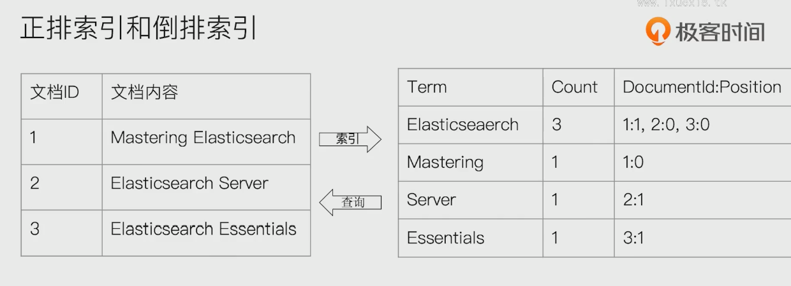
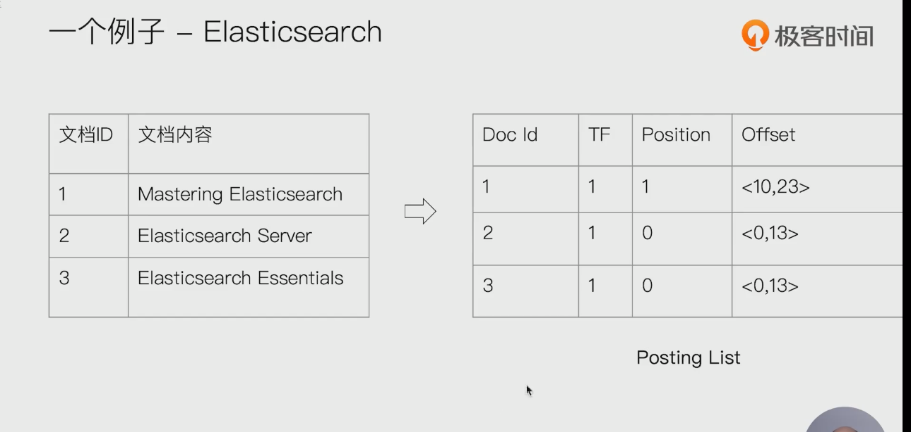

# 图书和搜索引擎的类比

- 图书
  - 正排索引  - 目录页
  - 倒排索引 - 索引页
- 搜索引擎
  - 正排索引 - 文档id到文档内容和单词的关联
  - 倒排索引 - 单词到文档id的关联

- 

# 倒排索引的核心组成

- 倒排索引包含两个部分
  - 单词词典（Term Dictionary）,记录所有文档的单词，记录单词到到倒排列表的关联关系
    - 单词词典一般比较大，可以通过B+树或哈希链表法实现，以满足高性能的插入与查询
  - 倒排列表（Posting List） : 记录了单词对应的文档集合，由倒排索引项组成
    - 倒排索引项（Posting）
      - 文档id
      - 词频TF - 该单词在文档中出现的次数，用于相关性评分
      - 位置（Position） - 单词在文档中分词的位置。用于语句搜索（phrase query）
      - 偏移（Offset） - 记录单词的开始结束位置，实现高亮显示

- 

# es的倒排索引

- es的json文档中的每个字段，都有自己的倒排索引
- 可以指定对某些字段不做索引
  - 优点： 节省存储空间
  - 缺点： 字段无法被搜索

